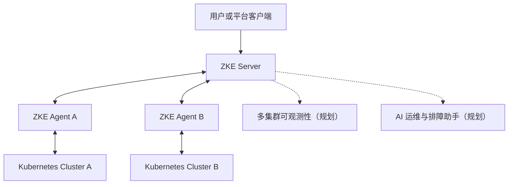

# ZKE

> **ZKE（Z Kubernetes Engine）**
>
> 面向私有网络与混合云环境的 Kubernetes 多集群管理平台


ZKE 通过 Server + Agent 连接分散在数据中心、私有云和公有云中的 Kubernetes 集群，为平台团队提供统一的资源管理、权限控制、安全操作与审计入口。

> [!IMPORTANT]
> ZKE 当前处于开发预览阶段。平台基础与容器服务主要链路已经实现，多集群可观测性和 AI 运维与排障助手（Copilot）仍在规划中；产品范围与技术选型仍可能调整，当前版本不适用于生产环境。

## 核心能力

| 能力方向 | 产品目标 | 当前状态 |
| --- | --- | --- |
| 多集群管理 | 统一接入和查看多个 Kubernetes 集群及其 Agent 状态 | 主要链路已实现 |
| 容器服务 | 在选定集群中管理节点、Namespace、工作负载、网络、配置和存储资源 | 主要链路已实现 |
| 安全与审计 | 使用租户、项目和 RBAC 限定资源范围，保护敏感操作并记录审计日志 | 主要链路已实现 |
| 多集群可观测性 | 汇总指标、日志和事件，提供查询、告警、仪表盘与资源对比 | 规划中 |
| AI 运维与排障助手（Copilot） | 结合资源状态、事件、日志和指标辅助分析故障、解释风险并提供处理建议 | 规划中 |

“主要链路已实现”不代表已经具备生产可用性或水平扩展能力，具体范围以 [Roadmap](docs/roadmap.md) 和功能文档为准。

## 设计原则

- 以 Kubernetes 为统一基础设施底座，工作负载最终运行在具体 Kubernetes 集群中。
- 通过 Server + Agent 管理多集群，由 Agent 主动连接 Server。
- 全局查看资源，在明确的目标集群中执行操作。
- 敏感操作必须验证权限、确认目标并记录审计日志。

> **全局观察，按集群执行。**

[了解产品愿景与完整设计原则](docs/product/vision.md)

## 系统架构

ZKE 采用 Server + Agent 架构。每个接入的 Kubernetes 集群部署一个 ZKE Agent，由 Agent 主动连接 ZKE Server。



这一连接模型面向私有网络、混合云、多云和边缘集群。

- [系统架构](docs/architecture/overview.md)
- [Server + Agent 架构](docs/architecture/server-agent.md)
- [应用作用域与资源模型](docs/architecture/resource-model.md)
- [安全与权限](docs/security/authorization.md)

## 快速安装

### Docker

带 PostgreSQL 的一体镜像适合本地快速预览：

```bash
docker run -d --name zke \
  -p 8080:8080 -p 8081:8081 -p 8443:8443/udp \
  ghcr.io/togettoyou/zke-server-pg:latest
```

打开 <http://127.0.0.1:8080>，并读取自动生成的初始管理员密码：

```bash
docker exec zke cat /var/lib/zke/admin-password
```

### Kubernetes

标准部署使用 `ghcr.io/togettoyou/zke-server:latest` 和独立 PostgreSQL StatefulSet。用于共享或外部可访问环境前，先替换清单中的默认数据库密码。

```bash
kubectl apply -f deploy/kubernetes/zke.yaml
kubectl -n zke-system port-forward service/zke-server 8080:8080 8081:8081
```

### Helm

`main` 分支的 OCI Chart 使用 `0.0.0-latest` 版本；Git Tag 使用对应的语义化版本：

```bash
helm upgrade --install zke oci://ghcr.io/togettoyou/charts/zke \
  --version 0.0.0-latest \
  --namespace zke-system --create-namespace
```

[查看完整部署、持久化、配置覆盖与外部入口说明](docs/deployment.md)

## 产品预览

> 产品截图正在准备中，首次公开预览前将在这里补充控制台首页、集群管理、容器服务、安全审计和 Copilot 等界面预览。

## 适用场景

- 数据中心、私有云和公有云中的多 Kubernetes 集群统一管理
- 具有独立网络边界的私有云与混合云 Kubernetes 环境
- Kubernetes 资源、工作负载与敏感运维操作的统一入口
- 统一权限边界与审计要求下的平台工程和 SRE 协作
- 规划中的多集群可观测性和 AI 运维与排障助手（Copilot）

## Roadmap

当前规划分为四个阶段：

1. 平台基础
2. 容器服务
3. 可观测性
4. AI 运维与排障助手（Copilot）

[查看完整 Roadmap](docs/roadmap.md)

## 文档

完整的产品、架构、功能与安全文档请查看 [ZKE 文档导航](docs/README.md)。
