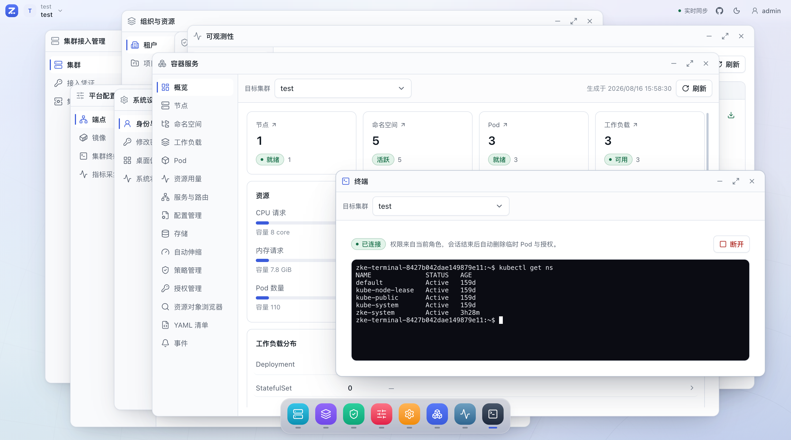
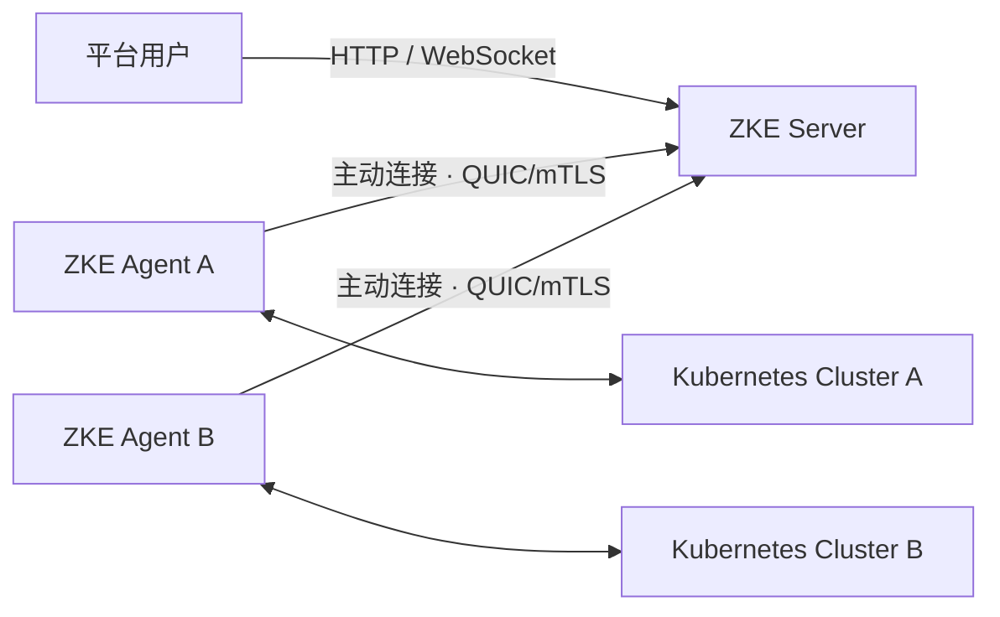

# ZKE

> **macOS 风格的 Kubernetes 多集群控制台**

**像使用桌面应用一样，管理分散在数据中心、私有云、公有云和边缘环境中的 Kubernetes 集群。**

ZKE（Z Kubernetes Engine）通过 Server + Agent 架构连接多个 Kubernetes 集群。Agent 使用 QUIC/mTLS 主动连接 Server，无需 ZKE Server 直接访问各集群的 Kubernetes API Server；平台团队可以在统一入口中管理资源与工作负载，并实施权限控制、安全操作和审计。

**在线体验：** [打开 ZKE 体验环境](https://fbcupchhlacp.sealosbja.site/)

> 账号：`view`　密码：`LECQkqcp2tQ5Yh8`　（体验数据可能随时重置）

[部署指南](docs/deployment.md) · [完整文档](docs/README.md) · [Roadmap](docs/roadmap.md)



## 为什么选择 ZKE

- **桌面式交互：** 以窗口、Dock 和应用分区组织管理能力，在同一工作空间中切换集群管理、容器服务、终端与安全审计。
- **适应私有网络：** Agent 通过 QUIC/mTLS 主动连接 Server，适合具有独立网络边界的数据中心、私有云、混合云和边缘集群。
- **多集群不混淆：** 提供全局视图，但所有查询和操作都携带明确的 Cluster、Namespace 与资源身份，避免跨集群误操作。
- **敏感操作受控：** 使用 Tenant、Project 和 RBAC 限定权限范围，并通过 DryRun、差异确认、幂等保护与审计降低变更风险。

> **全局观察，按集群执行。**

## 当前能力

| 能力 | 已实现的主要链路 |
| --- | --- |
| 多集群接入 | 集群注册、Agent 状态、证书续期、撤销与重新接入 |
| 资源与工作负载 | Node、Namespace、Pod、Deployment、StatefulSet、DaemonSet、Job、CronJob，以及服务、路由、配置、存储、自动伸缩和策略管理 |
| 日常运维 | Pod 日志、Web Terminal、临时访问、事件追踪、资源用量、工作负载诊断和版本回滚 |
| Kubernetes 原生资源 | Discovery、CRD 资源浏览、YAML 编辑及多文档清单应用与删除 |
| 权限与安全 | Tenant、Project、RBAC、敏感操作确认、DryRun 差异、并发身份保护和审计日志 |

各项能力的具体边界和已知限制以 [Roadmap](docs/roadmap.md) 与功能文档为准。

## 产品一览

| 工作负载诊断 | 安全更新确认 |
| --- | --- |
|  |  |
| **Pod 实时日志** | **Pod 临时访问** |
|  |  |

## 快速开始

### Docker

一条命令启动 ZKE 与内置 PostgreSQL：

```bash
docker run -d --name zke \
  -p 8080:8080 -p 8081:8081 -p 8443:8443/udp \
  -v zke-data:/data \
  -v zke-postgresql-data:/var/lib/postgresql/data \
  ghcr.io/togettoyou/zke-server-pg:latest
```

需要独立维护 Server 与 PostgreSQL 时使用 Docker Compose：

```bash
cd deploy/docker
cp .env.example .env
# 修改 .env 中的数据库密码
docker compose up -d
```

打开 <http://127.0.0.1:8080>。首次进入时，Console 会引导设置全局管理员用户名和密码。

### Helm

`main` 分支的 OCI Chart 使用 `0.0.0-latest`；Git Tag 使用对应的语义化版本：

```bash
helm upgrade --install zke oci://ghcr.io/togettoyou/charts/zke \
  --version 0.0.0-latest \
  --namespace zke-system --create-namespace
```

远程集群接入还需要配置可达的 HTTP 注册地址与 QUIC/UDP 入口，详见[部署指南](docs/deployment.md)。

## 架构

每个接入集群部署一个 ZKE Agent。Agent 主动建立 QUIC/mTLS 长连接，ZKE Server 通过对应连接将查询和操作定域到目标集群。



- [系统架构](docs/architecture/overview.md)
- [Server + Agent 架构](docs/architecture/server-agent.md)
- [Agent 注册与 QUIC/mTLS 连接](docs/architecture/agent-enrollment-and-connection.md)
- [资源作用域与权限模型](docs/architecture/resource-model.md)

## Roadmap

- **已实现主要链路：** 平台基础、集群接入与容器服务。
- **规划中：** 多集群可观测性，包括指标、日志、告警和资源对比。
- **规划中：** AI 运维与排障助手（Copilot），用于结合资源状态、事件、日志和指标辅助分析问题。

规划不代表发布时间或交付承诺，详情请查看[完整 Roadmap](docs/roadmap.md)。

## 文档

产品、架构、功能、安全设计与开发规划统一收录在 [ZKE 文档导航](docs/README.md) 中。
