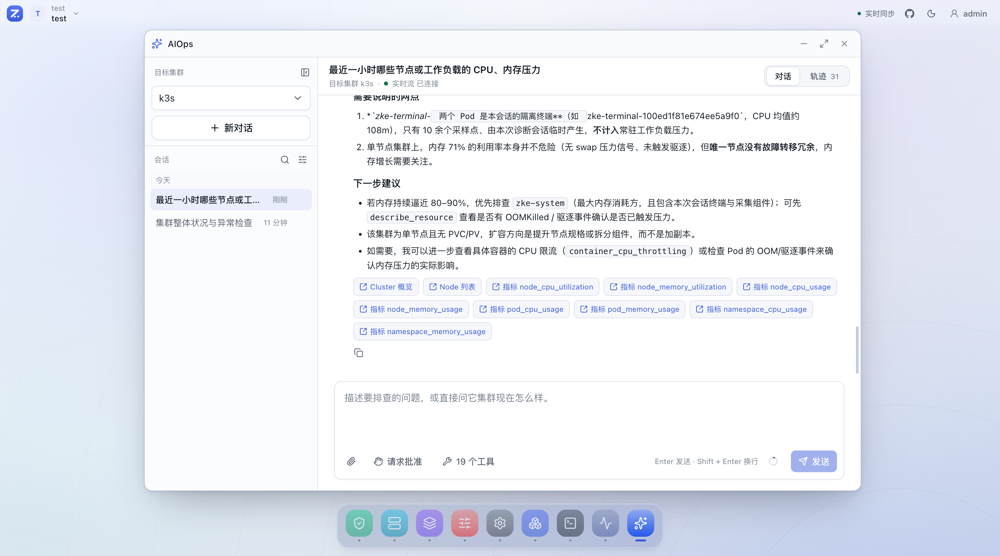
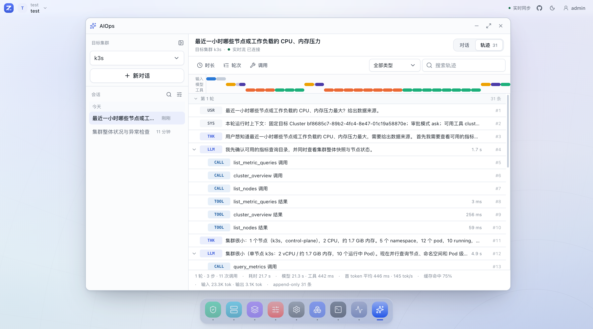
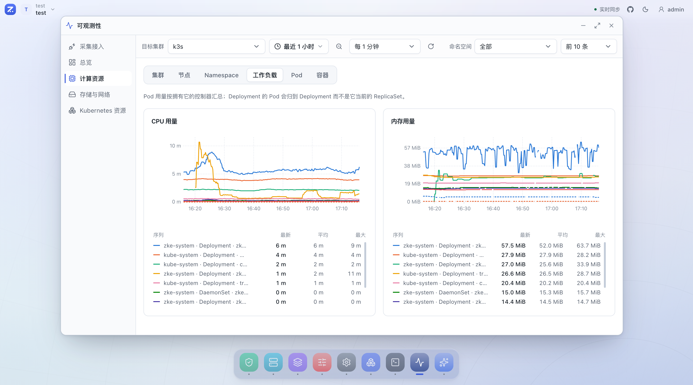

<div align="center">


# ZKE

**AI 原生的 Kubernetes 云操作环境**

[](https://github.com/togettoyou/zke/actions/workflows/ci.yml)
[](go.mod)
[](LICENSE)
[](https://github.com/togettoyou/zke/stargazers)

[在线体验](https://fbcupchhlacp.sealosbja.site/) · [部署指南](docs/deployment.md) · [完整文档](docs/README.md) · [Roadmap](docs/roadmap.md)

</div>

ZKE（Z Kubernetes Engine）是一个 AI 原生的 Kubernetes 云操作环境，把分散在数据中心、私有云、公有云和边缘的 Kubernetes 集群，收敛成一个可以直接操作的云环境：Agent 从每个集群主动向 Server 建立 QUIC/mTLS 出向连接，Console 用桌面、窗口和 Dock 组织能力，AIOps 作为常驻其中的运维 Agent，与人共用同一套权限、同一条通道和同一份审计。

ZKE Console 采用了一套运行在浏览器中的桌面式交互界面。集群接入管理、组织与资源、访问与审计、容器服务、Helm 应用、终端和 AIOps 都以独立应用存在。用户可以从桌面或 Dock 打开应用，在窗口之间切换、最小化、最大化，并保存自己的桌面布局和工作作用域。这种设计并不只是视觉模仿。多集群运维很少是一条从上到下的单页面流程。排查一个异常工作负载时，操作者可能同时需要资源详情、事件、Pod 日志和终端。多窗口让这些上下文保留在同一个工作空间中，最小化终端窗口也不会被当成关闭会话。

https://github.com/user-attachments/assets/f06f2229-48c2-4911-8e72-8cf60975d28f

> **在线体验：** <https://fbcupchhlacp.sealosbja.site/>
>
> 用户名 `view` / 密码 `LECQkqcp2tQ5Yh8`（只读账号，体验数据可能随时重置）

## 把多集群当成一台机器来用

| 操作系统里的概念 | ZKE 中对应的东西 |
| --- | --- |
| 硬件 | 你已有的 Kubernetes 集群，分布在数据中心、私有云、公有云和边缘 |
| 内核与驱动 | ZKE Server 加每个集群里的 Agent；Server 不直连任何集群的 Kubernetes API Server |
| 系统调用 | 携带明确 Cluster、Namespace 与资源身份的具名操作，逐次判权并写入审计 |
| 桌面与窗口 | Console 的窗口、Dock 与多应用并行工作区 |
| 应用 | 集群接入、组织与资源、容器服务、Helm 应用、终端、监控、访问与审计、平台配置、AIOps |
| Shell | Cluster Terminal 与 Pod 终端，按当前用户权限投影 Kubernetes RBAC |
| 用户与权限 | Tenant、Project、RBAC 三层作用域与细粒度操作权限 |
| 系统日志 | 审计事件，以及 AIOps 的 append-only 轨迹 |
| 常驻的操作者 | AIOps：模型自主工具循环、敏感操作审批、结论携带证据引用 |

> **全局观察，按集群执行。**

## AI 原生意味着什么

模型是这个环境里的一等操作者，用和人一样的通路做事：

- **共用一套权限。** 模型不持有 kubeconfig，也不直连 Kubernetes API Server；每次工具调用重新校验发起用户当时的
  RBAC，上限永远是发起人自己的权限，审批模式只决定谁来确认。
- **共用一条通路。** 每次读写都由会话固定 Cluster 的 Agent 定域执行，和你在桌面上点出来的是同一套判权与审计。
  工具目录由 Server 维护，模型不能安装或定义新工具。
- **先预演再提交。** 伸缩、回滚与 Manifest Apply/Delete 先做服务端 DryRun 并给出有界差异，提交只认预检返回的
  `preview_id`，批准后重验权限、重跑 DryRun，幂等键防重复写入。
- **每一步留痕。** 模型调用、工具参数与返回、授权判断、审批与压缩写入 append-only 轨迹，可筛选、回放和导出；
  结论里的每条证据都能在当前桌面打开对应窗口并定位到那个对象或那张图。
- **是 Dock 上的一个 App。** 关掉应用窗口任务会继续跑，重开从上次位置接着继续。

| AIOps 对话 | AIOps 轨迹 |
| --- | --- |
|  |  |

定时巡检与事件触发自动化仍在规划中，具体边界见 [AIOps](docs/features/ai-assistant.md)。

## 它解决什么问题

- **集群在内网，控制台进不去？** Agent 主动向 Server 外连 QUIC/mTLS，只需要一条出向通道，不必为控制台开放
  Kubernetes API Server 入口，适合具有独立网络边界的数据中心、私有云、混合云和边缘集群。
- **多集群视图容易点错对象？** 全局视图只负责观察，所有查询和操作都携带明确的 Cluster、Namespace 与资源身份，
  执行始终定域到目标集群。
- **在多个终端和面板之间反复切换？** 集群管理、容器服务、Helm 应用、终端、监控与 AIOps 以窗口和 Dock 组织，可以在同一
  个工作空间里并行打开。
- **不敢把变更权限放给一线，更不敢放给模型？** Tenant、Project 和 RBAC 限定范围，DryRun 差异、二次确认、幂等
  保护与审计日志覆盖敏感操作；模型走同一套约束。

## 产品一览

| 工作负载诊断 | 安全更新确认 |
| --- | --- |
|  |  |

| 多集群指标 | 集群终端 |
| --- | --- |
|  |  |

| Pod 实时日志 | Pod 临时访问 |
| --- | --- |
|  |  |

| 角色与细粒度权限 | 审计事件 |
| --- | --- |
|  |  |

## 快速开始

ZKE Server 是单个二进制，内置 Console 静态资源，依赖 PostgreSQL、一个持久目录，以及启用多集群指标时的
VictoriaMetrics。把三者打包在一起的 `zke-server-all` 镜像可以一条命令启动，无需任何前置准备：

```bash
docker run -d --name zke \
  -p 8080:8080 -p 8081:8081 -p 8443:8443/udp \
  -v zke-data:/data \
  -v zke-postgresql-data:/var/lib/postgresql/data \
  -v zke-metrics-data:/var/lib/victoria-metrics \
  ghcr.io/togettoyou/zke-server-all:latest
```

启动后打开 <http://127.0.0.1:8080>，Console 会引导设置第一个全局管理员的用户名和密码。

> **端口：** TCP `8080` 是 Console 与 API，TCP `8081` 是 Pod Access，UDP `8443` 接收 Agent 的 QUIC/mTLS 连接。
>
> **数据：** 请务必保留 `zke-data`，它保存 Server Managed PKI，丢失后已接入的 Agent 无法继续连接。
>
> **指标：** 指标默认启用，接入集群后在「监控 → 采集接入」中一键安装三个采集组件即可看到曲线。
> 用 `-e ZKE_OBSERVABILITY_METRICS_ENABLED=false` 关闭。
>
> **AIOps：** 在「平台配置 → AI 模型」中填写 OpenAI Responses 或 Chat Completions 兼容端点并启用，再把
> `ai.run` 授予需要的角色。未启用时桌面不显示 AIOps。

### 接入第一个集群

1. 在「组织与资源」中创建 Tenant 和 Project；
2. 在「集群接入管理」中创建接入凭证，填写凭证名称、选择接入端点并指定 Agent Namespace；
3. 复制生成的 `curl | kubectl apply` 命令，在目标集群执行，即可部署 ZKE Agent。

Agent 需要能访问 Server 的 HTTP 注册地址和 QUIC/UDP 地址。本机 Docker Desktop / OrbStack 集群可直接使用内置
端点预设；跨主机或跨网络接入时，先在「平台配置」中添加目标集群可达的接入端点。

Docker Compose、Helm 等其他部署方式，以及完整的配置、升级与备份说明见[部署指南](docs/deployment.md)。

## 当前能力

| 能力 | 已实现的主要链路 |
| --- | --- |
| 多集群接入 | 集群注册、Agent 状态、证书续期、撤销与重新接入 |
| 工作负载 | Deployment、StatefulSet、DaemonSet、Job、CronJob |
| 集群资源 | Node、Namespace、Pod、服务与路由、配置、存储、自动伸缩、策略 |
| 日常运维 | Pod 日志、Web Terminal、临时访问、事件追踪、资源用量 |
| 诊断与回滚 | 工作负载诊断、关联对象分析、版本回滚 |
| 原生资源 | Discovery、CRD 资源浏览、YAML 编辑、多文档清单应用与删除 |
| Helm 应用 | 平台级 Chart 仓库目录、Chart 检索、values 编辑、提交前渲染预览与差异、安装、升级、回滚与卸载（渲染与写入由目标集群的 Agent 用 Helm 引擎执行） |
| 多集群指标 | 集群内三组件一体采集、经 Agent 回传、六个维度的用量与利用率、申请与限制、CPU 限流、节点磁盘与网络、持久卷、容器状态原因、每集群摄取预算（默认启用）；预置面板之外可自己书写 MetricsQL 表达式，目标集群由 Server 强制注入每一个选择器 |
| 权限模型 | Tenant、Project、RBAC 与细粒度操作权限 |
| 安全与审计 | 敏感操作确认、DryRun 差异、并发身份保护、审计日志 |
| AIOps | 固定 Cluster 的自主取证（含预置与自定义 MetricsQL 查询）、变更时间线与变更后验证、受控资源写入与 Cluster Terminal 命令，Manifest DryRun/差异/Apply/Delete、工作负载伸缩与回滚、审批、轨迹和证据深链 |

各项能力的具体边界和已知限制以 [Roadmap](docs/roadmap.md) 与功能文档为准。

## 架构

每个接入集群部署一个 ZKE Agent。Agent 主动建立 QUIC/mTLS 长连接，ZKE Server 通过对应连接将查询和操作定域到目标集群。
多集群指标复用同一条出向连接：集群内 vmagent 抓取 kubelet、kube-state-metrics 与 node-exporter 后经 Agent
回传，Server 摄取时按连接身份写入 `zke_cluster_id` 再存入 VictoriaMetrics。三个采集组件由该集群的 Agent
一并安装与卸载。AIOps 不新增通道，模型请求的每次读写都落在同一条 Agent 连接上。日志采集与 VictoriaLogs 仍在
规划中，图中以虚线标注。


- [系统架构](docs/architecture/overview.md)
- [Server + Agent 架构](docs/architecture/server-agent.md)
- [Agent 注册与 QUIC/mTLS 连接](docs/architecture/agent-enrollment-and-connection.md)
- [资源作用域与权限模型](docs/architecture/resource-model.md)
- [AIOps 架构与运行时](docs/architecture/ai-phase-4.md)

## Roadmap

- **已实现：** 平台基础、集群接入、容器服务、Helm 应用、多集群指标，以及 AIOps 的自主工具循环、受控写操作与受控终端命令。
- **规划中：** 日志、告警、集群间资源对比，以及 AIOps 的定时巡检和事件触发自动化。

规划不代表发布时间或交付承诺。完整规划见 [Roadmap](docs/roadmap.md)；产品、架构、功能与安全设计统一收录在
[ZKE 文档导航](docs/README.md)。

## 参与贡献

欢迎通过 [Issues](https://github.com/togettoyou/zke/issues) 反馈问题和需求，
或直接提交 Pull Request。提交前请阅读 [ZKE 开发协作指南](AGENTS.md)。

如果 ZKE 对你有帮助，欢迎点一个 Star，这对项目很有意义。

## License

ZKE 基于 [Apache License 2.0](LICENSE) 开源。
