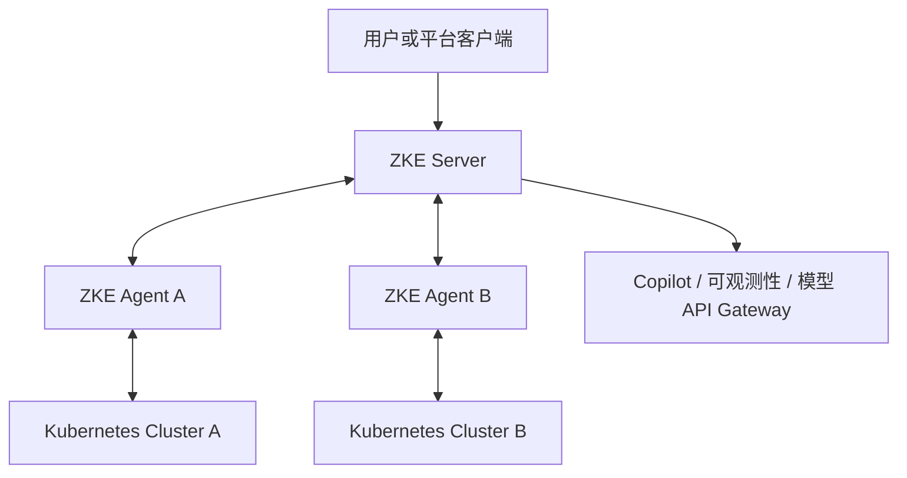

# ZKE

> **ZKE（Z Kubernetes Engine）— AI-native Kubernetes Management & Compute Platform**
>
> AI 原生 Kubernetes 管理与算力平台

ZKE 是一款构建在 Kubernetes 之上的云原生管理平台，面向多集群管理、容器服务、作业调度、AI 算力、模型服务、统一可观测性与 AI 辅助排障场景。

> [!IMPORTANT]
> ZKE 当前处于早期设计与开发阶段。部分模块尚未实现，产品范围与技术选型仍可能调整，当前版本不适用于生产环境。

## 核心能力

| 能力 | 产品目标 |
| --- | --- |
| 多集群管理 | 统一接入、分组、标记和查看多个 Kubernetes 集群及其 Agent 状态 |
| 容器服务 | 在选定集群中管理节点、Namespace、工作负载、网络、配置和存储资源 |
| 作业平台 | 面向批处理、AI 训练、分布式训练和 GPU 作业提供队列、配额与状态跟踪 |
| 算力平台 | 全局查看 CPU/GPU 资源，管理算力池、配额、模型服务和推理实例 |
| 统一模型 API | 通过 OpenAI-compatible API、API Key 和路由策略访问模型服务 |
| 可观测性 | 汇总多集群指标、日志和事件，提供查询、告警、仪表盘与资源对比 |
| ZKE Copilot | 在明确作用域内联合分析资源与遥测数据，输出证据、根因和修复建议 |
| 安全与审计 | 使用租户、项目和 RBAC 限定资源范围，记录用户与 AI 发起的敏感操作 |

以上均为产品规划，具体能力将随开发进度分阶段交付。

## 设计原则

- 以 Kubernetes 为统一基础设施底座，工作负载最终运行在具体 Kubernetes 集群中。
- 通过 Server + Agent 管理多集群，由 Agent 主动连接 Server。
- 全局查看资源，在明确的目标集群中执行操作。
- AI 提供分析证据和修复建议，执行前仍需权限检查与用户确认。
- 敏感操作必须验证权限、确认目标并记录审计日志。

> **全局观察，按集群执行；全局管理算力，按策略选择落点。**

[了解产品愿景与完整设计原则](docs/product/vision.md)

## 系统架构

ZKE 采用 Server + Agent 架构。每个接入的 Kubernetes 集群部署一个 ZKE Agent，由 Agent 主动连接 ZKE Server，不要求 Server 直接访问 Kubernetes API Server。

这一连接模型计划适用于私有网络、混合云、多云、边缘集群，以及无法由 Server 主动访问的 Kubernetes 集群。

- [系统架构](docs/architecture/overview.md)
- [Server + Agent 架构](docs/architecture/server-agent.md)
- [应用作用域与资源模型](docs/architecture/resource-model.md)
- [安全与权限](docs/security/authorization.md)

## 功能领域

| 领域 | 作用域 | 说明 | 详细文档 |
| --- | --- | --- | --- |
| 集群接入管理 | 多集群 | 以 Cluster 聚合接入状态、连接身份和诊断信息 | [查看](docs/features/agent-management.md) |
| 容器服务 | 单集群 | 管理当前集群的 Kubernetes 资源 | [查看](docs/features/container-service.md) |
| 作业平台 | 单集群为主 | 管理批处理、训练和 GPU 作业 | [查看](docs/features/job-platform.md) |
| 算力平台 | 多集群 | 统一管理算力、模型与 API 服务 | [查看](docs/features/compute-platform.md) |
| 可观测性平台 | 多集群 | 汇总指标、日志、事件与告警 | [查看](docs/features/observability.md) |
| ZKE Copilot | 多集群 | 在明确作用域内分析问题并提供受控操作建议 | [查看](docs/features/copilot.md) |

跨集群查询必须遵守租户、项目和 RBAC 权限边界。全局视图不代表全局操作权限。

## 适用场景

- 企业多 Kubernetes 集群统一管理
- 私有云和混合云 Kubernetes 管理
- GPU 集群和 AI 算力管理
- AI 训练与批处理作业
- 大语言模型推理服务
- Kubernetes 可观测性
- AI 辅助故障定位
- 受控的智能运维

## Roadmap

当前规划分为七个阶段：

1. 平台基础
2. 容器服务
3. 可观测性
4. 作业平台
5. 算力平台
6. 智能调度与多集群模型服务
7. ZKE Copilot

[查看完整 Roadmap](docs/roadmap.md)

## 文档

完整的产品、架构、功能与安全文档请查看 [ZKE 文档导航](docs/README.md)。
