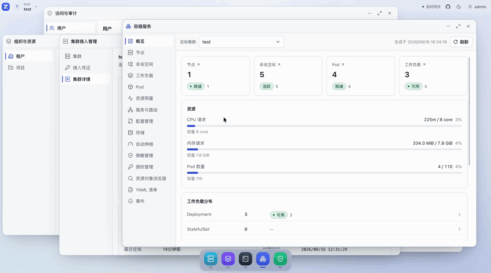
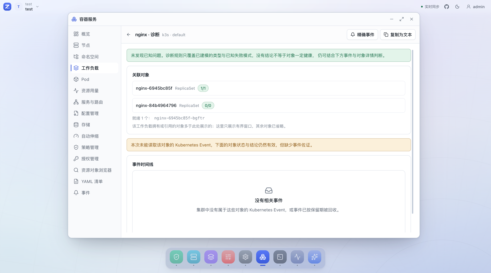
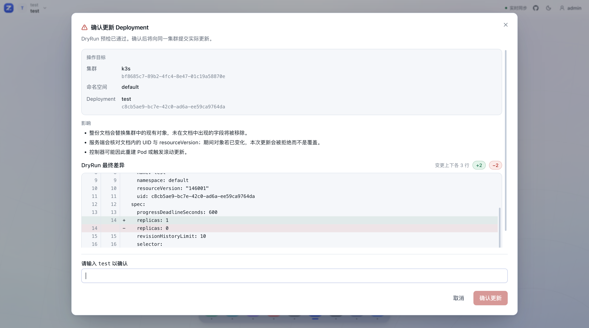
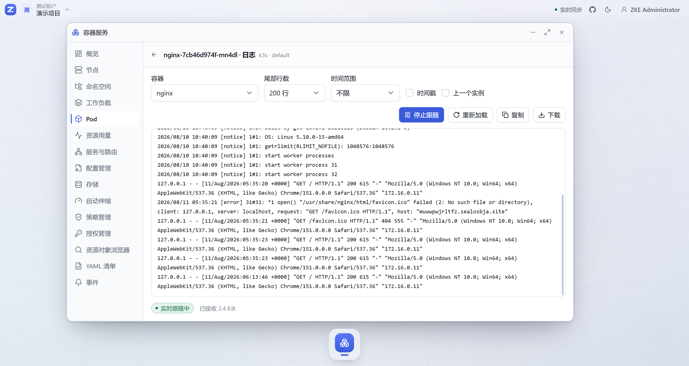
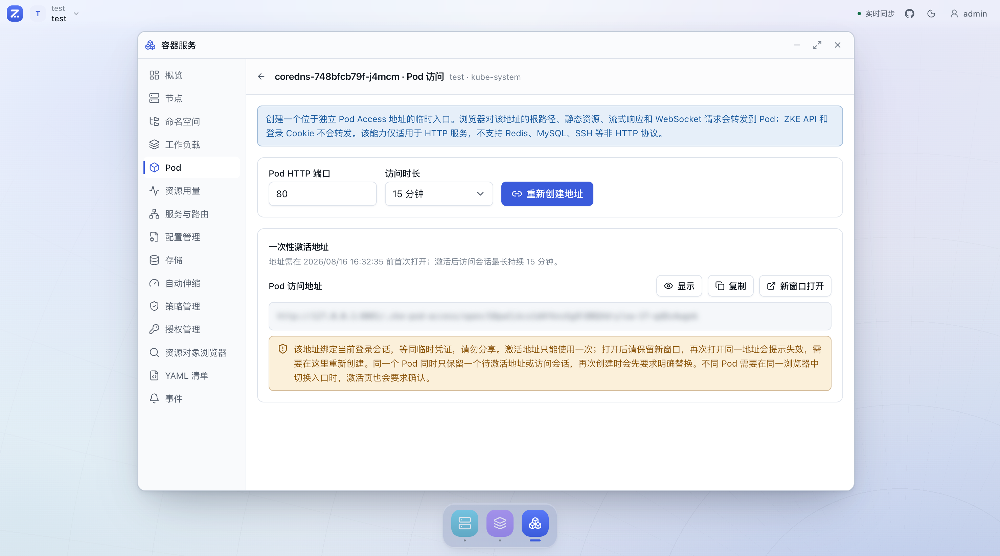
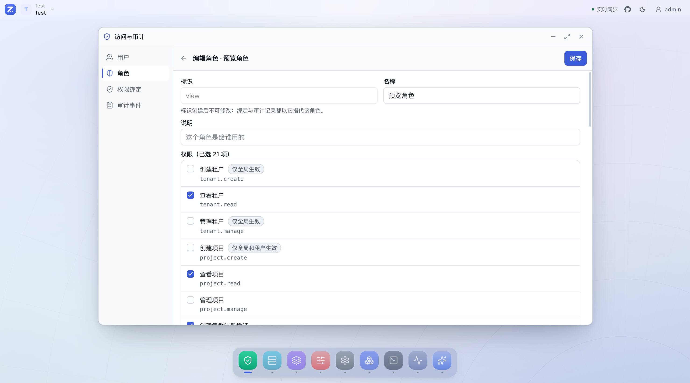
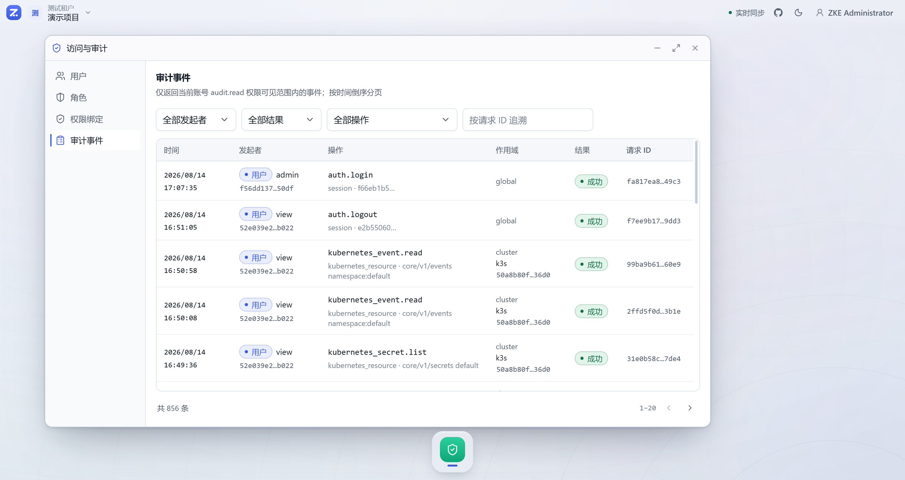
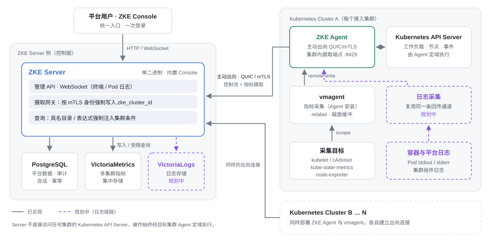

<div align="center">


# ZKE

**像使用桌面应用一样，管理 Kubernetes 多集群**

[](https://github.com/togettoyou/zke/actions/workflows/ci.yml)
[](go.mod)
[](LICENSE)
[](https://github.com/togettoyou/zke/stargazers)

[在线体验](https://fbcupchhlacp.sealosbja.site/) · [部署指南](docs/deployment.md) · [完整文档](docs/README.md) · [Roadmap](docs/roadmap.md)

</div>

ZKE（Z Kubernetes Engine）通过 Server + Agent 架构连接分散在数据中心、私有云、公有云和边缘环境中的
Kubernetes 集群。Agent 使用 QUIC/mTLS 主动连接 Server，ZKE Server 无需直接访问任何集群的 Kubernetes
API Server；平台团队可以在统一入口中管理资源与工作负载，并实施权限控制、安全操作和审计。



> **在线体验：** <https://fbcupchhlacp.sealosbja.site/>
>
> 用户名 `view` / 密码 `LECQkqcp2tQ5Yh8`（只读账号，体验数据可能随时重置）

## 为什么选择 ZKE

- **集群在内网，控制台进不去？** Agent 主动向 Server 外连 QUIC/mTLS，只需要一条出向通道，不必为控制台开放
  Kubernetes API Server 入口，适合具有独立网络边界的数据中心、私有云、混合云和边缘集群。
- **多集群视图容易点错对象？** 全局视图只负责观察，所有查询和操作都携带明确的 Cluster、Namespace 与资源身份，
  执行始终定域到目标集群。
- **在多个终端和面板之间反复切换？** 以窗口、Dock 和应用分区组织管理能力，集群管理、容器服务、终端与安全审计
  可以在同一个工作空间里并行打开。
- **不敢把变更权限放给一线？** Tenant、Project 和 RBAC 限定权限范围，DryRun 差异、二次确认、幂等保护与审计日志
  覆盖敏感操作。

> **全局观察，按集群执行。**

## 产品一览

| 工作负载诊断 | 安全更新确认 |
| --- | --- |
|  |  |

| Pod 实时日志 | Pod 临时访问 |
| --- | --- |
|  |  |

| 角色与细粒度权限 | 审计事件 |
| --- | --- |
|  |  |

## 快速开始

ZKE Server 是单个二进制，内置 Console 静态资源，依赖 PostgreSQL、一个持久目录，以及启用多集群指标时的
VictoriaMetrics。把三者打包在一起的 `zke-server-all` 镜像可以一条命令启动，无需任何前置准备：

```bash
docker run -d --name zke \
  -p 8080:8080 -p 8081:8081 -p 8443:8443/udp \
  -v zke-data:/data \
  -v zke-postgresql-data:/var/lib/postgresql/data \
  -v zke-metrics-data:/var/lib/victoria-metrics \
  ghcr.io/togettoyou/zke-server-all:latest
```

启动后打开 <http://127.0.0.1:8080>，Console 会引导设置第一个全局管理员的用户名和密码。

> **端口：** TCP `8080` 是 Console 与 API，TCP `8081` 是 Pod Access，UDP `8443` 接收 Agent 的 QUIC/mTLS 连接。
>
> **数据：** 请务必保留 `zke-data`，它保存 Server Managed PKI，丢失后已接入的 Agent 无法继续连接。
>
> **指标：** 指标默认启用，接入集群后在「可观测性 → 采集接入」中一键安装三个采集组件即可看到曲线。
> 用 `-e ZKE_OBSERVABILITY_METRICS_ENABLED=false` 关闭。

### 接入第一个集群

1. 在「组织与资源」中创建 Tenant 和 Project；
2. 在「集群接入管理」中创建接入凭证，填写凭证名称、选择接入端点并指定 Agent Namespace；
3. 复制生成的 `curl | kubectl apply` 命令，在目标集群执行，即可部署 ZKE Agent。

Agent 需要能访问 Server 的 HTTP 注册地址和 QUIC/UDP 地址。本机 Docker Desktop / OrbStack 集群可直接使用内置
端点预设；跨主机或跨网络接入时，先在「平台配置」中添加目标集群可达的接入端点。

Docker Compose、Helm 等其他部署方式，以及完整的配置、升级与备份说明见[部署指南](docs/deployment.md)。

## 当前能力

| 能力 | 已实现的主要链路 |
| --- | --- |
| 多集群接入 | 集群注册、Agent 状态、证书续期、撤销与重新接入 |
| 工作负载 | Deployment、StatefulSet、DaemonSet、Job、CronJob |
| 集群资源 | Node、Namespace、Pod、服务与路由、配置、存储、自动伸缩、策略 |
| 日常运维 | Pod 日志、Web Terminal、临时访问、事件追踪、资源用量 |
| 诊断与回滚 | 工作负载诊断、关联对象分析、版本回滚 |
| 原生资源 | Discovery、CRD 资源浏览、YAML 编辑、多文档清单应用与删除 |
| 多集群指标 | 集群内三组件一体采集、经 Agent 回传、六个维度的用量与利用率、申请与限制、CPU 限流、节点磁盘与网络、持久卷、容器状态原因、每集群摄取预算（默认启用） |
| 权限模型 | Tenant、Project、RBAC 与细粒度操作权限 |
| 安全与审计 | 敏感操作确认、DryRun 差异、并发身份保护、审计日志 |
| AIOps（开发预览） | 固定 Cluster 的自主取证与受控资源写入、Manifest DryRun/差异/Apply/Delete、工作负载伸缩与回滚、审批、轨迹和证据深链 |

各项能力的具体边界和已知限制以 [Roadmap](docs/roadmap.md) 与功能文档为准。

## 架构

每个接入集群部署一个 ZKE Agent。Agent 主动建立 QUIC/mTLS 长连接，ZKE Server 通过对应连接将查询和操作定域到目标集群。
多集群指标复用同一条出向连接：集群内 vmagent 抓取 kubelet、kube-state-metrics 与 node-exporter 后经 Agent
回传，Server 摄取时按连接身份写入 `zke_cluster_id` 再存入 VictoriaMetrics。三个采集组件由该集群的 Agent
一并安装与卸载。日志采集与 VictoriaLogs 仍在规划中，图中以虚线标注。



- [系统架构](docs/architecture/overview.md)
- [Server + Agent 架构](docs/architecture/server-agent.md)
- [Agent 注册与 QUIC/mTLS 连接](docs/architecture/agent-enrollment-and-connection.md)
- [资源作用域与权限模型](docs/architecture/resource-model.md)

## Roadmap

- **已实现主要链路：** 平台基础、集群接入、容器服务，以及多集群指标的采集、摄取、查询与可视化。
- **规划中：** 可观测性的其余部分，包括日志、告警与集群间资源对比。
- **开发预览：** AIOps 已提供跟随桌面 Tenant/Project、按 Cluster 隔离的会话，以及模型自主工具循环、敏感工具审批、
  流式输出、可重建长上下文压缩与完整轨迹；资源写入已支持工作负载伸缩与回滚，以及多文档 Manifest 的 DryRun、
  有界差异、Apply 和 Delete。受控 Cluster Terminal 仍在规划中。

规划不代表发布时间或交付承诺。完整规划见 [Roadmap](docs/roadmap.md)；产品、架构、功能与安全设计统一收录在
[ZKE 文档导航](docs/README.md)。

## 参与贡献

ZKE 仍在快速开发中，欢迎通过 [Issues](https://github.com/togettoyou/zke/issues) 反馈问题和需求，
或直接提交 Pull Request。提交前请阅读 [ZKE 开发协作指南](AGENTS.md)。

如果 ZKE 对你有帮助，欢迎点一个 Star，这对项目很有意义。

## License

ZKE 基于 [Apache License 2.0](LICENSE) 开源。
