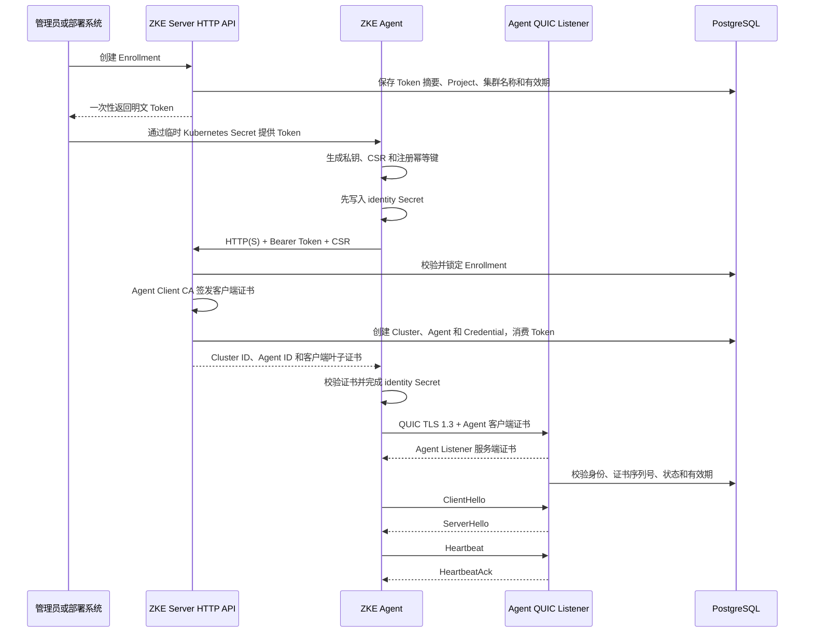

# Agent 注册与连接

本文说明当前 ZKE Agent 从首次注册到建立 QUIC/mTLS 长连接的完整流程、相关凭据和证书的职责，以及各步骤的必要性。
内容以仓库现有实现为准；Phase 2 业务 Stream 传输内核及 Node List/Detail 的 Kubernetes Resource Handler
已经实现，容器服务 Web 界面和 Helm Chart 尚未实现。

## 1. 总体模型

管理面把 Kubernetes Cluster 与其中的 ZKE Agent 视为一个共同体，只暴露稳定的 Cluster 资源。下文中的 Agent ID
是证书、连接和 Credential 使用的内部身份，不是独立的管理 API 资源。首次接入创建 Cluster 和内部 Agent 身份；
重新接入保持 Cluster ID 不变并替换内部身份。

同一个 Agent 进程使用两个独立端点：

- `registration.server_url`：一次性 HTTP(S) 注册端点；
- `connection.server_address`：长期 QUIC/mTLS 连接端点。

首次安装且身份 Secret 不完整时，Agent 先注册并取得客户端证书，再建立 QUIC/mTLS 连接。后续重启会直接读取身份
Secret 并连接 QUIC Listener，不再访问注册接口。



HTTP 注册和 QUIC 长连接分离是当前明确设计。注册属于尚未建立长期身份时的短请求，使用一次性 Token；长连接属于
已建立身份后的持续通信，使用 mTLS。二者在认证方式、限流、网络协议和生命周期上不同。

## 2. 凭据与证书职责

### 2.1 Server Managed Agent mTLS PKI

`agent_pki.mode: managed` 时，Server 首次启动会在配置目录生成以下六个文件。该目录在部署中必须挂载到受保护的
持久卷：

| 文件 | 运行时使用者 | 作用 | 生命周期 |
| --- | --- | --- | --- |
| `agent-client-ca.crt` | ZKE Server | 验证 Agent 客户端证书 | 默认 10 年；CA 到期前人工规划轮换 |
| `agent-client-ca.key` | ZKE Server | 注册和续期时签发 Agent 客户端证书 | 高敏感；CA 轮换时更换 |
| `agent-listener-ca.crt` | ZKE Agent | 验证 QUIC Listener 的服务端证书 | 默认 20 年；CA 到期前人工规划轮换 |
| `agent-listener-ca.key` | ZKE Server | 自动签发或续期 Agent Listener 证书 | 高敏感；Managed 模式保存在 PV |
| `agent-listener.crt` | ZKE Server | QUIC Listener 向 Agent 证明服务端身份 | 默认 10 年；启动时进入续期窗口会自动续期 |
| `agent-listener.key` | ZKE Server | QUIC Listener TLS 私钥 | Listener 续期时复用 |

两条 CA 信任链在密码学上可以合并，但不建议这样做：

- Agent Client CA 私钥需要由当前 Server 在线加载以签发客户端证书；
- Agent Listener CA 私钥只用于签发 Listener 证书；Managed 模式为了启动时自动续期而在线保存在受保护 PV；
- 两者泄露后的影响范围和轮换节奏不同。

Managed 模式以 PostgreSQL advisory lock 串行化多实例初始化，并在数据库保存三张证书的 SHA-256 指纹与过期
时间。只在“数据库没有 PKI/已注册 Agent 安全状态且目录完全为空”时生成 CA；目录只有部分文件会拒绝启动；
数据库已有状态但 PV 文件丢失时也会拒绝启动，绝不静默生成新的信任根。文件完整但数据库无 PKI 状态时允许
导入并登记，便于现有开发 PKI 迁移。私钥权限为 `0600`，目录为 `0700`。

默认 Agent Client CA 为 10 年，Agent Listener CA 为 20 年，Agent Listener 服务端证书为 10 年。Listener
CA 比叶子证书更长，避免叶子证书声明的有效期晚于签发 CA。Listener 叶子证书可自动续期，但两张 CA 不会自动
轮换；CA 轮换需要明确的双信任窗口和运维方案。

`agent_pki.mode: external` 仍支持由外部系统提供 Agent Client CA、Listener 身份和 Listener CA。Managed
模式以自动化换取 Listener CA 私钥在线这一安全代价；需要离线 CA、KMS 或 HSM 时应改用 external 模式。

external 模式的文件集中配置，不再散落到 Enrollment、Listener 或安装配置中：

```yaml
agent_pki:
  mode: external
  agent_client_certificate_validity: 720h
  external:
    agent_client_ca:
      certificate_file: /var/run/secrets/zke-agent-pki/agent-client-ca.crt
      private_key_file: /var/run/secrets/zke-agent-pki/agent-client-ca.key
    agent_listener_ca:
      certificate_file: /var/run/secrets/zke-agent-pki/agent-listener-ca.crt
    agent_listener:
      certificate_file: /var/run/secrets/zke-agent-pki/agent-listener.crt
      private_key_file: /var/run/secrets/zke-agent-pki/agent-listener.key
```

`agent-listener-ca.key` 不在 external 配置中，因为它只应由外部签发环境持有，Server 不加载。

### 2.2 Agent identity Secret

每个 Agent 在自己的 Kubernetes 集群中维护一个长期身份 Secret，默认名称为
`zke-system/zke-agent-identity`：

| Secret Key | 内容 | 使用阶段 |
| --- | --- | --- |
| `tls.key` | Agent 本地生成的 ECDSA P-256 私钥 | 注册 CSR、每次 QUIC/mTLS 握手 |
| `tls.crt` | Agent 客户端叶子证书 | 每次 QUIC/mTLS 握手 |
| `cluster-id` | Server 分配的 Cluster ID | `ClientHello` 和作用域校验 |
| `agent-id` | Server 分配的 Agent ID | `ClientHello` 和作用域校验 |
| `certificate-expires-at` | 客户端证书过期时间 | Agent 启动校验 |
| `enrollment.csr` | 待注册 CSR | 仅注册未完成时存在 |
| `enrollment.idempotency-key` | Agent 注册幂等键 | 仅注册未完成时存在 |
| `certificate.renewal.csr` | 待续期 CSR | 仅续期未完成时存在，用于重试恢复 |

注册成功后会删除 CSR 和注册幂等键，但保留私钥、证书和身份元数据。Agent 私钥从不发送给 Server。

identity Secret 是 QUIC/mTLS 客户端身份，不是注册 Token Secret，也不包含 QUIC Listener 的服务端证书。获得
其中 `tls.key` 和 `tls.crt` 的主体可以在证书过期或被撤销前冒充对应 Agent，因此生产环境必须使用最小 RBAC、
etcd Encryption at Rest 或 KMS，并避免在日志和诊断信息中暴露 Secret 内容。

### 2.3 临时注册 Token

Enrollment Token 是 Agent 尚未取得客户端证书时使用的引导凭据：

- Server 生成 32 字节随机值并以 Base64URL 表示；
- 明文只在创建 Enrollment 的响应中返回一次；
- PostgreSQL 只保存 SHA-256 摘要；
- 当前有效期为 15 分钟；
- Token 与 Tenant、Project 和集群名称间接绑定；
- 成功注册后被消费，不能创建第二个并行有效连接身份。

部署系统应把 Token 写入独立的 Kubernetes Secret。Agent 通过 client-go 读取固定名称
`zke-agent-enrollment` 的 `token` Key，不把 Token 写入 YAML 或宿主机文件。Agent 完成身份后不会再读取
Token，Server 也已经单次消费该 Token，因此 Secret 可以保留以简化 Pod 重建；它仍属于敏感引导数据，应限制
读取权限，并可由外部 Secret 生命周期策略按需清理。

## 3. Enrollment 创建

管理员或部署系统调用：

```text
POST /api/v1/projects/{project_id}/cluster-enrollments
```

当前接口要求：

- 已认证 Session；
- CSRF Token；
- `cluster.enrollment.create` Project 权限；
- 集群显示名称；
- 调用方提供的 `Idempotency-Key`。

Server 校验权限后生成一次性 Token，保存 Token 摘要、Project、集群名称、创建者、有效期和审计记录。创建
Enrollment 的幂等键用于防止调用方因网络重试而生成多个 Token。

这一阶段的必要性如下：

| 步骤 | 判断 | 原因 |
| --- | --- | --- |
| 身份认证和 Project RBAC | 必需 | 决定谁可以把集群接入哪个作用域 |
| 一次性引导凭据 | 当前架构必需 | Agent 尚无客户端证书，需要初始信任 |
| 短有效期和单次消费 | 必需 | 降低 Token 泄露后的可利用窗口 |
| 创建请求幂等 | 强烈建议 | 防止重试生成重复 Enrollment |
| Kubernetes Secret 交付 | 可替换实现 | 必须有安全交付通道，当前由 client-go 定域读取 |

### 3.1 一键安装 Manifest

启用 `agent_install` 后，管理员可以调用：

```text
POST /api/v1/projects/{project_id}/cluster-installations
```

认证、CSRF、Project RBAC、请求幂等和 15 分钟 Token 规则与 Enrollment 创建相同。响应不要求管理员手写 Secret
或 Deployment，而是返回：

```bash
curl -fsSL -H 'Authorization: Bearer <Enrollment Token>' \
  'https://zke.example.com/agent-install/v1/manifest' | kubectl apply -f -
```

Manifest 下载端点是 `GET /agent-install/v1/manifest`。Token 放在 Authorization Header 而不是 URL，避免进入
常见的 URL、访问日志和代理查询参数记录；端点只接受仍未消费、未撤销、未过期且作用域有效的 Enrollment。

生成资源包括 Namespace、Enrollment Secret、包含 Listener CA（以及可选 Registration CA）的 Trust Secret、
Agent ConfigMap、ServiceAccount、最小 Role/RoleBinding、Node、Namespace、Pod、Pod Logs、Kubernetes Event 与工作负载管理
ClusterRole/ClusterRoleBinding 和单副本
Deployment。不会创建 Kubernetes Service，
因为 Agent 只主动出站连接；不会创建 PVC，因为长期身份由 `zke-agent-identity` Secret 持久化；也不会预创建
或 `apply` 该 identity Secret，避免覆盖 Agent 已签发的身份。Enrollment Secret 默认保留；Agent 通过
Kubernetes API 读取 Enrollment/Trust Secret，Deployment 不挂载这两个 Secret。

该默认 ClusterRole 满足 Node、Namespace、Pod、五类工作负载、Pod Logs 和 Kubernetes Event 当前后端能力。
其中 Node、Namespace 和 Pod 的 `update` 用于完整 YAML 管理，Pod Logs 只增加 `pods/log` 的 `get`，Pod Exec
只增加 `pods/exec` 的 `create`，Event 只增加 `events` 的 `get/list/watch`，不授予 Eviction。Agent 的通用
Discovery/CRUD 能力不会自动扩大其他 Kubernetes 权限；需要读取或变更更多内置资源、CRD 或 CR 时，安装方
必须为同一 ServiceAccount 增加明确的最小 RBAC。
不得为了使用通用接口直接绑定 `cluster-admin`。

在 YAML 管理上线前使用旧清单接入的集群不会自动获得新增权限；管理员需要把同一 ClusterRole 中 Node、
Namespace 和 Pod 的规则更新为包含 `update`，无需扩大到通配资源或绑定 `cluster-admin`。

## 4. Agent 首次注册

### 4.1 初始化待注册身份

Agent 启动后读取 identity Secret：

1. 完整且有效的身份存在时直接进入 QUIC 连接；
2. Secret 不存在或为空时，在本地生成私钥、CSR 和随机注册幂等键；
3. 在发出网络请求前，把三者写入 identity Secret；
4. Secret 处于部分或冲突状态、证书与私钥不匹配、证书过期时拒绝继续。

先持久化再请求是必要的可靠性措施。如果 Server 已完成签发但响应丢失，Agent 重启后仍能复用同一私钥、CSR 和
幂等键恢复结果，而不会消耗 Token 后再生成另一套身份。

### 4.2 注册请求

Agent 调用：

```text
POST /agent-api/v1/enroll
Authorization: Bearer <Enrollment Token>
Idempotency-Key: <Agent 注册幂等键>
Content-Type: application/json

{
  "csr_pem": "-----BEGIN CERTIFICATE REQUEST-----\n...",
  "agent_version": "...",
  "protocol_version": "v1"
}
```

这里存在两个不同的幂等键：

1. 创建 Enrollment 时由管理员客户端提供的幂等键，用于防止重复创建 Token；
2. Agent 生成并写入 identity Secret 的注册幂等键，用于把同一个 CSR 的注册重试绑定到同一结果。

Agent 对网络错误、超时、`429`、`5xx` 和部分响应读取失败使用有上限的指数退避与随机抖动重试，并始终复用同一
CSR 和注册幂等键。HTTP 客户端禁止自动跟随 Redirect，避免 Bearer Token 被带到其他地址。

### 4.3 Server 校验与签发

Server 依次执行：

1. 按来源限流并限制请求体大小；
2. 解析 Bearer Token，计算 SHA-256 摘要；
3. 在数据库事务中锁定对应 Enrollment；
4. 检查 Tenant、Project、Token 有效期、撤销和消费状态；
5. 校验 CSR 签名并计算 CSR 指纹；
6. 将 Agent 注册幂等键与 CSR 指纹绑定；
7. 生成 Cluster ID 和 Agent ID；
8. 使用 Agent Client CA 签发客户端证书；
9. 原子创建 pending Cluster、pending Agent 和 Credential；
10. 保存证书序列号、CSR 指纹、证书和过期时间；
11. 消费 Token，保存可重放响应并写入审计。

相同 Token、幂等键和 CSR 可以恢复已有结果；同一幂等键换用其他 CSR 会被拒绝。

签发的客户端证书包含：

- `KeyUsage: DigitalSignature`；
- `ExtendedKeyUsage: ClientAuth`；
- CN 为 Agent ID；
- URI SAN：

```text
zke://agent/tenants/{tenant_id}/projects/{project_id}/clusters/{cluster_id}/agents/{agent_id}
```

默认有效期为 30 天，并且不会超过 Agent Client CA 的有效期。把 Tenant、Project、Cluster 和 Agent 作用域写入
证书，使 Server 可以从经过 CA 签名的身份中确定连接边界。

### 4.4 Agent 完成身份

Agent 收到注册结果后检查：

- 客户端证书 PEM 格式；为兼容旧身份 Secret，也会验证其中可能存在的历史附加证书；
- 证书是否处于有效期；
- 返回的过期时间是否与证书一致；
- 证书公钥是否与本地私钥匹配；
- 是否允许 ClientAuth；
- CN 是否等于 Agent ID；
- URI SAN 中的 Cluster ID、Agent ID 和作用域格式是否正确。

验证成功后，Agent 原子更新 identity Secret，删除待注册 CSR 和注册幂等键。首次成功响应为 `201`，幂等恢复
响应为 `200`。

## 5. HTTP TLS

注册阶段的 Agent 尚无客户端证书，因此使用 Bearer Token 而不是 mTLS。生产环境必须使用 HTTPS，但 TLS 可以由
ZKE Server 原生终止，也可以由上游网关终止。

### 5.1 Server 原生 HTTPS

```yaml
http:
  address: 0.0.0.0:8080
  tls:
    certificate_file: /var/run/secrets/zke-http/tls.crt
    private_key_file: /var/run/secrets/zke-http/tls.key

auth:
  cookie_secure: true
```

Agent 使用公有 CA 时只需要 HTTPS URL；使用私有 CA 时额外配置：

```yaml
registration:
  server_url: https://zke.example.com:8080
  ca_certificate_file: /path/to/registration-ca.crt
```

### 5.2 网关终止 HTTPS

```text
Agent -> HTTPS Gateway -> ZKE Server HTTP Listener
```

此时 Server 可以省略 `http.tls`，Agent 验证的是网关证书。私有网关 CA 配置在
`registration.ca_certificate_file`，公有 CA 时省略。只要浏览器通过 HTTPS 访问，无论 TLS 在哪里终止，
`auth.cookie_secure` 都必须设为 `true`。

Server 原生 HTTP TLS 是可选的，但生产注册链路上的 HTTPS 不是可选的。仓库只允许回环地址使用明文 HTTP；包含
Token 的明文注册请求不得进入不可信网络。

HTTP TLS 身份与 Agent Listener TLS 身份相互独立，不建议复用证书、私钥或 CA。Server 的 Managed Agent PKI
只生成 Agent Client CA、Agent Listener CA 和 Listener 身份，不生成 HTTP TLS 证书。

## 6. QUIC/mTLS 连接

### 6.1 TLS 1.3 双向认证

Agent 从 identity Secret 加载 `tls.crt` 和 `tls.key`，默认从 `zke-agent-trust` Secret 的
`agent-listener-ca.crt` Key 加载 Agent Listener 专用信任根，然后主动连接
`connection.server_address`。特殊部署可用 `connection.ca_certificate_file` 覆盖。该 TLS 配置使用独立的
新证书池，不加入操作系统根证书，因此只信任专用 Listener CA。

QUIC Listener：

- 使用 `agent-listener.crt` 和 `agent-listener.key` 提供服务端身份；
- 使用 `agent-client-ca.crt` 验证 Agent 客户端证书；
- 要求 TLS 1.3 和 ZKE Agent ALPN；
- 要求并验证客户端证书；
- 禁止 0-RTT。

mTLS 两个方向的信任关系为：

```text
Agent 验证 Server：
agent-listener.crt
    <- Trust Secret 的 agent-listener-ca.crt / connection.ca_certificate_file

Server 验证 Agent：
identity Secret 中的 tls.crt
    <- agent-client-ca.crt

Agent 证明持有身份：
identity Secret 中的 tls.key
```

### 6.2 证书身份和数据库状态

TLS 验证成功后，Server 从 Agent 客户端证书中提取 Tenant ID、Project ID、Cluster ID、Agent ID 和证书序列号，
然后查询 PostgreSQL 检查：

- Cluster 和 Agent 是否存在且未撤销；
- Credential 序列号是否与连接证书一致；
- Credential 是否未撤销；
- Credential 是否未过期。

CA 验证与数据库检查不能互相替代。CA 只能证明证书曾经合法签发，数据库检查用于执行当前撤销、过期和资源状态。

### 6.3 应用层握手

mTLS 建立后，Agent 打开 Control Stream 并发送 `ClientHello`，包含：

- 协议版本；
- Agent ID；
- Cluster ID；
- Agent 版本；
- 本次进程启动生成的 Startup ID；
- Capabilities。

Server 将 ClientHello 中的 Cluster ID、Agent ID 与证书身份交叉校验，通过后激活 Cluster 和 Agent，并返回
`ServerHello`：

- Connection ID；
- Server 时间；
- 心跳间隔；
- 心跳超时；
- Server Capabilities。

ClientHello 重复携带部分证书身份不是密码学必需，但可以防止应用层错误绑定，成本很低，应保留。

同一个 Agent 同时只保留一条主连接。新连接建立后，Server 向旧连接发送 `GoAway(connection_replaced)` 并关闭
旧连接，避免任务发送到已经失效的 Agent 进程。

### 6.4 心跳与重连

Agent 按 Server 指定的间隔发送带递增序号、发送时间和健康状态的 Heartbeat；Server 返回相同序号的
`HeartbeatAck`。Server 在内存中即时更新连接状态，并按 `last_seen_write_interval` 限频持久化
`last_seen_at`，避免每次心跳都写 PostgreSQL。

连接断开后，网络类错误使用有上限的指数退避与抖动重连；证书、身份和协议错误视为永久错误，不进行无限重试。
正常退出时 Agent 尝试发送 `ClientGoodbye`。

### 6.5 客户端证书自动续期

Agent 默认在证书剩余有效期进入 `identity.renew_before` 窗口时续期，当前示例配置为 `168h`。续期复用已经建立
的 QUIC/mTLS Control Stream，不重新使用 Enrollment Token：

1. Agent 和 Server 通过 Hello Capabilities 确认双方支持 `certificate-renewal-v1`；
2. Agent 使用 identity Secret 中的现有私钥生成 CSR，并先把 CSR 写入
   `certificate.renewal.csr`；
3. Agent 在已认证的 Control Stream 发送 `CertificateRenewalRequest`；
4. Server 再次校验当前连接的证书身份、数据库 Credential 状态和 CSR 签名；
5. Server 以 CSR 指纹作为续期幂等键，签发新的客户端叶子证书并创建新 Credential；
6. Agent 校验证书、作用域、公钥和过期时间，原子更新 `tls.crt` 与
   `certificate-expires-at`，删除待续期 CSR；
7. Agent 立即重连；新证书首次成功连接后，Server 激活它并撤销同一 Agent 的旧 Credential。

旧 Credential 会保留到新证书成功建立连接，避免续期响应丢失导致 Agent 立即失去可用身份。若响应丢失，Agent
重启后会复用持久化的 CSR，Server 返回同一续期结果。续期复用现有私钥，因此当前是证书轮换而不是密钥轮换。

续期必须在旧证书仍然有效且 Agent 可以连接 Server 时完成。如果 Agent 离线直到证书过期，mTLS 会在续期请求前
失败，当前仍需清理或修复 identity Secret 并重新执行 Enrollment。

### 6.6 撤销和连接关闭

Credential 或 Agent 身份被撤销时，数据库触发器通过 PostgreSQL `NOTIFY` 广播撤销事件。每个 Server 实例
监听该事件，匹配当前内存中的 Agent 会话，发送 `GoAway(credential_revoked)` 或
`GoAway(agent_revoked)`，并用认证错误关闭 QUIC 连接；后续重连仍会经过数据库状态校验并被拒绝。

Tenant、Project 或 Cluster 停用使用同一通知通道匹配并关闭作用域内现有连接，但发送可恢复的
`GoAway(scope_suspended)`，不撤销 Agent 身份或 Credential。Agent 保持退避重连，作用域恢复后可用原身份
重新建立连接。

管理端将 Cluster 与 Agent 视为一个聚合资源，不暴露内部 Agent ID。当前连接通过
`POST /api/v1/clusters/{cluster_id}/connection/revoke` 撤销，请求必须通过 Session、CSRF 和
`cluster.connection.revoke` 权限检查，并提交 `{"confirm":true}` 显式确认。Server 在同一数据库事务中把当前
内部 Agent 身份置为 `revoked`、撤销全部 Credential 并写入成功审计。接口具有状态幂等性，重复调用返回 `200`
和首次撤销时间，同时以 `already_revoked` 标识没有发生新的状态变化。

连接撤销后，管理端可调用 `POST /api/v1/clusters/{cluster_id}/connection/reenroll` 创建重新接入凭证。该凭证
绑定现有 Cluster；消费时保留原 `cluster_id`、创建新的内部 Agent 身份并保留历史身份。连接尚未撤销或 Cluster
已停用时，重新接入返回状态冲突；已删除时目标不存在。

Server 也会按当前客户端证书的 `NotAfter` 安排连接关闭，避免一条在证书有效期内建立的长连接越过证书到期时间
后继续存活。PostgreSQL 通知用于多 Server 实例间传播，不依赖撤销请求落到持有连接的同一实例。

## 7. 为什么不在 8443 上完成首次注册

技术上可以允许无客户端证书的 Agent 先建立只有服务端认证的 QUIC 连接，在 Stream 中提交 Token 和 CSR，获得
证书后再重新连接同一个端口。但不建议当前采用：

- 现有 8443 在 TLS 握手阶段拒绝无有效客户端证书的连接，安全边界清晰；
- 支持注册后必须允许未认证客户端完成 QUIC 握手，会扩大 UDP DoS 和协议解析攻击面；
- HTTP 的请求大小限制、网关、WAF、限流和审计能力需要在 QUIC 协议中重新实现；
- QUIC/TLS 1.3 连接不能在运行中升级为带客户端证书的 mTLS，签发完成后仍必须重连；
- 注册只在 identity Secret 不完整时发生，对稳态连接性能没有影响。

如果部署环境要求统一外部端口号，可以在入口层同时开放：

```text
443/TCP -> HTTPS Gateway -> Server 内部 HTTP 端口
443/UDP -> QUIC LB/Gateway -> Server 内部 Agent Listener 端口
```

两条链路仍是独立的 TCP 和 UDP Listener，只是复用外部数字端口。当前仓库继续使用独立的
`http.address` 和 `agent_listener.address`。

## 8. 必要性总结

应保留的核心步骤：

- 由已认证、已授权的用户在明确 Project 下创建 Enrollment；
- 使用短期、一次性 Token 建立初始信任；
- Agent 本地生成并持有私钥，Server 只接收 CSR；
- 发起注册前持久化私钥、CSR 和幂等键；
- 原子创建 Cluster、Agent、Credential 并消费 Token；
- Agent Client CA 与 Agent Listener CA 分离；
- QUIC/mTLS 后继续校验证书序列号和数据库撤销状态；
- 在旧证书有效期内通过已认证 Control Stream 续期，并持久化 CSR 保证重试幂等；
- 新证书成功连接后撤销旧 Credential；
- 撤销或自然过期后及时关闭已建立连接；
- 证书身份与 ClientHello 身份交叉校验；
- identity Secret 跨 Pod 重建持久化 Agent 身份；
- HTTP 注册与 QUIC 长连接使用独立端点。

可以替换但不能直接删除的实现：

- Token 的具体交付机制；
- Kubernetes Secret 这一身份持久化介质；
- HTTPS 在 Server 还是网关终止；
- 证书身份 URI 的具体编码格式；
- 心跳和持久化的具体时间参数。

不建议通过复用 CA、服务端证书或私钥来减少文件数量。这样会扩大密钥泄露影响范围，并使不同生命周期的证书难以
独立轮换。

## 9. 当前缺口和后续改进

1. **Helm 与升级管理**：当前由 Server 动态生成基础 Kubernetes Manifest，尚无 Helm Chart、镜像升级和版本
   兼容编排。
2. **在线 CA 私钥保护**：Managed 模式把两个 CA 私钥保存在 Server PV；需要更强隔离时应使用 external 模式接入
   受控的离线流程、KMS 或 HSM。项目不强制引入独立签发服务。
3. **过期后的自动恢复**：正常续期已实现，但 Agent 离线至证书过期后仍需通过 Cluster 重新接入流程恢复。
4. **CA 无中断轮换**：当前连接 CA 使用单一专用信任根，双信任窗口和 Listener/Client CA 自动轮换尚未实现。
5. **Web 界面**：`GET /api/v1/projects/{project_id}/clusters` 已在 `connection` 中返回当前凭据序列号、过期
   时间、剩余秒数以及 `valid`、`expiring`、`expired`、`revoked` 状态，并以首次成功连接记录的 active serial
   解决续期重叠期选择；Web 展示尚未实现。Server 还会周期扫描并输出结构化到期告警。
