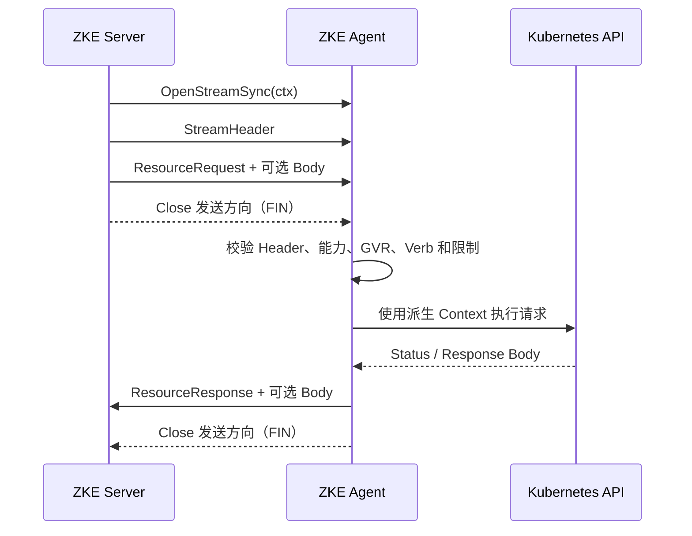

# Phase 2 Server–Agent 协议设计

本文定义 ZKE Phase 2 容器服务使用的 Server–Agent 业务协议，包括 QUIC Stream 模型、通用 Kubernetes
资源请求、取消语义、并发与背压、安全边界以及分阶段交付要求。

> 本文是 Phase 2 的设计基线。当前代码已经实现版本化 Stream/Resource Protobuf、通用有界分帧、双方
> accept 循环、Resource Stream 往返、能力协商、原生 Stream reset 取消和并发限制，并已接入 Node
> List/Detail 以及受控通用 Discovery/List/Get 的 Kubernetes dynamic client、Server HTTP API 和真实 QUIC
> 闭环；通用主资源 Create/Update/Patch/Delete、DryRun、写能力协商、幂等重放、响应内存预算和真实集群 E2E
> 已实现。类型化 Namespace CRUD 及 Console 集群选择、预检和确认闭环也已完成。
> Watch、Pod Logs、Pod Exec 和 Subresource 仍待后续阶段实现。

Agent 注册、证书和 Control Stream 的现有流程参见
[Agent 注册与连接](agent-enrollment-and-connection.md)。系统级技术约束参见
[技术基础设计](technical-foundation.md)。

## 1. 目标

Phase 2 协议需要支持：

- 在同一条 Agent QUIC Connection 上并发执行多个 Kubernetes 资源请求；
- 资源查询、Watch、Pod 日志和 Web Terminal 使用相互独立的 Stream；
- 慢响应或慢消费者只对自身施加背压，不阻塞其他业务 Stream 和 Control Stream；
- 用户取消或超时只重置对应 Stream，并及时取消 Agent 侧 Kubernetes 请求；
- 保留 Tenant、Project、Cluster、Namespace 和资源对象的完整作用域；
- 对请求大小、响应大小、并发、超时和内存占用施加明确上限；
- 支持 Server 与 Agent 独立升级以及协议能力协商。

Phase 2 不在单条 Stream 上实现请求多路复用。QUIC 已经提供 Stream 多路复用，在应用层再次把多个请求放入
同一 Stream，会重新引入排队、取消耦合和应用层队头阻塞。

## 2. 非目标

第一阶段不包括：

- 跨集群自动调度；
- 向浏览器直接开放任意 Kubernetes Verb、原始路径或透明代理接口；
- 将 Control Stream 作为业务请求队列；
- 在连接级建立统一的请求响应路由表；
- 默认压缩所有业务流量；
- 在首个里程碑开放资源变更、Secret 内容、Pod 日志或 Web Terminal。

## 3. 协议分层

```text
UDP
└── QUIC / TLS 1.3 / mTLS
    └── Connection（绑定唯一 Agent 和 Cluster）
        ├── Control Stream
        ├── Resource Stream #1
        ├── Resource Stream #2
        ├── Resource Watch Stream
        ├── Pod Logs Stream
        └── Pod Exec Stream
```

- Agent 主动建立 QUIC Connection。
- Control Stream 仍由 Agent 创建，负责 Hello、心跳、证书续期和 Connection 排空。
- 一个逻辑 RPC 或流式会话占用一条独立 QUIC 双向 Stream。
- Server 和 Agent 都运行 `AcceptStream` 循环，接收由对方创建的双向 Stream。
- Stream 的创建方发送 `StreamHeader` 和该类型的首个请求消息。
- 每条业务 Stream 只分发给一个类型处理器，不在 Stream 内承载其他逻辑请求。

双向 Stream 的两个方向分别承载请求和响应：

```text
Server ── StreamHeader + Request + Request Body ──▶ Agent
Server ◀─ Response + Response Body ─────────────── Agent
```

请求和响应天然由 QUIC Stream ID 关联，不需要额外创建响应 Stream，也不需要使用 `request_id` 配对两条单向
Stream。

## 4. Stream 类型

Phase 2 规划以下业务 Stream：

| Stream 类型 | 发起方 | 生命周期 | 用途 |
| --- | --- | --- | --- |
| `RESOURCE` | Server | 短请求 | List、Get 及后续资源变更 |
| `RESOURCE_WATCH` | Server | 长请求 | Kubernetes 资源 Watch |
| `POD_LOGS` | Server | 长请求 | Pod 日志读取与 Follow |
| `POD_EXEC` | Server | 长会话 | Web Terminal 的 stdin、stdout、stderr 和终端尺寸变更 |

Agent 主动上报事件或数据时，应使用独立的 Agent 发起 Stream 类型；不得复用 Server 发起的 Resource Stream。
这类上报不属于 Phase 2 第一阶段。

同一条 Stream 内允许出现该业务自身需要的多种消息，例如 Pod Exec 的 stdin、stdout、stderr 和 resize。此时
可以定义仅属于 `POD_EXEC` 的类型化帧，但这些帧仍属于同一个终端会话，不代表在 Stream 内复用多个请求。

## 5. Protobuf 组织

协议文件使用显式版本目录和 package：

```text
api/agent/v1/
├── control.proto
├── stream.proto
├── resource.proto
├── logs.proto
├── exec.proto
└── watch.proto
```

```protobuf
package zke.agent.v1;
```

文件职责：

- `control.proto`：现有 Control Stream 消息；
- `stream.proto`：`StreamHeader`、`StreamKind`、结果码和公共限制类型；
- `resource.proto`：通用 Kubernetes 资源请求与响应；
- `logs.proto`：Pod 日志请求及流式数据；
- `exec.proto`：Pod Exec 会话消息；
- `watch.proto`：资源 Watch 请求及事件。

业务正文不统一包装在一个连接级或全协议级的巨大 `oneof` 中。读取 `StreamHeader` 后，处理器直接按
Stream 类型解析后续消息。

### 5.1 StreamHeader

当前采用以下结构：

```protobuf
message StreamHeader {
  uint32 protocol_version = 1;
  StreamKind kind = 2;
  string request_id = 3;
  uint64 timeout_millis = 4;
  string idempotency_key = 5;
}

enum StreamKind {
  STREAM_KIND_UNSPECIFIED = 0;
  STREAM_KIND_RESOURCE = 10;
  STREAM_KIND_RESOURCE_WATCH = 11;
  STREAM_KIND_POD_LOGS = 20;
  STREAM_KIND_POD_EXEC = 21;
}
```

字段语义：

- `protocol_version`：业务 Stream 协议版本，与 Server、Agent 产品版本分离；
- `kind`：决定后续消息的唯一解析器；
- `request_id`：随机 128 位标识，用于日志、指标和审计关联，不参与响应路由；
- `timeout_millis`：请求方给出的相对超时，接收方必须按本地上限截断；
- `idempotency_key`：仅用于后续创建或变更操作；只读请求必须为空。

`StreamHeader` 不携带 `cluster_id`。mTLS 身份、`ClientHello` 和 Server Connection Registry 已将 Connection
绑定到唯一 Cluster。Agent 必须使用该可信绑定确定目标集群，不能接受业务请求覆盖 Cluster 身份。

### 5.2 能力协商

现有 `ClientHello.capabilities` 和 `ServerHello.capabilities` 用于声明双方能力。业务 Stream 只有在双方都声明
相应能力后才可以创建。

能力名称应包含自身版本，例如：

```text
resource.v1
resource-discovery.v1
resource-write.v1
resource-watch.v1
pod-logs.v1
pod-exec.v1
```

未声明 `resource.v1` 的旧 Agent 仍可维持 Phase 1 Control Stream，Server 不得向其打开 Resource Stream。
能力协商用于增量上线功能，不能替代 `protocol_version` 的兼容性检查。

## 6. 通用 Kubernetes 资源协议

### 6.1 资源寻址

Resource Stream 使用 Kubernetes Group、Version、Resource（GVR）寻址：

```protobuf
message GroupVersionResource {
  string group = 1;
  string version = 2;
  string resource = 3;
}
```

例如：

```text
core/v1 pods            → group="", version="v1", resource="pods"
apps/v1 deployments     → group="apps", version="v1", resource="deployments"
batch/v1 jobs           → group="batch", version="v1", resource="jobs"
```

采用 GVR 的原因：

- Server 的类型化 HTTP API 已明确知道目标 Kubernetes Resource；
- Agent 可以直接使用动态客户端访问目标资源；
- 请求热路径不需要通过 RESTMapper 将 Kind 转换为 Resource；
- 避免同名 Kind、Discovery 缓存和 CRD 更新带来的寻址歧义。

### 6.2 请求

```protobuf
enum ResourceVerb {
  RESOURCE_VERB_UNSPECIFIED = 0;
  RESOURCE_VERB_LIST = 1;
  RESOURCE_VERB_GET = 2;
  RESOURCE_VERB_CREATE = 3;
  RESOURCE_VERB_UPDATE = 4;
  RESOURCE_VERB_PATCH = 5;
  RESOURCE_VERB_DELETE = 6;
  RESOURCE_VERB_DISCOVER = 7;
}

enum ResourceRepresentation {
  RESOURCE_REPRESENTATION_UNSPECIFIED = 0;
  RESOURCE_REPRESENTATION_TABLE = 1;
  RESOURCE_REPRESENTATION_METADATA = 2;
  RESOURCE_REPRESENTATION_FULL_OBJECT = 3;
}

message ResourceRequest {
  ResourceVerb verb = 1;
  GroupVersionResource resource = 2;
  string namespace = 3;
  string name = 4;
  string subresource = 5;
  ResourceRepresentation representation = 6;
  ListOptions list_options = 7;
  PatchType patch_type = 8;
  uint64 body_size = 9;
  MutationOptions mutation_options = 10;
  DeleteOptions delete_options = 11;
}

message ListOptions {
  string label_selector = 1;
  string field_selector = 2;
  uint64 limit = 3;
  string continue_token = 4;
  string resource_version = 5;
}
```

约束：

- `DISCOVER` 不携带 GVR、名称、Namespace、Subresource、表示类型或正文；
- `LIST` 不允许设置 `name`；
- `GET`、`UPDATE`、`PATCH` 和 `DELETE` 必须设置 `name`；
- Cluster-scoped Resource 的 `namespace` 必须为空；
- Namespaced Resource 必须由 Server 的类型化接口明确传入 Namespace；
- `subresource` 使用 Agent allowlist，例如后续允许 `status`，不得接受任意路径；
- 只读请求的 `body_size` 必须为零；
- `PATCH` 必须声明受支持的 `patch_type`；
- 所有字符串、选择器、分页参数和正文大小均执行本地上限校验。

Phase 2 第一里程碑只允许 `DISCOVER`、`LIST` 和 `GET`。第二里程碑在独立
`resource-write.v1` 能力协商后开放主资源 `CREATE`、`UPDATE`、`PATCH` 和 `DELETE`。

### 6.3 写选项与安全边界

```protobuf
message MutationOptions {
  bool dry_run = 1;
  string field_manager = 2;
  bool force = 3;
}

enum DeletePropagation {
  DELETE_PROPAGATION_UNSPECIFIED = 0;
  DELETE_PROPAGATION_ORPHAN = 1;
  DELETE_PROPAGATION_BACKGROUND = 2;
  DELETE_PROPAGATION_FOREGROUND = 3;
}

message ResourcePreconditions {
  string uid = 1;
  string resource_version = 2;
}

message DeleteOptions {
  bool dry_run = 1;
  optional int64 grace_period_seconds = 2;
  DeletePropagation propagation = 3;
  ResourcePreconditions preconditions = 4;
}
```

写操作遵守以下约束：

- 只开放 Kubernetes Discovery 可见、Agent 策略允许且 ServiceAccount RBAC 授权的主资源；
- Secret 和任意 Subresource 默认拒绝，`status`、`scale`、`eviction` 后续按独立 allowlist 设计；
- `CREATE` 必须使用 `metadata.name`，不接受 `generateName`，确保重试不会创建多个不同对象；
- `UPDATE` 的 URL 名称、正文 `metadata.name`、Namespace 和 GVK 必须一致，并要求正文携带
  `metadata.resourceVersion`；
- `PATCH` 明确区分 JSON Patch、JSON Merge Patch、Strategic Merge Patch 和 Server-Side Apply；
- Server-Side Apply 必须提供 `field_manager`，`force` 默认且通常保持 `false`，只有 Apply 可以设置；
- `DELETE` 支持 Grace Period、Propagation Policy 以及 UID/resourceVersion 前置条件；
- `dry_run=true` 映射为 Kubernetes `DryRunAll`，用于变更预检，不产生实际资源变更；
- 每个实际写请求必须携带 16 至 128 字符的 `idempotency_key`；Agent 在有界窗口内对相同键和相同请求返回
  首次结果，对同键不同请求返回冲突；
- Server 不自动重试已经发送的写请求。连接中断后结果未知时，调用方应先读取目标对象并按幂等键语义重放；
- 浏览器 API 的实际写入还必须经过 Session、CSRF、细粒度 RBAC、影响展示、显式确认和审计，协议能力本身
  不代表用户有权修改资源。

### 6.4 资源发现

Server 通过 `DISCOVER` 获取目标 Cluster 当前 API Discovery 目录。Agent 调用 Kubernetes Discovery API，
将各 API Group/Version 下的主资源整理为稳定目录：

```json
{
  "resources": [
    {
      "group": "apps",
      "version": "v1",
      "resource": "deployments",
      "kind": "Deployment",
      "namespaced": true,
      "verbs": ["get", "list"],
      "short_names": ["deploy"],
      "categories": ["all"]
    }
  ],
  "partial": false
}
```

要求：

- 目录使用 GVR 作为后续请求身份，不使用 Kind 反推 Resource；
- 返回所有 Kubernetes Discovery 可见且至少支持一个已知 CRUD Verb 的主资源；
- Subresource 不加入第一阶段目录；
- Secret 等明确禁止的敏感资源不出现在目录中；
- Aggregated API 部分不可用时可以返回 `partial=true` 的可用目录；
- 目录只表示 API Server 暴露的资源，不表示当前 Agent ServiceAccount 一定拥有访问权限；
- 实际 CRUD 仍由 Agent 策略和 Kubernetes RBAC 双重裁决；
- 新增 CRD 后无需升级 ZKE；Discovery 目录刷新后即可使用其 GVR；
- `resource-discovery.v1` 能力独立协商，未声明该能力的旧 Agent 不接收 `DISCOVER`；
- `resource-write.v1` 能力独立协商，未声明该能力的任一端都只能使用 Discovery/List/Get。

### 6.5 响应和错误

```protobuf
message ResourceResponse {
  ResultCode result = 1;
  int32 kubernetes_status_code = 2;
  string reason = 3;
  string message = 4;
  string content_type = 5;
  uint64 body_size = 6;
}

enum ResultCode {
  RESULT_CODE_UNSPECIFIED = 0;
  RESULT_CODE_OK = 1;
  RESULT_CODE_INVALID_ARGUMENT = 2;
  RESULT_CODE_UNAUTHENTICATED = 3;
  RESULT_CODE_FORBIDDEN = 4;
  RESULT_CODE_NOT_FOUND = 5;
  RESULT_CODE_CONFLICT = 6;
  RESULT_CODE_RESOURCE_EXHAUSTED = 7;
  RESULT_CODE_UNAVAILABLE = 8;
  RESULT_CODE_TIMEOUT = 9;
  RESULT_CODE_CANCELED = 10;
  RESULT_CODE_INTERNAL = 11;
}
```

Agent 应解析 Kubernetes `Status`，映射为稳定的 `ResultCode`，并保留适用的 Kubernetes HTTP 状态码和安全的
`reason`。`message` 用于定位问题，但不得包含凭证、Secret 内容或其他敏感正文。

协议错误和业务错误的处理边界：

- Kubernetes 返回 NotFound、Forbidden 或 Conflict：发送 `ResourceResponse`，正常结束 Stream；
- Header 非法、消息无法解析、正文超限或消息顺序错误：使用协议错误码重置当前 Stream；
- 用户取消、请求超时或处理方主动中止：使用对应应用错误码重置当前 Stream；
- mTLS 身份失败、Connection 身份不一致或根本不兼容的协议版本：关闭 Connection。

### 6.5 大正文传输

Protobuf 只承载结构化元数据。请求和响应的大正文紧随消息，以原始字节流传输：

```text
StreamHeader
ResourceRequest
Request Body（恰好 body_size 字节）
ResourceResponse
Response Body（恰好 body_size 字节）
FIN
```

实现必须：

- 在读取正文前校验 `body_size` 上限；
- 使用 `io.CopyN`、有界 Reader 和固定大小缓冲区流式复制；
- 不按外部声明的大小直接分配等长内存；
- 不使用无上限的 `io.ReadAll`；
- 正文不足、正文超长或尾随未知数据均视为当前 Stream 的协议错误；
- 在 Server 向 HTTP Client 写入响应时继续保留背压，不先完整缓冲整个 Kubernetes 对象。

列表请求优先使用 Kubernetes Table 表示，减少大型列表的字段和网络开销。详情页或 YAML 查看再请求完整
对象。完整对象按产品需求移除不需要的 `managedFields`，但不能改变资源身份、版本或权限语义。

## 7. Stream 生命周期

### 7.1 Resource 请求



`Close()` 只表示本端已经正常发送完毕。它不能表示取消。

每个 Stream 必须有唯一 Owner 负责最终关闭或重置。处理函数不得把仍在使用的 Stream 交给无生命周期约束的
后台 goroutine。

### 7.2 取消

Phase 2 使用 QUIC 原生的每 Stream 取消语义，不在 Control Stream 增加 `CancelRequest`：

- 请求方取消或超时：对当前 Stream 调用 `CancelRead(code)` 和 `CancelWrite(code)`；
- `CancelRead` 通知响应方停止写入响应；
- `CancelWrite` 中止尚未发送完成的请求；
- Agent 将 Stream 发送方向的 Context 与 Kubernetes 请求 Context 关联；
- 收到对端停止读取或 Stream reset 后，Agent 及时取消对应 Kubernetes 请求；
- 取消只作用于当前 Stream，不影响 Control Stream 或其他业务 Stream。

传输封装需要明确区分：

```text
FinishWrite / Close   正常发送完成，发送 FIN
Abort                 异常结束，CancelRead + CancelWrite
```

`request_id` 不参与取消路由。这样不需要 Connection 级 `request_id → CancelFunc` 注册表，也不会因为注册表
泄漏或请求 ID 竞态错误地取消其他请求。

断连时，Connection Context 必须取消该 Connection 下的全部 Stream Context 和 Kubernetes 请求。

### 7.3 双向 AcceptStream

Control 握手成功后，Server 和 Agent 分别启动一个长期 `AcceptStream` 循环：

```text
对端 OpenStreamSync
  → QUIC 按接收端 max_incoming_streams 执行总量准入
本端 AcceptStream
  → 在首帧 Deadline 内读取 StreamHeader
  → 校验协议版本、StreamKind 和能力
  → 检查 Connection、Cluster 和 StreamKind 应用层额度
  → 获取额度
  → 分发给唯一处理器
  → 正常结束或仅重置当前 Stream
  → 释放应用层额度和 QUIC Stream 额度
```

要求：

- Accept 循环本身不得同步执行具体业务；
- 每条已接受 Stream 使用独立处理任务；
- 处理任务必须受 Connection Context 和 Stream Deadline 约束；
- 并发额度获取失败时立即拒绝，不建立无界等待队列；
- 被应用层拒绝的 Stream 在 reset 被 QUIC 处理前会短暂占用一个 incoming stream 名额；
- 未知 Stream 类型只重置该 Stream；
- Accept 循环退出后停止接收新任务，并触发 Connection 清理。

新 Connection 替换旧 Connection 时：

1. Connection Registry 原子地把新请求切换到新 Connection；
2. 旧 Connection 停止打开和接受新的业务 Stream；
3. 在配置的排空期限内等待已有 Stream；
4. 超时后重置剩余 Stream；
5. 关闭旧 Connection。

## 8. 并发、背压与性能

QUIC 提供 Stream 级多路复用和流控，但同一 Connection 上的 Stream 仍共享网络带宽、拥塞控制、连接级流控
窗口和对端允许的总 Stream 数。

### 8.1 并发隔离

`max_incoming_streams` 是 QUIC 传输层对一条 Connection 的双向 Stream 总量硬限制。该值由接收端配置，
限制对端能够同时创建的 Stream，而不是限制本端创建的 Stream：

| 配置位置 | 被限制的方向 | Phase 2 中包含的 Stream |
| --- | --- | --- |
| Server `agent_listener.max_incoming_streams` | Agent → Server | Control，以及未来 Agent 主动上报 |
| Agent `connection.max_incoming_streams` | Server → Agent | Resource、Watch、Pod Logs、Pod Exec |

Control Stream 由 Agent 创建并在 Connection 生命周期内持续存在，因此占用 Server incoming 额度中的一个。
Control Stream 不占用 Agent incoming 额度。当前协议不接受 QUIC 单向 Stream。

两端的配置都必须纳入 Phase 2 容量设计，但不要求使用相同数值：

- Agent 侧直接承载全部 Server 发起的业务 Stream，当前 `16` 对完整 Phase 2 偏小；
- Server 侧在第一里程碑只接收一条 Control Stream，当前 `16` 可以暂时保留；
- 未来增加 Agent 主动上报 Stream 时，再根据上报并发和预留额度提高 Server 侧数值。

QUIC 只知道 Stream 数量，读取 `StreamHeader` 前不知道 `StreamKind`。因此每条新 Stream 会先占用一个
`max_incoming_streams` 名额，随后接收方才能检查应用层分类额度。

有效并发受多层额度共同限制：

```text
单个 StreamKind 的有效并发
= min(
    接收端 max_incoming_streams 的剩余额度,
    StreamKind 并发额度,
    Cluster 并发额度,
    Server 实例并发额度,
    Kubernetes API Client 并发额度
  )
```

Server 和 Agent 还需要同时设置：

- Connection 最大并发 Stream 数；
- 按 `StreamKind` 划分的并发额度；
- 为短 Resource 请求预留的额度；
- 用户、Project、Cluster 和 Server 实例级请求限制；
- Kubernetes API Client 的并发和速率限制。

Agent 侧各业务类型的最坏情况并发与预留额度必须满足：

```text
Resource + Resource Watch + Pod Logs + Pod Exec + 预留额度
≤ Agent connection.max_incoming_streams
```

Server 侧必须满足：

```text
1 条 Control Stream + Agent 主动上报并发 + 预留额度
≤ Server agent_listener.max_incoming_streams
```

Pod Logs、Watch 或 Pod Exec 不得耗尽全部 Stream，导致 Resource 请求无法执行。超过应用层额度的请求应尽快
返回 `RESOURCE_EXHAUSTED` 并重置当前 Stream，不进入无界应用层队列。

Phase 2 混合负载测试可以使用以下数值作为验证基线：

| 接收端 | QUIC incoming 总额度 | 应用层额度 |
| --- | ---: | --- |
| Agent | 128 | Resource 64、Watch 16、Pod Logs 24、Pod Exec 8、预留 16 |
| Server | 16 | Control 1，其余为未来 Agent 主动上报及预留 |

这些数值不是生产承诺，也不表示为每条 Connection 预先创建处理任务或分配正文内存。QUIC 额度只允许
最多打开这些 Stream，内存和 Kubernetes API 压力仍由实际打开数量及应用层额度决定。

单个 Agent 的额度不能替代 Server 实例总量保护。例如 1024 条 Agent Connection 分别允许 128 条
Server 发起 Stream 时，理论上可以形成 131072 条业务 Stream，因此必须同时设置 Server 实例级和 Cluster
级限制。

初始额度只能作为压测参数，不作为未经验证的生产默认值。最终配置必须根据以下混合负载确定：

- 多个小型 Resource 请求；
- 大型列表响应；
- 持续 Pod Logs；
- 慢速客户端和慢速 Kubernetes API；
- Watch 和终端长连接；
- 多 Agent 并发与重连。

Phase 2 第一里程碑落地时，优先调整 Agent 侧 transport 上限并实现 Resource、Cluster 和 Server 实例级应用
额度。Server 侧 transport 上限可以保留 Phase 1 数值，直到协议引入 Agent 主动业务 Stream。

### 8.2 内存和正文

- Protobuf 帧继续采用有界长度前缀，单帧上限默认保持现有 64 KiB；
- 大正文不复制进入 Protobuf；
- 每条 Stream 使用固定上限的读写缓冲区，可在验证收益后使用受控 buffer pool；
- Connection 总缓冲和处理中正文总量必须有独立上限；
- 共享缓冲额度按响应声明的正文大小一次性预留，额度不足立即拒绝当前请求并重置该 Stream；逐块增长共享额度
  会让多个大响应各持一部分并同时等待剩余部分，把额度耗尽变成所有在途请求一起等到超时；
- 未知长度的日志和 Watch 数据只能使用有界帧或有界数据块；
- 慢消费者通过 QUIC 流控产生背压，不能转化为无界内存队列。

### 8.3 Deadline

每条业务 Stream 至少包含：

- `OpenStreamSync` Deadline；
- 首个 `StreamHeader` Deadline；
- 单帧读取 Deadline；
- 写入 Deadline；
- 空闲 Deadline；
- 总请求或会话 Deadline。

请求给出的 `timeout_millis` 不能扩大 Server 或 Agent 的本地上限。流式日志、Watch 和终端可以使用不同的
总时长策略，但仍必须有空闲检测、用户取消和 Connection 关闭路径。

### 8.4 压缩

Phase 2 第一里程碑不默认启用应用层压缩。压缩只有在真实负载基准证明收益后才加入能力协商，并遵守：

- 压缩算法按 Stream 协商，不使用单方面布尔开关；
- Table、JSON 或文本日志可以单独评估；
- 终端交互、小消息和已压缩内容默认不压缩；
- 同时限制压缩前输入、压缩后输出和解压比例；
- 压缩不能要求完整缓冲正文。

### 8.5 可观测性

指标和结构化日志至少包含：

- `cluster_id`、Connection ID、Stream 类型和请求关联 ID；
- 当前及峰值 Stream 数；
- 分类型并发、拒绝和额度等待；
- `OpenStreamSync` 延迟；
- 首帧、总请求和空闲超时；
- 上下行字节数及响应正文大小；
- 正常结束、取消和 reset code；
- Kubernetes 请求延迟和结果类别；
- Connection 排空时间以及未正常回收的 Stream 数。

不得记录 Secret、Token、证书正文、终端输入或未脱敏的敏感资源正文。

## 9. Server API 与安全边界

Resource Stream 是 Server 与 Agent 之间的内部协议。Server 提供受控的通用主资源 CRUD API，但该 API
不是透明 Kubernetes 代理：浏览器不能指定任意 Subresource、原始 Kubernetes URL 或协议未声明的操作。

调用链必须是：

```text
类型化 Server HTTP API 或受控通用 CRUD API
  → Session / CSRF（写操作）
  → Tenant / Project / Cluster RBAC
  → Server 固定 Verb，并校验 GVR、Scope、敏感资源策略和响应表示
  → 目标 Cluster 的已认证 Agent Connection
  → Agent allowlist
  → Kubernetes ServiceAccount RBAC
```

要求：

- 类型化 HTTP 路由由 Server 固定选择 GVR 和 Verb；
- 通用 HTTP 路由只映射到明确的 Discovery/List/Get/Create/Update/Patch/Delete Handler，校验 GVR 语法并
  拒绝敏感资源；调用方应从最新
  Discovery 目录选择 GVR，目录刷新与实际请求之间的变化最终由 Kubernetes API 返回；
- 通用路由不接受 Subresource 或任意 Kubernetes URL；
- Cluster 通过 URL 路径和 Server 数据库归属解析，不从正文信任 Cluster 身份；
- Cluster 继承所属 Project 的授权，Namespace 不是独立授权层级；
- Agent 对 GVR、Verb、Subresource、正文和选择器执行独立 allowlist；
- Agent 使用最小权限 Kubernetes ServiceAccount；
- 默认安装授予 Node 的 `get/list/patch` 与 Namespace 的 `get/list/create/delete`；需要管理其他内置资源、
  CRD 或 CR 时，由安装方显式扩展 Agent ServiceAccount RBAC；
- Secret 内容和任意 Subresource 不纳入当前通用 CRUD；
- 资源变更要求显式目标、DryRun 影响预览、用户确认、幂等键和 Cluster 定域审计；
- Pod Logs 和 Web Terminal 使用独立权限，其中 Web Terminal 属于敏感操作。

Server 必须把面向用户的错误区分为认证失败、无权限、目标不存在、Agent 未连接、Agent 不支持能力、
执行失败、超时和取消。

## 10. 协议兼容性

- Protobuf package 和 Go package 路径保持显式版本；
- 已发布字段编号不得复用；
- 删除字段时保留字段编号和名称；
- 未识别字段按 Protobuf 兼容规则处理；
- Enum 新值只能追加，接收方必须安全处理未知值；
- 未声明的能力不能被假定存在；
- 破坏性协议变更使用新的 package 或明确的新协议版本；
- 协议版本与 Server、Agent 产品版本独立；
- Protobuf 生成工具固定版本；
- CI 需要执行格式、lint、生成结果一致性和 breaking-change 检查。

当前仓库已固定 Protobuf 生成工具，并在 CI 中执行 lint、生成结果一致性和 breaking-change 检查。

## 11. 分阶段实施

### 11.1 传输内核

- 增加 `stream.proto` 和 `resource.proto`；
- 实现通用有界 Protobuf 编解码，不限制为 `ControlFrame`；
- Server 和 Agent 实现双向 `AcceptStream` 循环；
- 实现业务 Stream 打开、分发、正常关闭和原生 reset 取消；
- 增加能力协商、结构化错误和分类型并发限制；
- 使用真实 QUIC 连接完成集成测试，暂不访问 Kubernetes API。

上述传输内核已经实现。生产 Agent 已接入 dynamic client，并声明 `resource.v1`、
`resource-discovery.v1` 与 `resource-write.v1`；旧 Agent 未声明相应能力时，Server 不会向其发起对应请求。
真实 QUIC 测试已覆盖慢流与小请求并发、Control 心跳隔离、取消、
QUIC incoming 上限、Resource 类型额度、异常首帧、正文限制、单 Stream 故障隔离、断连资源回收，以及
Node dynamic client 的 List/Detail 往返。

### 11.2 只读资源闭环

- Node List/Detail 与受控通用 Discovery/List/Get 已实现；
- Server 类型化 HTTP API、通用 Discovery/List/Get API 和权限；
- Agent 动态客户端；
- 真实 QUIC 已覆盖 CRD 资源发现、List 和 Get；
- Node 列表当前使用完整对象表示、Kubernetes continuation token 分页和类型化精简响应；Table 表示尚未实现；
- Console 已实现项目内在线集群选择以及 Namespace List/Detail 页面；
- Deployment、StatefulSet、DaemonSet、Job 和 CronJob 已实现按 Cluster、Namespace 和资源类型定域的
  类型化 List/Detail 投影，变更复用通用 CRUD；只读 Console 已实现，类型化变更表单尚未实现。

### 11.3 更多只读资源

- 通用资源浏览器通过 Discovery 目录读取已授权的内置资源和 CR，无需逐资源增加后端接口；
- Service、Ingress、配置和存储资源的类型化产品投影。

### 11.4 资源变更

- Create、Update、四类 Patch、Delete 和 DryRun 已实现；
- 细粒度 RBAC、显式确认、审计、有界幂等重放和能力协商已实现；
- 冲突检测、Update `resourceVersion` 以及 Delete UID/resourceVersion 前置条件已实现；
- Namespace 类型化 Create/Delete 表单、DryRun 预检、影响展示和二次确认已经实现；其他资源的 YAML
  编辑器、类型化变更表单和 Console 影响展示页面仍待实现。

### 11.5 流式能力

- Resource Watch；
- Pod Logs；
- Pod Exec 和 Web Terminal。

Pod Exec 最后接入，因为它需要单独处理终端通道、尺寸变更、空闲超时、敏感权限、确认和审计。

## 12. 验证与验收

传输内核至少覆盖：

- 真实 QUIC Connection 上并发执行多个双向 Stream；
- 一条慢速大响应与大量小请求并发，小请求不等待大响应；
- Control Stream 心跳在业务压力下继续工作；
- 取消一条 Stream 后，对应 Agent 处理 Context 和 Kubernetes Context 及时取消，其他 Stream 不受影响；
- Stream 额度耗尽时，打开操作按 Deadline 返回；
- 按类型的额度和短请求预留生效；
- 慢消费者产生有界背压，内存不随正文无限增长；
- Connection 中断和替换后所有 Stream、Context 和 goroutine 被回收；
- 非法 Header、未知类型、超限帧、超限正文和截断正文只影响当前 Stream；
- 不兼容协议版本和身份不一致关闭 Connection；
- Protobuf 编解码和消息顺序执行 fuzz 测试；
- `go test -race` 下无数据竞争；
- 延迟、抖动、丢包和带宽限制下的混合负载基准。

性能指标必须先记录基线，再根据实际数据设置回归阈值。文档不预设未经验证的吞吐量、延迟或
内存承诺。

## 13. Phase 2 第一里程碑完成标准

第一里程碑仅在以下条件全部满足后完成：

- Server 可以通过独立 Resource Stream 向目标 Cluster 的 Agent 发起只读请求；
- 每个请求使用独立 QUIC 双向 Stream；
- Agent 接受、校验并定域执行请求；
- 取消、超时和断连能及时释放对应资源；
- 并发限制、正文限制和 Deadline 生效；
- 旧 Agent 不声明能力时不会收到业务 Stream；
- Server HTTP API 完成 Project/Cluster 权限检查；
- 真实 QUIC 并发、取消、慢消费者和资源回收测试通过；
- OpenAPI、容器服务文档和 Roadmap 按实际实现状态同步更新。
