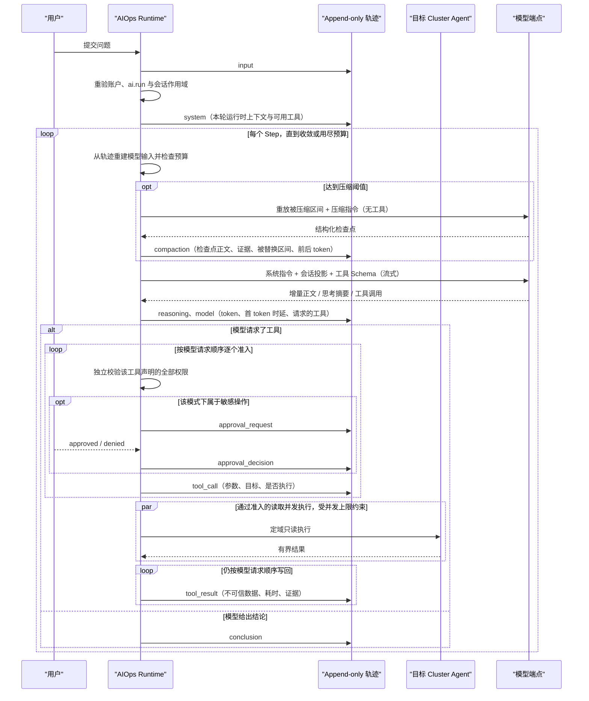

# AIOps Agent 运行时与上下文设计

> 状态：事件溯源会话、后台运行、SSE 续传与流式增量、可重建的摘要压缩、模型自主工具循环、受控资源写入及
> 敏感工具审批等待、受控 Cluster Terminal 命令、Helm Release 的读取与受控变更、随 Server 发布的排查技能与
> 只读并行子任务、变更时间线与变更后验证已经实现；定时巡检与事件触发自动化仍在规划中。

本文描述 AIOps 从“单次模型对话”演进为受控运维 Agent 的运行时边界。产品总览见
[Phase 4 AIOps 架构](ai-phase-4.md)，用户可见行为见 [AIOps](../features/ai-assistant.md)。

## 参考实现结论

[DeepSeek Harness 源码](https://github.com/deepseek-ai/deepseek-harness)有四点值得吸收：

1. 会话日志是仅追加真源，模型消息、UI 时间线和恢复状态都是它的投影；
2. 一个 Turn 可以包含多个 Step，每个 Step 是一次模型调用及其产生的工具调用，工具结果进入下一 Step；
3. 系统提示词、运行时上下文、工具参数、授权结果与工具输出都可在轨迹中检查；
4. 子 Agent 是有明确父子关系、深度和回收边界的任务，不是共享可变上下文的匿名并发协程。

ZKE 不照搬“一切皆插件”。AIOps 的工具需要长期遵守 Server + Agent、RBAC、单 Cluster 定域、审批、幂等和审计约束，
因此工具目录与循环策略由 Server 维护，不能由模型或会话动态安装代码。可借鉴的是事件模型、上下文投影和可观测性，
不是把安全边界也做成可替换插件。

## 当前运行流程

一次运行是一个循环，不是一条流水线：模型决定调用什么、按什么顺序调用，循环在它不再请求任何工具时结束。

工具目录由 `aitools` 组装，全部复用 ZKE 已有的读取或写入服务，因此经过 Agent 传输、权限与响应上限。有一组例外：
Chart 目录的四个读取工具不触达任何 Cluster，它们读的是平台配置，权限是全局的 `helm.repository.read` 并按全局作用域
在工具内判定——运行时把工具声明的权限一律按会话 Cluster 判定，而这个权限的作用域下限是全局，写进声明会比 Console
的路由更宽松。读取工具还
包括 Helm Release 的清单、修订历史与单个 revision 详情：Release 不是 Kubernetes 的 Kind，其余工具都答不了它，
而它由 Helm 存成 Secret，所以三个工具都要求 `cluster.read` 加 `cluster.secret.read`，并且只返回 Chart 身份、
revision、状态、被覆盖的 values 路径与渲染出的对象清单——values 取值、NOTES.txt 与 Manifest 正文是 Secret 内容，
不进入模型上下文或轨迹。资源写工具包括
工作负载伸缩、历史读取与回滚，多文档 Manifest 的 DryRun、差异、Apply 和 Delete，Helm Release 的安装、升级、
回滚与卸载，以及 AIOps Turn 级 Cluster Terminal 命令会话。Manifest、回滚与 Helm Release 变更的预检结果由
Server 保存为 15 分钟有效、绑定用户和 Cluster 的不可替换快照；实际工具只接受 `preview_id`，批准后重验权限并再次
DryRun。Helm 的四种动作共用一个提交工具，因为提交对四者是同一件事——重放快照；`preview_id` 前缀带着动作，因为
审批时人看到的就是这一个字符串。它们的权限按动作分开算而不取并集：`cluster.read`、`cluster.helm.manage` 与
`cluster.secret.manage` 是公共项由运行时重验，对象权限（安装/升级/回滚要 create 与 update，卸载要 delete）、
受保护 Namespace 与决定能否渲染集群级对象的 `cluster.manage` 在工具内按动作和目标 Namespace 解析，且在批准之后
再解析一次。运行时为实际调用稳定派生幂等键，含写工具的同一步按模型顺序执行。运行时本身没有 kubeconfig，也不直连
Kubernetes API Server。工具失败或逐目标拒绝都会形成明确结果与审计状态。

终端命令固定为敏感且可能变更，必须持有 `cluster.terminal.exec`。一个 Turn 首次调用时重新计算用户当前 Cluster
权限并投射到短生命周期 ServiceAccount，后续命令复用同一个终端 Pod 和冻结的权限快照；`kubectl exec` 由目标集群
的 `pods/exec` RBAC 再要求 `cluster.pod.exec`，系统或 Agent Namespace 还要求对应的独立管理权限。AIOps 仅不投射
Secret 读写权限；命令容器也不挂载 ServiceAccount Token，而是通过同 Pod 的 localhost 凭证代理访问 API Server。
命令、stdout 与 stderr 进入轨迹前受字节和上下文双重上限。快照权限在命令执行及模型思考的空闲期持续重验；任一权限
被撤销就关闭本轮终端，Turn 结束、失败或取消时也立即清理，Agent TTL 负责进程异常时兜底。

## 循环边界与参数

所有边界都在 `configs/zke-server.yaml` 的 `aiops` 段，不再是代码常量。分界线是：**端点的事实**（模型名、上下文
窗口、单次最大输出、请求超时）属于“平台配置 → AI 模型”，随端点变化；**部署策略**（循环预算、压缩比例、重试、
工具输出上限）属于配置文件，随安装变化。

| 配置项 | 默认值 | 作用 |
| --- | --- | --- |
| `turn_timeout` | 20m | 一个 Turn 的总时长上限，模型调用与集群读取合计 |
| `max_steps` | 40 | 没有收敛的循环以 `step_budget_exhausted` 结束，而不是继续消耗预算 |
| `max_tool_calls` | 120 | 几十个 Step 各读几次是排查；几百次读取是跑飞了 |
| `max_parallel_tool_calls` | 10 | 同一 Step 内互不依赖的读取并发执行的上限 |
| `subtask.max_parallel` | 3 | 一次派发可以打开的分支数；0 关闭派发并把该工具移出目录 |
| `subtask.max_steps` / `max_tool_calls` | 8 / 24 | 单个分支自己的预算，远小于主线：需要四十步的不是分支，是调查本身 |
| `subtask.timeout` | 5m | 单个分支的时限，卡住的分支不占用已经答完的同伴的预算 |
| `repeated_call_limit` | 2 | 同名同参数的第三次调用直接返回收敛提示，不再打到集群 |
| `approval_timeout` | 15m | 无人答复时以 `approval_timeout` 结束，不长期占住一个 Turn |
| `title_timeout` | 30s | 会话命名调用的上限，它跑在 Turn 旁边，没有人在等它 |
| `model_retry.max_retries` | 5 | 限流、5xx、连接中断等瞬时失败的重试次数；不含首次请求 |
| `model_retry.initial_delay` / `max_delay` | 500ms / 10s | 指数退避的下界与上界 |
| `model_retry.jitter_ratio` | 0.1 | 围绕每次退避的对称抖动，避免同时被拒的多个 Turn 同时回来 |
| `compaction.threshold_ratio` | 0.8 | 达到上下文窗口的该比例时，在下一次调用前压缩 |
| `compaction.retain_ratio` | 0.16 | 原样保留的最近尾部占窗口的比例 |
| `compaction.max_summary_tokens` | 8192 | 检查点是结构化简报，不是逐字记录 |
| `compaction.retries` | 1 | 摘要调用的额外重试次数，用尽后退回机械摘要 |
| `compaction.max_overflow_retries` | 1 | 端点以“请求过大”拒绝后，压缩并重发的次数 |
| `tool_result.threshold_chars` | 8192 | 一次工具答复在模型上下文中的字符上限 |
| `tool_result.head_chars` / `tail_chars` | 4096 / 1024 | 超限时保留的首尾长度，中间替换为省略标记 |

超限时保留首尾而不是只截首部：列表的开头说明答复的形状，而崩溃的容器把原因写在日志末尾，只砍尾部会让模型
围着启动横幅推理。

取消后不再启动新工具；已经发出的调用等待有界收敛，并把真实结果或明确的取消结果写入轨迹，不补写虚构成功。

## 模型失败的分类与重试

端点失败被分成可重试与不可重试两类，而不是统一报成“不可用”：

| 分类 | 触发 | 处理 |
| --- | --- | --- |
| `rate_limited` / `server` / `timeout` / `transport` / `empty_response` | 429、5xx、超时、连接中断、空响应 | 按退避重试，重试前向 SSE 发送 `reset`，让界面丢掉上一次没写完的正文 |
| `context_overflow` | 端点判定请求超过上下文窗口 | 压缩后重发，最多 `max_overflow_retries` 次；仍压不下去则以 `budget_exceeded` 结束 |
| `auth` / `invalid_request` | 凭证被拒、请求不被接受 | 不重试，以 `model_rejected` 结束 |
| `quota` | 账户额度或余额用尽 | 不重试，以 `model_quota_exhausted` 结束 |

分类只保留类别，不保留端点返回的正文：那段文字可能带着地址、请求头或凭证片段，而它既会进入模型上下文，也会
进入持久轨迹。`context_overflow` 与 `quota` 通过端点自己的措辞识别，因为没有任何 OpenAI 兼容服务用独立状态码
表达它们。

## 工具与授权

每个工具声明自己需要的权限集合，运行时在**每一次**调用前针对当前用户在会话固定 Cluster 上逐项校验，缺一项就不
执行，并把这个判定写进 `tool_call`。`ai.run` 只负责打开 AIOps，从不替代其中任何一项。

工具参数按 Schema 解码，未声明的字段一律拒绝而不是忽略：被静默丢弃的 `namespace` 会把一次窄查询变成全集群查询，
而模型不会知道自己问错了。目标 Cluster 由运行时填入，模型无法在参数里指定别的集群。

敏感工具在 `ask` 与 `assisted` 模式下停下来等待用户批准，`full` 模式不停；普通写工具在 `ask` 模式等待，
`assisted` 与 `full` 模式不停。三档都不扩大权限，改变的只是一段来自 Pod 日志等不可信内容的提示注入能走多远，
因此每次请求都记录当时的模式。

目录里有三个工具由运行时自己实现而不是转交 `aitools`，因为它们要的正是目录刻意没有的东西：`load_skill` 返回的是
Server 自己发布的文本，`run_subtasks` 启动的是带独立预算、审批与轨迹条目的模型对话，`open_console_view` 的作用域
是操作者的 Console 而不是任何集群。三者都只声明 `ai.run`——这不是让 `ai.run` 顶替某个集群权限，而是它们本身不触达
集群；技能推荐的每一步、分支执行的每一次读取仍各自独立授权。

## 主动打开应用

`open_console_view` 是目录里唯一一个作用在屏幕上而不是集群上的工具：它请求 Console 在操作者当前桌面上打开一个
应用并定位到指定视图，指标还可以在打开后直接执行查询。它存在的理由是有些答案不是文字——「最近一小时内存涨到
多少」的答案是一张图，而一个能写出表达式却不能把它显示出来的 Agent，恰好把最后一步留给了那个正因为不想做这一步
才来提问的人。

它被刻意设计成**例外而不是默认**。结论本来就带证据引用，证据是操作者想看时才点开的邀请；替他切换画面是更强的
动作，因此必须由模型显式选择、必须给出一句给人看的理由，并且每轮最多一次（运行时与 Console 各自守着同一条上限）。
默认路径没有变：不调用它，就还是证据入口。

它能指向的东西恰好等于证据能指向的东西，也复用同一套引用与权限判定——指标要 `cluster.metrics.read`，Event 要
`cluster.event.read`，日志要 `cluster.pod.logs.read`，Helm Release 要 `cluster.secret.read`，其余要 `cluster.read`。
理由有两条：一是不再引入第二套指向集群对象的寻址方式，两套迟早会互相矛盾；二是打开一个操作者无权读取的视图，
等于在记录里留下一个点不开的链接。目标 Cluster 与其余工具一样由运行时填入，模型不能在参数里指定别的集群。

意图写在那次调用的 `tool_result` 上，因此它是记录的一部分：可导出、可复核，会话隔几天再打开也还在。这也决定了
Console 必须自己判断什么时候真的动画面——一条持久条目每次加载都会被重放，重放一次就会打开一个和当下无关的窗口。
详见 [AIOps 功能文档](../features/ai-assistant.md)。

打开窗口本身不授予任何东西：被打开的应用仍以操作者自己的身份逐次授权它发出的每一个请求，和他从 Dock 里点开它
时完全一样。读取轨迹时 Server 会按目标类型重新校验一次，权限已撤销的意图不再返回。

## 技能

技能是流程，不是能力。一条技能只能说明用目录里的哪些工具、按什么顺序取证、以什么标准下结论，因此它无法新增工具、
放大权限、改变审批模式或指向另一个 Cluster。

- 技能随 Server 发布，不由会话或租户编写。技能正文是给模型遵循的指令，一段用户或集群能写入的技能就是提示注入；
  租户自建 Playbook 是后续问题，需要自己的信任标记；
- 系统提示词里只有 ID 和一句话摘要，正文按需用 `load_skill` 读取。把十几份流程全塞进每一次请求，等于让第一次
  调用先为十一份用不上的流程付费；
- 技能声明自己会用到的工具。部署没有组装其中任何一个时，这条技能不出现在目录里——第三步走不通的流程比没有流程更
  糟，因为模型会先围着那一步规划；
- 技能结果是目录里唯一被标记为**可信**的工具答复。这个标记只给整段正文由 Server 提供的工具；任何经过 Agent、
  对象、日志或命令的内容都不能带它，因为“集群内容是数据不是指令”正是审批模式在保护的东西；
- 技能不产生证据引用。Playbook 不是集群里发生过的事，把它列进结论的证据行会给出一个点不开的链接。

## 流式输出与记录的区别

SSE 上有两类事件，性质不同：

- `trajectory` 是持久条目，事件 id 等于数据库序号，重连用 `Last-Event-ID` 精确续传，Server 重启后依然成立；
- `delta` 是模型正在产生的正文，没有 id、不重放、不进数据库。它存在的意义只是让操作者看见答案在成形，对应
  步骤的 `model` 条目才是记录、导出和事后复核的依据。

订阅在补历史之前建立，因此两者之间写入的条目会以唤醒信号到达，而不是要等到下一次轮询。

这条连接不受 HTTP 服务端的普通响应写超时约束：一个 Turn 大部分时间在等模型，期间没有任何帧，按普通响应的超时
会在中途掐断连接。流自身有最长存活时间，每一帧单独设置写截止时间，安静时按固定间隔发送 SSE 注释心跳——心跳写
失败就是对端已经不在，此时结束这条流，浏览器按持久序号重连续传。

会话标题由第一轮附带产生：运行时在第一个问题写入轨迹后，另起一次不带工具的模型调用要一个短标题，成功就改名，
失败或超时就退回问题本身的前若干字。它跑在这一轮旁边而不是里面，所以不会拖慢第一个工具调用；标题在这轮里被人
改过就不再覆盖。标题与运行状态都不是轨迹条目，SSE 因此在它们变化时单独发送 `session` 事件。

## 会话、Turn、Step 与轨迹

- **Session**：长期对话，固定 Tenant、Project、Cluster 和发起用户；同一时刻只允许一个主 Turn。
- **Turn**：一次用户输入到结论、失败或取消。
- **Step**：一次模型调用加该调用请求的工具执行，工具结果进入下一个 Step。Step 序号记录在条目正文里而不是列上：
  没有查询按它过滤，分配它的循环就是写正文的那一段。
- **Trajectory Entry**：持久真源。类型包括 `system`、`input`、`context`、`model`、`reasoning`、`tool_call`、
  `tool_result`、`approval_request`、`approval_decision`、`compaction`、`conclusion` 和 `error`。

Server 必须先写轨迹，再向 SSE 观察者推送。取消只结束当前 Turn，不删除已经发生的条目；Server 重启把孤立的工作中
Turn 标记为 `interrupted`，不会假装继续执行。

轨迹 UI 与对话是同一主工作区中的两个 Tab，都是同一条列表的投影，因此两边不可能互相矛盾。轨迹 Tab 提供输入 /
模型 / 工具三条时间轨、类型筛选、全文搜索、单条事件详情，以及全部由条目现算的运行统计：耗时、轮次、步骤、
工具调用、首 token 时延、吞吐、缓存命中与 token 用量。计数器需要跨重连、跨重启、跨几天后重开会话都保持一致，
而从轨迹重算不会漂移。工具结果若被截断，UI 必须明确标注并通过证据引用回到原对象，不能把摘录渲染成完整事实。

## 上下文分层

模型输入不是数据库轨迹的机械拼接，而是一个受权限与预算约束的派生表层：

| 层 | 来源 | 生命周期 | 规则 |
| --- | --- | --- | --- |
| 安全指令 | Server 固定模板 | 每次请求重建 | 不可被压缩、附件或集群正文覆盖 |
| 运行时上下文 | 会话作用域、审批模式、可用工具 | 每 Turn 快照 | 写入 `system`，便于复盘 |
| 对话表层 | 用户输入与已完成结论 | 跨 Turn | 只保留当前仍有权读取的正文与证据 |
| 工具表层 | 调用与结果 | 当前及后续 Turn | 调用前独立授权；集群输出一律是不可信数据 |
| 附件 | 用户显式选择的文本 | 选中的 Turn | 有界、标记为不可信，不执行附件内容 |
| 技能 | Server 发布的 Playbook | 被 `load_skill` 读取的那一步之后 | 唯一可信的工具答复，可作为流程遵循；不新增工具或权限 |
| 子任务表层 | 该分支自己的条目 | 分支存续期间 | 按分支标记过滤重建，看不到对话，也看不到其他分支 |
| 检查点 | `compaction.text` | 直到下次压缩 | 只替换 `shadowed_from`–`shadowed_to` 这一段，其后的条目原样保留，原始轨迹不被改写 |

压缩是“用一份检查点替换一段区间”，不是“丢掉更早的一切”：

1. 从尾部向前累加，直到达到 `retain_ratio × 上下文窗口`，这一段原样保留——下一步真正推理的依据就是最近这几步；
2. 边界再向前推到一个 Step 的开头，避免把 assistant 的工具调用与它的结果拆开：孤立的工具结果会被多数端点整个拒收；
3. 边界之前的区间交给模型写成结构化检查点（目标、工作区与约束、已确认事实、已执行读取、未决问题、当前进展、
   下一步），摘要调用复用同一套系统指令与工具 Schema，并把压缩指令放在最后一条用户消息上，因此它是上一次请求的
   前缀，可以命中端点的前缀缓存；
4. 摘要调用失败且重试用尽时退回机械摘要，方法记为 `summary` 而不是 `model_summary`——预算已经紧张的时刻，不该再
   多一个可能失败的环节；
5. `compaction` 条目记录方法、触发原因、前后 token、阈值、保留尾部大小，以及**被替换的轨迹序号区间**。

区间是关键：轨迹仅追加，检查点写在它有意保留的尾部之后，若按“这条之前的一切”理解，下一步就会把刚刚保留的尾部
一起吞掉。重建模型可见上下文时跳过该区间，其后的条目原样保留。旧条目仍完整保留在轨迹和导出中，压缩只改变模型
可见投影，不修改历史。

## Token 计量

判定是否压缩用的是“这次请求会占多少”，它优先锚定在端点自己报告的用量上：最近一个带用量的 `model` 条目，它的
`input` 就是系统指令、工具 Schema 和到那一次调用为止的对话的准确价格；从那一步本身开始的内容才用本地启发式估算。
这样长会话的误差被限制在“一步的新增内容”，而不是随每一步累积。

本地启发式按字符类别分成两档：ASCII 约四个字符一个 token，CJK 约一个字符一个 token。单一比例对其中一边总是错得
很厉害，而 AIOps 是一个读英文集群的中文产品——把中文按 ASCII 的密度计价会把会话报成实际大小的四分之一，第一个
坏掉的就是“在端点拒绝之前先压缩”。

Console 的输入框旁显示这一读数（占比、绝对值与系统提示词/工具/对话三段拆分），读数由 Server 计算：真正决定压缩的
是循环每次请求前的那次测量，浏览器再实现一遍只会在两边任一改动时开始漂移。三段拆分始终是本地估算——没有端点会
报告它的输入是怎样分配的——它用来解释总量，不参与任何判定。

部署配额复用端点报告的计量，但不复用本地上下文估算：`aiops.quota.daily_tokens` 只累计持久 `model` 条目的
input/output token。配额作用域是用户与 Project，UTC 日切换；新 Turn 的准入在持久化 input 之前通过数据库事务和
advisory lock 串行化。已经运行的 Turn 不在中途按日配额截断，达到限制后拒绝下一次启动；单 Turn 自身继续由本页的
Step、工具、上下文和耗时预算收敛。

模型可见投影还有一条与协议相关的规则：一次模型步骤和它请求的调用组成同一条 assistant 消息，工具结果紧随其后。
一个步骤并行请求多次读取时同样如此——所有调用留在同一条 assistant 消息里，全部结果跟在它后面，而不是按轨迹里
“调用、结果、调用、结果”的先后顺序拆成多条 assistant 消息。轨迹按发生顺序记录，投影按协议结构重建：拆开会把一次
步骤说成多次，思考型模型会因为多出来的步骤缺少对应推理而直接拒收整个请求。
调用因权限变化在重建时不再可读时，对应的工具结果会一并丢弃——孤立的工具结果是多数端点直接拒收的请求，也会让
记录看起来像凭空多出一次读取。

压缩必须保留：最初目标、用户约束、最近问题、已确认结论、未完成事项和证据引用。系统安全指令不参与替换。读取历史
时如果证据权限已撤销，Server 先脱敏再构建上下文，不能让“曾经有权”变成永久数据访问权。

## 并行子任务

子任务适合互不依赖的取证分支，例如“资源状态”“近期 Event”“指标异常”三路并行。它不适合把一次 Kubernetes 变更拆给
多个并发执行者：写入的顺序、幂等与审批保证定义在一条串行路径上，没有一种“多个 Agent 同时 Apply”能保住它们。

落地形态：

- 主 Agent 调用 `run_subtasks` 创建分支，每个分支记录分支 ID、派发它的 `call_id`、序号和目标，并继承会话的
  Tenant/Project/Cluster、发起用户与审批模式；
- 分支只接收目标和主 Agent 显式传递的少量已知信息，看不到对话，也看不到彼此。上下文是快照而不是共享的可变消息
  列表：能读整个会话的分支会把派发变成“把同一次调查复制三份”，用三倍上下文换一点延迟；
- 隔离是**双向**的：主线重建模型输入时同样跳过带分支标记的条目。两条线共用一条轨迹，不分开投影就会把分支的
  assistant 消息插在“派发调用”和“它的结果”之间——那是多数端点直接整条拒收的请求，表现为派发成功之后的下一步
  以 `model_rejected` 结束。同理，分支的 `model` 条目也不参与主线的用量锚定与压缩计价：它计的是另一次请求；
- 调用标识按分支限定后再落库。每个分支是独立对话，它们的模型都会把第一次调用叫 `call_1`；而这个标识正是审批、
  结果与 UI 行三者的连接键，共用一个就会把某个人的批准送到另一个分支上。但**限定只属于轨迹**：重建模型输入时
  前缀会被去掉，端点必须收到它自己签发的那个 `call_id`——各家都对它的长度和字符集有限制，把 ZKE 的内部标识发出去
  会让分支从第二次请求（也就是第一次带着历史调用的请求）起全部被拒；
- 分支只拿到目录里的**非写**工具，并且拿不到 `run_subtasks` 本身。深度上限 1 由“看不到就调不到”保证，而不是靠
  一个谁都可能忘记向下传递的计数器；
- 每个分支有自己的 Step、工具调用与超时预算，以及父 Turn 之内的取消信号。父 Turn 在这次工具调用内等待全部分支
  返回，因此不存在跨 Turn 存活的分支；
- 分支只返回结构化结论、证据引用和失败分类。冲突不在汇总时消解——两个分支给出相反结论是关于集群的事实，把它藏在
  一段合并摘要里等于把这个矛盾从负责消解它的模型那里拿走；
- 分支不压缩上下文。达到上下文窗口的分支已经超出了“分支”该做的事，如实报告 `budget_exceeded` 比再实现一遍摘要
  更诚实；
- 分支的每一步写进同一条 Session 轨迹并带分支标记。对话 Tab 把它们折叠在派发它们的那次工具调用下面，轨迹 Tab
  原位显示并标注来源。唯一不折叠的是审批请求：停在人身上的分支必须在人正在看的位置可答复；
- 分支不推送流式增量。三条分支的 token 同时写进同一块正文区只会互相覆盖；它们的持久条目照常即时到达；
- `max_parallel_tool_calls` 在分支之间**分摊**而不是各自享用一份。那个上限约束的是对端 Agent，而它同时还在服务
  平台其余部分；不分摊的话，派发就把部署配置的并发直接乘上了分支数。

一个分支失败不结束父 Turn。它以分类回到主线的那条工具结果里，由主 Agent 决定是重问、绕开还是如实说明这一路没有
结论——把它伪装成“没有发现问题”才是真正的错误。

## 不变量

- 所有工具目标必须等于会话固定 Cluster；Namespace 与对象身份在调用中显式记录；
- `ai.run` 只允许启动 AIOps，不替代 `cluster.read`、日志、Event、指标或写权限；工具声明的权限逐项校验，缺一不执行；
- 每个外部步骤重验账户和 RBAC，权限撤销后不再继续；
- 集群正文、附件和模型输出都不是授权依据；
- Secret、Session Token、模型 API Key、Agent 证书和 kubeconfig 不进入模型上下文或轨迹；Helm Release 的读取与变更
  都只返回 Release 的身份、形状与受影响对象清单，不返回 values 取值、NOTES.txt 或 Manifest 正文。模型可以撰写
  values，但它被限制在轨迹能完整保存的长度内，并与终端命令适用同一条“不得写入凭证明文”的规则；
- 轨迹是有界事件记录，不是 Pod 日志、指标或完整对象的副本仓库；
- 技能只改变取证顺序，不改变工具目录、权限、审批模式或作用域；
- 主动打开应用只改变操作者看到的画面：它不读取集群内容、不新增权限，被打开的应用仍以操作者身份逐次授权；
  意图按目标类型判权并写入轨迹，每轮最多一次，操作者可以关掉这项行为而不失去入口；
- 子任务只有只读工具、不可再派生、不跨 Turn 存活，其每一步都带分支标记写回同一条轨迹。
