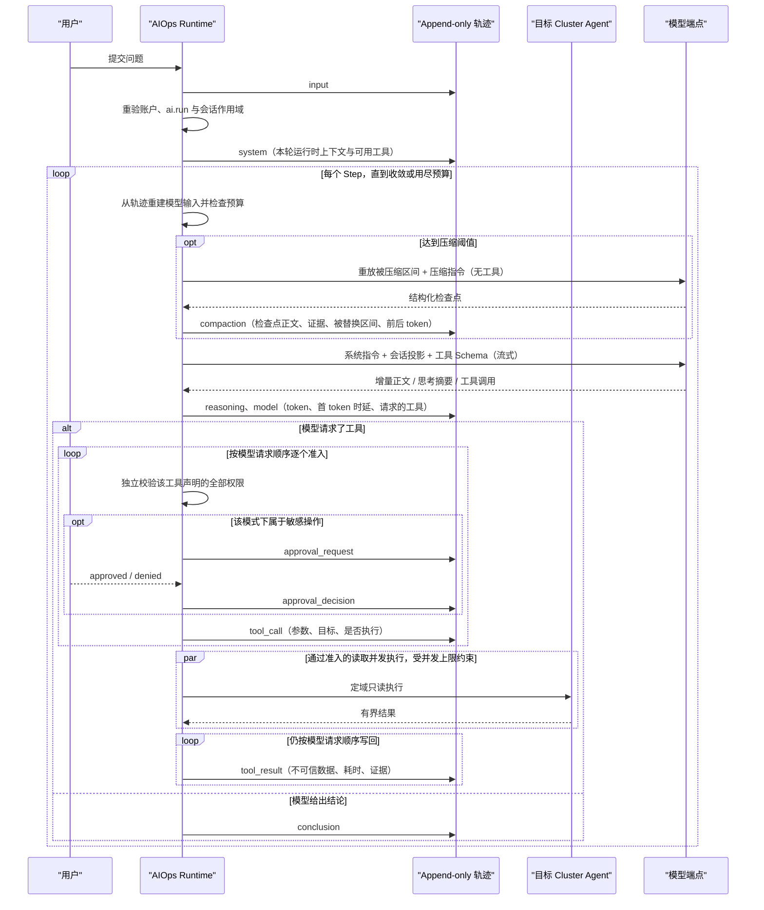

# AIOps Agent 运行时与上下文设计

> 状态：事件溯源会话、后台运行、SSE 续传与流式增量、可重建的摘要压缩、模型自主工具循环、受控资源写入及
> 敏感工具审批等待与受控 Cluster Terminal 命令已经实现；并行子任务与自动化仍在规划中。

本文描述 AIOps 从“单次模型对话”演进为受控运维 Agent 的运行时边界。产品总览见
[Phase 4 AIOps 架构](ai-phase-4.md)，用户可见行为见 [AIOps](../features/ai-assistant.md)。

## 参考实现结论

[DeepSeek Harness 源码](https://github.com/deepseek-ai/deepseek-harness)有四点值得吸收：

1. 会话日志是仅追加真源，模型消息、UI 时间线和恢复状态都是它的投影；
2. 一个 Turn 可以包含多个 Step，每个 Step 是一次模型调用及其产生的工具调用，工具结果进入下一 Step；
3. 系统提示词、运行时上下文、工具参数、授权结果与工具输出都可在轨迹中检查；
4. 子 Agent 是有明确父子关系、深度和回收边界的任务，不是共享可变上下文的匿名并发协程。

ZKE 不照搬“一切皆插件”。AIOps 的工具需要长期遵守 Server + Agent、RBAC、单 Cluster 定域、审批、幂等和审计约束，
因此工具目录与循环策略由 Server 维护，不能由模型或会话动态安装代码。可借鉴的是事件模型、上下文投影和可观测性，
不是把安全边界也做成可替换插件。

## 当前运行流程

一次运行是一个循环，不是一条流水线：模型决定调用什么、按什么顺序调用，循环在它不再请求任何工具时结束。

工具目录由 `aitools` 组装，全部复用 ZKE 已有的读取或写入服务，因此经过 Agent 传输、权限与响应上限。资源写工具包括
工作负载伸缩、历史读取与回滚，多文档 Manifest 的 DryRun、差异、Apply 和 Delete，以及 AIOps Turn 级 Cluster
Terminal 命令会话。Manifest 与回滚的预检结果由
Server 保存为 15 分钟有效、绑定用户和 Cluster 的不可替换快照；实际工具只接受 `preview_id`，批准后重验权限并再次
DryRun。运行时为实际调用稳定派生幂等键，含写工具的同一步按模型顺序执行。运行时本身没有 kubeconfig，也不直连
Kubernetes API Server。工具失败或逐目标拒绝都会形成明确结果与审计状态。

终端命令固定为敏感且可能变更，必须持有 `cluster.terminal.exec`。一个 Turn 首次调用时重新计算用户当前 Cluster
权限并投射到短生命周期 ServiceAccount，后续命令复用同一个终端 Pod 和冻结的权限快照；`kubectl exec` 由目标集群
的 `pods/exec` RBAC 再要求 `cluster.pod.exec`，系统或 Agent Namespace 还要求对应的独立管理权限。AIOps 仅不投射
Secret 读写权限；命令容器也不挂载 ServiceAccount Token，而是通过同 Pod 的 localhost 凭证代理访问 API Server。
命令、stdout 与 stderr 进入轨迹前受字节和上下文双重上限。快照权限在命令执行及模型思考的空闲期持续重验；任一权限
被撤销就关闭本轮终端，Turn 结束、失败或取消时也立即清理，Agent TTL 负责进程异常时兜底。

## 循环边界与参数

所有边界都在 `configs/zke-server.yaml` 的 `aiops` 段，不再是代码常量。分界线是：**端点的事实**（模型名、上下文
窗口、单次最大输出、请求超时）属于“平台配置 → AI 模型”，随端点变化；**部署策略**（循环预算、压缩比例、重试、
工具输出上限）属于配置文件，随安装变化。

| 配置项 | 默认值 | 作用 |
| --- | --- | --- |
| `turn_timeout` | 20m | 一个 Turn 的总时长上限，模型调用与集群读取合计 |
| `max_steps` | 40 | 没有收敛的循环以 `step_budget_exhausted` 结束，而不是继续消耗预算 |
| `max_tool_calls` | 120 | 几十个 Step 各读几次是排查；几百次读取是跑飞了 |
| `max_parallel_tool_calls` | 10 | 同一 Step 内互不依赖的读取并发执行的上限 |
| `repeated_call_limit` | 2 | 同名同参数的第三次调用直接返回收敛提示，不再打到集群 |
| `approval_timeout` | 15m | 无人答复时以 `approval_timeout` 结束，不长期占住一个 Turn |
| `title_timeout` | 30s | 会话命名调用的上限，它跑在 Turn 旁边，没有人在等它 |
| `model_retry.max_retries` | 5 | 限流、5xx、连接中断等瞬时失败的重试次数；不含首次请求 |
| `model_retry.initial_delay` / `max_delay` | 500ms / 10s | 指数退避的下界与上界 |
| `model_retry.jitter_ratio` | 0.1 | 围绕每次退避的对称抖动，避免同时被拒的多个 Turn 同时回来 |
| `compaction.threshold_ratio` | 0.8 | 达到上下文窗口的该比例时，在下一次调用前压缩 |
| `compaction.retain_ratio` | 0.16 | 原样保留的最近尾部占窗口的比例 |
| `compaction.max_summary_tokens` | 8192 | 检查点是结构化简报，不是逐字记录 |
| `compaction.retries` | 1 | 摘要调用的额外重试次数，用尽后退回机械摘要 |
| `compaction.max_overflow_retries` | 1 | 端点以“请求过大”拒绝后，压缩并重发的次数 |
| `tool_result.threshold_chars` | 8192 | 一次工具答复在模型上下文中的字符上限 |
| `tool_result.head_chars` / `tail_chars` | 4096 / 1024 | 超限时保留的首尾长度，中间替换为省略标记 |

超限时保留首尾而不是只截首部：列表的开头说明答复的形状，而崩溃的容器把原因写在日志末尾，只砍尾部会让模型
围着启动横幅推理。

取消后不再启动新工具；已经发出的调用等待有界收敛，并把真实结果或明确的取消结果写入轨迹，不补写虚构成功。

## 模型失败的分类与重试

端点失败被分成可重试与不可重试两类，而不是统一报成“不可用”：

| 分类 | 触发 | 处理 |
| --- | --- | --- |
| `rate_limited` / `server` / `timeout` / `transport` / `empty_response` | 429、5xx、超时、连接中断、空响应 | 按退避重试，重试前向 SSE 发送 `reset`，让界面丢掉上一次没写完的正文 |
| `context_overflow` | 端点判定请求超过上下文窗口 | 压缩后重发，最多 `max_overflow_retries` 次；仍压不下去则以 `budget_exceeded` 结束 |
| `auth` / `invalid_request` | 凭证被拒、请求不被接受 | 不重试，以 `model_rejected` 结束 |
| `quota` | 账户额度或余额用尽 | 不重试，以 `model_quota_exhausted` 结束 |

分类只保留类别，不保留端点返回的正文：那段文字可能带着地址、请求头或凭证片段，而它既会进入模型上下文，也会
进入持久轨迹。`context_overflow` 与 `quota` 通过端点自己的措辞识别，因为没有任何 OpenAI 兼容服务用独立状态码
表达它们。

## 工具与授权

每个工具声明自己需要的权限集合，运行时在**每一次**调用前针对当前用户在会话固定 Cluster 上逐项校验，缺一项就不
执行，并把这个判定写进 `tool_call`。`ai.run` 只负责打开 AIOps，从不替代其中任何一项。

工具参数按 Schema 解码，未声明的字段一律拒绝而不是忽略：被静默丢弃的 `namespace` 会把一次窄查询变成全集群查询，
而模型不会知道自己问错了。目标 Cluster 由运行时填入，模型无法在参数里指定别的集群。

敏感工具在 `ask` 与 `assisted` 模式下停下来等待用户批准，`full` 模式不停；普通写工具在 `ask` 模式等待，
`assisted` 与 `full` 模式不停。三档都不扩大权限，改变的只是一段来自 Pod 日志等不可信内容的提示注入能走多远，
因此每次请求都记录当时的模式。

## 流式输出与记录的区别

SSE 上有两类事件，性质不同：

- `trajectory` 是持久条目，事件 id 等于数据库序号，重连用 `Last-Event-ID` 精确续传，Server 重启后依然成立；
- `delta` 是模型正在产生的正文，没有 id、不重放、不进数据库。它存在的意义只是让操作者看见答案在成形，对应
  步骤的 `model` 条目才是记录、导出和事后复核的依据。

订阅在补历史之前建立，因此两者之间写入的条目会以唤醒信号到达，而不是要等到下一次轮询。

这条连接不受 HTTP 服务端的普通响应写超时约束：一个 Turn 大部分时间在等模型，期间没有任何帧，按普通响应的超时
会在中途掐断连接。流自身有最长存活时间，每一帧单独设置写截止时间，安静时按固定间隔发送 SSE 注释心跳——心跳写
失败就是对端已经不在，此时结束这条流，浏览器按持久序号重连续传。

会话标题由第一轮附带产生：运行时在第一个问题写入轨迹后，另起一次不带工具的模型调用要一个短标题，成功就改名，
失败或超时就退回问题本身的前若干字。它跑在这一轮旁边而不是里面，所以不会拖慢第一个工具调用；标题在这轮里被人
改过就不再覆盖。标题与运行状态都不是轨迹条目，SSE 因此在它们变化时单独发送 `session` 事件。

## 会话、Turn、Step 与轨迹

- **Session**：长期对话，固定 Tenant、Project、Cluster 和发起用户；同一时刻只允许一个主 Turn。
- **Turn**：一次用户输入到结论、失败或取消。
- **Step**：一次模型调用加该调用请求的工具执行，工具结果进入下一个 Step。Step 序号记录在条目正文里而不是列上：
  没有查询按它过滤，分配它的循环就是写正文的那一段。
- **Trajectory Entry**：持久真源。类型包括 `system`、`input`、`context`、`model`、`reasoning`、`tool_call`、
  `tool_result`、`approval_request`、`approval_decision`、`compaction`、`conclusion` 和 `error`。

Server 必须先写轨迹，再向 SSE 观察者推送。取消只结束当前 Turn，不删除已经发生的条目；Server 重启把孤立的工作中
Turn 标记为 `interrupted`，不会假装继续执行。

轨迹 UI 与对话是同一主工作区中的两个 Tab，都是同一条列表的投影，因此两边不可能互相矛盾。轨迹 Tab 提供输入 /
模型 / 工具三条时间轨、类型筛选、全文搜索、单条事件详情，以及全部由条目现算的运行统计：耗时、轮次、步骤、
工具调用、首 token 时延、吞吐、缓存命中与 token 用量。计数器需要跨重连、跨重启、跨几天后重开会话都保持一致，
而从轨迹重算不会漂移。工具结果若被截断，UI 必须明确标注并通过证据引用回到原对象，不能把摘录渲染成完整事实。

## 上下文分层

模型输入不是数据库轨迹的机械拼接，而是一个受权限与预算约束的派生表层：

| 层 | 来源 | 生命周期 | 规则 |
| --- | --- | --- | --- |
| 安全指令 | Server 固定模板 | 每次请求重建 | 不可被压缩、附件或集群正文覆盖 |
| 运行时上下文 | 会话作用域、审批模式、可用工具 | 每 Turn 快照 | 写入 `system`，便于复盘 |
| 对话表层 | 用户输入与已完成结论 | 跨 Turn | 只保留当前仍有权读取的正文与证据 |
| 工具表层 | 调用与结果 | 当前及后续 Turn | 调用前独立授权；集群输出一律是不可信数据 |
| 附件 | 用户显式选择的文本 | 选中的 Turn | 有界、标记为不可信，不执行附件内容 |
| 检查点 | `compaction.text` | 直到下次压缩 | 只替换 `shadowed_from`–`shadowed_to` 这一段，其后的条目原样保留，原始轨迹不被改写 |

压缩是“用一份检查点替换一段区间”，不是“丢掉更早的一切”：

1. 从尾部向前累加，直到达到 `retain_ratio × 上下文窗口`，这一段原样保留——下一步真正推理的依据就是最近这几步；
2. 边界再向前推到一个 Step 的开头，避免把 assistant 的工具调用与它的结果拆开：孤立的工具结果会被多数端点整个拒收；
3. 边界之前的区间交给模型写成结构化检查点（目标、工作区与约束、已确认事实、已执行读取、未决问题、当前进展、
   下一步），摘要调用复用同一套系统指令与工具 Schema，并把压缩指令放在最后一条用户消息上，因此它是上一次请求的
   前缀，可以命中端点的前缀缓存；
4. 摘要调用失败且重试用尽时退回机械摘要，方法记为 `summary` 而不是 `model_summary`——预算已经紧张的时刻，不该再
   多一个可能失败的环节；
5. `compaction` 条目记录方法、触发原因、前后 token、阈值、保留尾部大小，以及**被替换的轨迹序号区间**。

区间是关键：轨迹仅追加，检查点写在它有意保留的尾部之后，若按“这条之前的一切”理解，下一步就会把刚刚保留的尾部
一起吞掉。重建模型可见上下文时跳过该区间，其后的条目原样保留。旧条目仍完整保留在轨迹和导出中，压缩只改变模型
可见投影，不修改历史。

## Token 计量

判定是否压缩用的是“这次请求会占多少”，它优先锚定在端点自己报告的用量上：最近一个带用量的 `model` 条目，它的
`input` 就是系统指令、工具 Schema 和到那一次调用为止的对话的准确价格；从那一步本身开始的内容才用本地启发式估算。
这样长会话的误差被限制在“一步的新增内容”，而不是随每一步累积。

本地启发式按字符类别分成两档：ASCII 约四个字符一个 token，CJK 约一个字符一个 token。单一比例对其中一边总是错得
很厉害，而 AIOps 是一个读英文集群的中文产品——把中文按 ASCII 的密度计价会把会话报成实际大小的四分之一，第一个
坏掉的就是“在端点拒绝之前先压缩”。

Console 的输入框旁显示这一读数（占比、绝对值与系统提示词/工具/对话三段拆分），读数由 Server 计算：真正决定压缩的
是循环每次请求前的那次测量，浏览器再实现一遍只会在两边任一改动时开始漂移。三段拆分始终是本地估算——没有端点会
报告它的输入是怎样分配的——它用来解释总量，不参与任何判定。

模型可见投影还有一条与协议相关的规则：一次模型步骤和它请求的调用组成同一条 assistant 消息，工具结果紧随其后。
一个步骤并行请求多次读取时同样如此——所有调用留在同一条 assistant 消息里，全部结果跟在它后面，而不是按轨迹里
“调用、结果、调用、结果”的先后顺序拆成多条 assistant 消息。轨迹按发生顺序记录，投影按协议结构重建：拆开会把一次
步骤说成多次，思考型模型会因为多出来的步骤缺少对应推理而直接拒收整个请求。
调用因权限变化在重建时不再可读时，对应的工具结果会一并丢弃——孤立的工具结果是多数端点直接拒收的请求，也会让
记录看起来像凭空多出一次读取。

压缩必须保留：最初目标、用户约束、最近问题、已确认结论、未完成事项和证据引用。系统安全指令不参与替换。读取历史
时如果证据权限已撤销，Server 先脱敏再构建上下文，不能让“曾经有权”变成永久数据访问权。

## 子 Agent（规划）

子 Agent 适合互不依赖的取证分支，例如“资源状态”“近期 Event”“指标异常”三路并行。它不适合把一次 Kubernetes
变更拆给多个并发执行者。

设计约束如下：

- 主 Agent 创建有界子任务，记录 `parent_run_id`、子任务目标、允许工具集合、固定 Cluster、发起用户和委派深度；
- 子任务继承安全指令与作用域，但只接收完成任务所需的上下文快照，不共享可变消息列表；
- 每个子任务拥有独立 Step/工具预算和取消信号，父 Turn 结束时必须回收全部子任务；
- 子任务只能返回结构化结论、证据引用和失败分类，主 Agent 负责冲突消解与最终结论；
- 子任务事件归入同一 Session 轨迹并携带子任务标识，UI 可按来源折叠；
- 默认最大深度为 1。是否提高深度必须基于真实任务与资源数据评估，不能让递归委派绕过总预算。

落地子 Agent 前需要扩展数据模型与协议；当前版本不得把并行取证描述为已实现。

## 不变量

- 所有工具目标必须等于会话固定 Cluster；Namespace 与对象身份在调用中显式记录；
- `ai.run` 只允许启动 AIOps，不替代 `cluster.read`、日志、Event、指标或写权限；工具声明的权限逐项校验，缺一不执行；
- 每个外部步骤重验账户和 RBAC，权限撤销后不再继续；
- 集群正文、附件和模型输出都不是授权依据；
- Secret、Session Token、模型 API Key、Agent 证书和 kubeconfig 不进入模型上下文或轨迹；
- 轨迹是有界事件记录，不是 Pod 日志、指标或完整对象的副本仓库。
