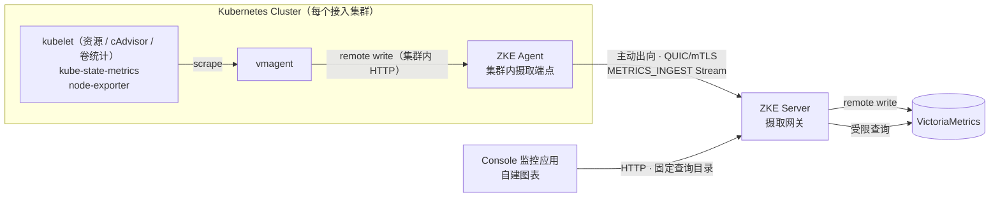

# Phase 3 可观测性架构设计

本文定义 ZKE Phase 3 多集群可观测性的数据通路：集群内采集、经 Agent QUIC 连接回传、Server 摄取与作用域
改写、集中存储，以及面向 Console 的查询、可视化与权限边界。可视化由 ZKE Console 自建，不依赖 Grafana。

> 状态：前三个切片已实现（见 §13）。协议层（`STREAM_KIND_METRICS_INGEST`、`STREAM_KIND_METRICS_COLLECTOR`
> 与两个对应能力）、Agent 摄取端点与转发、Agent 侧**三个采集组件**（vmagent、kube-state-metrics、
> node-exporter）的一体安装与卸载、Server 摄取网关与作用域改写、每集群的速率与基数预算、存储写入、
> 190 个固定查询（用量、利用率、申请与限制与可分配量、节点饱和度与 Pod 密度、工作负载用量与副本状态、
> 容器用量与 CPU 限流、Pod 网络、PVC 使用率与 inode、容器等待与退出原因、Namespace 配额、Pod 重启、
> Pod 与节点状态、节点磁盘 IO 与网络、连接跟踪与 TCP 重传、PSI 压力停顿，加 CPU 模式分布与被抢占、
> 三档负载与进程队列、上下文切换与中断、内存承诺/内核内存/Swap/主缺页/节点 OOM、文件描述符、运行时长与
> 时钟偏移、只读挂载与设备错误、磁盘延迟与队列、TCP 连接与 TIME_WAIT、套接字内存与 UDP 错误、kubelet 自身
> 的运行时错误与 PLEG 时延、Pod 磁盘与丢包与 OOM、封锁节点与无法调度 Pod、就绪 Pod、Job 状态、
> PVC 与持久卷状态、网络包速率与 Swap 换页，再加集群对象概览、采集健康度与采集链路自身的目标健康、抓取
> 耗时、样本数、新增序列与节点采集器失败数）、权限词、
> 审计事件，以及 Console 的「监控」应用和「平台配置 → 指标采集」都已落地。Console 侧的图表是共享时间
> 窗口的：相对与绝对两种时间范围、在图上拖拽选取横轴区间、跨面板同步的十字光标与数值读数、可开关的图例
> （见 §9.5）。
>
> 已验证：
>
> - 摄取网关与查询目录对着真实的 VictoriaMetrics v1.149.0 跑通——写入的样本可查回，集群侧伪造的
>   `zke_cluster_id` 被替换为连接身份，基础目录中的 119 个具名查询都能在真实存储上执行；扩展目录经过表达式构建与作用域验证。
>   用例直接遍历目录本身，因此新增查询不会漏过语法构建检查。其中工作负载的两级归属（Deployment 而非 ReplicaSet）、未就绪副本的
>   三控制器归一、Pod 密度的两族 join、对象概览并集的分支数与利用率的数值都做了断言
>   （`ZKE_TEST_METRICS_STORAGE_URL=http://127.0.0.1:8428 go test ./pkg/server/metricsingest ./pkg/server/metricsquery`）；
> - Agent 在真实集群中安装采集组件：三个组件一并安装，对象被 API Server 接受、vmagent 启动并就绪，卸载后
>   包括凭证在内的对象全部消失（`ZKE_LIVE_KUBERNETES_E2E=1 go test ./pkg/agent -run LiveMetricsCollector`）。
>   这一步抓出了替身客户端抓不到的两件事：vmagent 不接受 Kubernetes 的 `512Mi` 写法，缓冲上限必须换算成
>   字节；Agent 的 ClusterRole 必须自己持有 `nodes/metrics` 才能把它授予采集组件；
> - 完整链路在真实集群上跑通：集群内 vmagent → Agent 摄取端点 → Server 摄取网关 → 存储 → Console，
>   图表中能读到该集群的曲线。
>
> 尚未验证：node-exporter 在 `restricted` Namespace 下的实际拒绝路径（需要一个这样的 Namespace，替身客户端
> 只模拟过该拒绝）。每集群预算只在单元测试中验证过，没有观察过 vmagent 收到 `RESOURCE_EXHAUSTED` 后的退避
> 与回灌行为；容量、保留期与预算的实际取值还没有基线数据，当前默认值是保护性取值，五个抓取任务合计约十二倍
> 基数是按固定 allowlist 推算的结果而不是实测值。kubelet 的 cAdvisor 端点已对着真实组件核对过指标名与标签
> 形状；node-exporter v1.12.1 在 ZKE 下发的同一组参数下，目录读取的**全部**族都已核对（见 §14），vmagent
> v1.149.0 每个抓取目标产生的七条元信息也已核对；**`kubelet_volume_stats_*` 仍未在带 CSI 卷的真实集群上
> 抓到过序列**，kube-state-metrics 新增的封锁与调度失败/就绪/Job/PVC/PV 各族、kubelet 自身健康的五个族与
> cAdvisor 的容器磁盘与 OOM 三族**只在种子数据上验证过查询本身，尚未对着真实组件核对**（见 §14）。
> 日志、告警仍是规划（见 §13）。

前置阅读：[Server + Agent 架构](server-agent.md)、[Phase 2 Server–Agent 协议设计](agent-protocol-phase-2.md)、
[应用作用域与资源模型](resource-model.md)、[安全与权限](../security/authorization.md)。
产品侧的能力范围见[可观测性平台](../features/observability.md)。

## 1. 目标

- 在不要求 Server 直连任何集群网络的前提下，为接入的每一个集群提供指标查询与集群健康视图；
- 可视化在 ZKE Console 内自建，与桌面工作空间的窗口、权限和作用域模型保持一致，不引入第二套 UI、
  第二套登录与第二套权限体系；
- 采集、回传、存储和查询的每一段都保留不可变的 `cluster_id`，多集群数据不串扰；
- 查询结果严格受调用者的 Tenant、Project 与 RBAC 可见范围约束；
- 采集组件的安装、升级和卸载对使用者是显式的，不在用户集群里静默创建工作负载；
- 对基数、样本速率、正文大小、并发和保留期设置明确上限，单个集群不能拖垮平台；
- 允许 Server 与 Agent 独立升级：未启用或不支持可观测性能力的 Agent 保持现有行为。

## 2. 非目标

- 不实现自研时序数据库、查询引擎或采集器；
- 不向浏览器开放后端存储的原始查询接口：自定义表达式只经 Server 的 `/metrics/explore`，由 Server 解析、
  改写作用域并施加与具名查询相同的成本上限（见 §9.1）；
- 不集成、不嵌入、不代理 Grafana，也不提供 Grafana 数据源（理由见 §9.4）；
- 不做通用仪表盘编辑器与自定义可视化平台；
- 不做全局告警执行引擎（Phase 3 后续切片再设计，见 §13）；
- 不承担用户已有 Prometheus 生态的托管与迁移；
- 不在本阶段引入日志链路（首个切片只做指标，见 §13）。

## 3. 继承约束

以下约束来自 Phase 1/2，本设计不得打破：

- Server 不直接访问任何集群的 Kubernetes API Server，也不直接访问集群内的采集组件；
- Agent 主动出向连接 Server，集群侧只需要一条出向通道；
- 授权作用域止于 Cluster，Namespace 不是授权层级；
- ZKE Server 当前只支持单副本部署；
- Agent 使用最小权限 ServiceAccount，新增采集能力必须显式扩展 RBAC，不得复用现有资源权限；
- 敏感正文不进入日志、审计与错误消息。

## 4. 总体数据通路



五段职责边界：

| 段 | 归属 | 职责 | 不负责 |
| --- | --- | --- | --- |
| 采集 | 集群内 vmagent | 服务发现、抓取、relabel、失败重试与本地缓冲 | 认证 ZKE 用户、决定数据归属 |
| 回传 | ZKE Agent + QUIC Stream | 有界转发、背压、连接生命周期 | 解释指标语义、改写作用域标签 |
| 摄取 | ZKE Server | 强制作用域改写、限额、写入存储 | 抓取、长期存储 |
| 查询 | ZKE Server | 权限过滤、具名查询目录、自定义表达式的作用域改写与成本上限、错误分类 | 透传原始查询接口 |
| 展示 | ZKE Console | 图表渲染、时间范围与筛选、缺失与降级状态呈现 | 自行决定读哪个集群 |

## 5. 采集侧

### 5.1 为什么不在 Agent 内实现采集

Agent 内置抓取需要重新实现 Kubernetes 服务发现、relabel、staleness 标记、失败退避和断线期间的持久缓冲，
这些正是 vmagent 已经稳定提供的能力。自研会把一个采集器的长期维护成本加到 Agent 上，同时让 Agent 的内存
占用随目标数量增长，而 Agent 还承担着终端、日志和资源请求等交互链路。

因此采集由集群内独立的 vmagent 承担，ZKE Agent 只做一件事：把 vmagent 的 remote write 请求经已有的
QUIC 连接转发给 Server。这也让"断线期间数据不丢"由 vmagent 的磁盘队列解决，Agent 不需要自建持久缓冲。

### 5.2 组件与安装形态

采集组件是**可选**的，由集群自己的 Agent 安装，而不是由使用者去执行一份清单：

- 集群接入本身不安装任何采集组件。Console 打开「监控 → 采集接入」时向当前项目下每个集群的 Agent
  分别询问状态，未安装时提供安装，已安装时提供卸载；两者都要求 `cluster.metrics.manage`。逐集群询问而
  不是一次批量查询：合并成一个接口会让整体等最慢的集群，并在任何一个 Agent 离线时返回一份说不清哪里缺了
  的结果；
- **安装由 Agent 完成。** Server 只下发配置——镜像、拉取策略、抓取间隔、缓冲上限、kubelet 端口、CPU 与
  内存的请求和限制——对象的形状由 Agent 决定。这与独立终端会话是同一条既有路径：固定形状的特权操作走专用
  协议，由必须承担后果的一侧校验，而不是在 Server 侧给通用写入路径开一个口子。一个 Server 侧的缺陷因此不能
  变成"持 `cluster.metrics.manage` 就能往 Agent Namespace 里跑任意工作负载"；
- 安装的对象是 vmagent 的 Deployment、ServiceAccount、ClusterRole/ClusterRoleBinding 与抓取配置
  ConfigMap，全部位于该集群的 Agent Namespace（`identity.namespace`）。采集组件的 RBAC 只有 `nodes` 的
  读取和 `nodes/metrics` 的 `get`：比 `nodes/proxy` 窄，后者可以访问 kubelet 的任意路径；再加上
  Service、Pod 与 `discovery.k8s.io` 下 EndpointSlice 的 `get`/`list`/`watch`——Kubernetes 服务发现要读的
  元数据，注解接入的目标集合由它保持最新。读 EndpointSlice 而不是 `v1 Endpoints`：后者在 1.33 起弃用，
  API 不会消失，但生成它的控制器正在退出一致性要求，那种失效是"读得到、但是空的"，不会报错。
  Secret 与 ConfigMap 不在其中：注解只能选择「不认证」或「携带采集组件自己的
  ServiceAccount Token」，不能引用集群里的任何凭证，否则一个指标注解就成了集群凭证读取器；
- ZKE Agent 的 ClusterRole 因此需要持有 `nodes/metrics` 的 `get`——Kubernetes 拒绝创建一个包含创建者本身
  没有的权限的 ClusterRole。Agent 自己从不抓取 kubelet，持有它只是为了能够授予；
- 安装是幂等的：重复安装不会替换已有的摄取凭证，运行中的采集不会因此中断。同名但不带 ZKE 管理标签的
  对象一律拒绝而不是接管——集群里可能本来就跑着使用者自己的 vmagent；
- 卸载按安装的反序删除，凭证最后删除：不留下一个没有采集组件却仍然可用的令牌。Server 侧不保留任何
  "采集已启用"的记录，状态每次都问集群，因此有人手工删掉 Deployment 时 Console 会如实显示未安装；
- 采集组件的镜像、拉取策略与资源请求/限制是**平台配置**而不是 Server 配置文件项：采集在 Server 启动很久
  之后才按集群启用，换镜像或调预算不应当需要重启。镜像默认 `victoriametrics/vmagent:v1.149.0`，固定版本，
  未固定的 tag 会让两个集群装上不同的构建，报出无法互相比较的指标；请求默认 `50m` / `128Mi`，限制默认
  `500m` / `512Mi`——采集组件跑在别人的集群里，它能占多少必须由部署方说了算。四项都可以留空，表示不在容器
  上写这一项，供用 LimitRange 统一管预算的部署使用；Server 不为空值补默认，只有四项**全部**为空时 Agent
  才回落到旧的固定请求，那正是尚未认识这些字段的旧 Server 所要求的形状；
- 一次安装放进集群的是**三个组件**，一次卸载全部删除（见 §5.3）。它们不是三个开关：没人抓取的导出器是
  浪费，抓取一个从未安装的目标只会产生持续失败的 job，而一个"装了采集组件但没装 kube-state-metrics"的
  集群会让大半个查询目录静默为空。作为一体安装意味着这三种状态不可能出现。

### 5.3 三个采集组件

| 组件 | 形态 | 提供什么 | 缺了它会怎样 |
| --- | --- | --- | --- |
| vmagent | Deployment × 1 | 抓取与回传 | 没有任何指标 |
| kube-state-metrics | Deployment × 1 | 节点可分配量与容量、Pod 申请/限制、工作负载归属与放置节点、Pod 与节点状态、就绪与调度失败、重启与副本状态、容器等待与退出原因、ResourceQuota、Job 状态、PVC 与持久卷状态 | 利用率、申请量、限制量、Pod 密度、配额、容器状态原因、工作负载与 Kubernetes 资源各组视图为空 |
| node-exporter | DaemonSet（每节点） | 磁盘、文件系统、网络、负载与 CPU 模式、连接跟踪与 TCP/UDP 计数、套接字、PSI 压力停顿、内核内存与分页、进程与文件描述符、时钟 | 存储与网络、节点饱和度、内存明细、系统与网络饱和视图为空 |

**kube-state-metrics 是利用率的分母。** kubelet 的资源端点报告"用了多少"，从不报告"有多少"，因此在引入它
之前，`node_cpu_usage` 说"4 核"而没人知道那个节点是 8 核还是 64 核。容量数据在 ZKE 里本来就有——集群资源
视图通过 Agent 实时查询 Node 对象——但那是"此刻的容量"，画不进时间序列，也就没法和用量放在同一张图上。
让 Agent 把 Node 容量合成为指标上报的方案被否决了：那违反 §4 中"回传段不解释指标语义"的分工，Agent 一旦
开始造指标，Server 侧的作用域改写就不再是唯一防线。

新增的对象族沿用同一条界线：只收操作者会处理、而其他视图答不出来的那几种状态。被 cordon 的节点不带任何
条件、用量一切正常，只是安静地不再接收 Pod；调度不上的 Pod 与还在拉镜像的 Pod 同样是 Pending；就绪探针失败
的 Pod 仍然是 Running，却已经被从每个 Service 后面摘掉；跑完的 Job 不是缺副本的工作负载，因此副本查询故意
不包含它，而连续失败的定时任务在别处看不见——等有人去看的时候，它的 Pod 早就不在了；卡在 Pending 的 PVC 没有
Pod 起得来，因此 kubelet 的卷统计里根本没有它。`kube_pod_status_ready` 每个 Pod 每个条件取值一条，因此在抓取
处只保留 `true`：另外两个取值是它对 Pod 总数的补集，而 Pod 总数这条链路上已经有了。

**两侧都收窄，而不是装一个默认的 kube-state-metrics。** `--resources` 限制它 watch 哪些对象，
`--metric-allowlist` 限制它导出哪些指标族；两份清单与 Server 的查询目录是同一个决定——目录里有而这里没有的
族返回空且无从解释，这里有而目录里没有的族是纯粹的基数。它只持有 `list` 与 `watch`，且**不包含 Secret 与
ConfigMap**：一个负责数 Pod 的组件没有理由掌握集群里所有 Secret 的清单。Agent 有能力授予它——正因如此这条
限制必须写下来而不是默认成立。

allowlist 里的 `kube_pod_info` 是唯一一族只为"Pod 落在哪个节点上"而收的指标：Pod 容量是节点会先耗尽的第三
种资源——CPU 与内存都还有余量的节点，装满 Pod 之后同样调度不进去——而没有第二族指标同时带着 Pod 和它所在的
节点。代价是每个 Pod 一条序列，与已有的 `kube_pod_owner` 同一量级。

安装不需要扩展 Agent 的 ClusterRole：授予 kube-state-metrics 的读取范围是 Agent 自己已持有权限的子集，而
Kubernetes 拒绝创建包含创建者本身没有的权限的 ClusterRole，这条约束由 API Server 强制而不是靠约定。

**node-exporter 是唯一一个集群可以合法拒绝的组件。** 它的数字来自 `/proc`、`/sys` 和根文件系统，没有不用
host 命名空间与 hostPath 就能读磁盘和网络的版本；运行在 `baseline` 或 `restricted` Pod Security 级别的
Namespace 会拒绝它。ZKE **不改写别人 Namespace 的安全等级**——改变一个集群的安全姿态不是一次安装可以顺带
做的事。因此它的失败不使整个安装失败：其余链路没有它照常工作，拒绝的原因记录在采集组件 ConfigMap 的
annotation 上（改 annotation 不会重挂配置卷），后续的状态查询仍能读到，Console 如实显示"已被集群拒绝"。
不这样做的话，被拒绝的组件与"没人装过"在界面上完全一样，操作者会反复重装。

**宿主机根目录不带挂载传播。** 它以 hostPath 只读挂到 `/host/root`，供 `--path.rootfs` 使用，但**不设**
`mountPropagation: HostToContainer`——尽管上游 node-exporter 的打包用的正是它。原因是那一项会让整个组件在
根挂载为 private 的节点上根本起不来：Docker 运行时在创建容器之前校验源挂载的传播属性，直接以
`ContainerCannotRun`（`path / is mounted on / but it is not a shared or slave mount`）拒绝，进程没有运行过，
也就没有任何日志可读，`kubectl logs` 只会报找不到日志文件。Docker Desktop 的虚拟机正是这种情况（其
`/` 既不是 shared 也不是 slave），containerd 与 CRI-O 没有这道校验，而装了 systemd 的常规节点上 `/` 本来
就是 rshared。

代价写在这里而不是留给读数：hostPath 本身是递归绑定，Pod 启动时已经存在的挂载全都可见、也都会被测量；
丢掉的是**该 Pod 启动之后**节点上新挂的文件系统。而最常发生这件事的两个位置已经不在这个导出器上报的范围
内——PersistentVolume 挂在 `/var/lib/kubelet` 下、运行时分层挂在 `/var/lib/docker` 下，两者都在
`--collector.filesystem.mount-points-exclude` 里。剩下的情形是操作者给节点新挂了一块盘或一个网络文件系统：
在这个 Pod 被重建之前，它的挂载点如果是新建目录，容器内不存在该路径，node-exporter 会以 `device_error`
标记并报零（「只读挂载与设备错误」面板会显示），如果目录早已存在，则读到的是下层文件系统的数字。
Pod 重建即恢复。

它同时启用 `--collector.disable-defaults` 再逐项打开十四个 collector（cpu、meminfo、filesystem、diskstats、
netdev、loadavg、netstat、conntrack、pressure、stat、vmstat、sockstat、filefd、timex）：默认约四十个
collector 里大部分描述的是没人向 ZKE 提问的硬件，而每一个都会乘以节点数。文件系统排除 kubelet 与容器运行时
的挂载点，网络排除 veth/cali/cni 等虚拟接口——否则每个节点上每个 Pod 都会贡献一组序列。

**文件系统的排除按路径片段而不是按前缀匹配。** 上游的写法锚在 `/var/lib/kubelet` 与 `/var/lib/docker`，
那是 kubeadm 节点的位置，而 Docker Desktop 把两者都放在 `/mnt/docker-desktop-disk/data` 下、k3s 把 kubelet
放在 `/var/lib/rancher/k3s/agent` 下。在这些节点上锚定前缀什么都匹配不到，结果不是少排除了一点，而是完全
相反：每个 Pod 的每个卷、每个容器的共享内存段都变成一条文件系统序列，并且因为导出器以 nobody 运行、stat
不了它们，每一条还附带一个永久的 `device_error`——这会让「只读挂载与设备错误」这张本该长期为零的图一直
误报。因此排除表达式在上游那一支之外另加两支：任意 kubelet 根目录下的 `/kubelet/(pods|plugins)/`，以及
所有运行时都以 `/shm` 结尾的每容器共享内存挂载（节点自己的 `/dev/shm` 由 `/dev` 那一支覆盖）。netstat 本身会导出
整份 `/proc/net/snmp`（每节点约一百条序列），因此用 `--collector.netstat.fields` 收窄到目录真正读取的九个
计数。

conntrack、netstat、sockstat 与 pressure 回答的是"还通不通得过"而不是"用了多少"：连接跟踪表写满的节点会
丢弃新建连接，握手完成却没有进程接收的连接会被静默丢掉，TIME_WAIT 占满本地端口的节点建不出新连接，而这
几种情况下节点的字节计数完全正常。四个 UDP 计数是为集群 DNS 收的：DNS 走 UDP，节点上的接收缓冲区溢出在
每个 Pod 里都表现为解析超时，而它不出现在任何 TCP 计数器上。PSI 需要内核暴露 `/proc/pressure`
（Linux 4.20 及以上），较旧的内核上该 collector 不上报，其余部分不受影响——因此它是一个可能没有数据的视图，
而不是一个会失败的安装。

stat、vmstat、filefd 与 timex 补的是"节点自己出问题"的那一类：主缺页与内核 OOM 说明内存压力已经变成延迟或
杀进程，阻塞进程数说明任务在等存储而不是等 CPU，描述符用尽会让节点上所有的 accept 与 open 一起失败，时钟
漂移则在别处一律以别的名义出现——证书未生效、日志乱序、样本因超出摄取窗口被拒。它们都没有对应的
Kubernetes 对象，因此除了节点指标导出器没有第二个来源。

**没有启用的 collector 也是一个决定。** `softnet` 与 `schedstat` 按 CPU 上报，序列数要乘以每个节点的核数；
`hwmon`、`thermal_zone` 与 `power_supply` 描述的硬件在虚拟节点上不存在，在裸金属上则以各不相同的传感器名
暴露，没有可移植的查询写法。把它们留在关闭状态，意味着以后打开任何一个都是一次显式的改动。

抓取配置只写这次安装真的放进集群的目标：kubelet 总是有，另外两个按是否安装成功决定。默认抓取间隔 30 秒。
所有默认值都是资源保护配置，不是容量承诺；三个目标合计的基数估算见
[§7.4 容量估算与默认预算](#74-容量估算与默认预算)，大约是只抓 kubelet 资源端点的十倍。

**kubelet 是一个目标、三个端点。** `/metrics/resource` 是 Kubernetes 作为 API 维护的用量端点，小而稳定，
整份收下；`/metrics/cadvisor` 是容器运行时自己的视图，`/metrics` 是 kubelet 的内部指标，两者都远大于目录
需要的部分，因此各自带一份 `keep` 允许列表：cAdvisor 留下 CPU 限流周期、Pod 网络收发与丢包、容器磁盘读写
与容器 OOM 事件，`/metrics` 留下卷统计与 kubelet 自身的健康——运行中的 Pod 与容器数、容器运行时操作的
错误数、PLEG 重列时长的 `_sum` 与 `_count`。kubelet 是其余所有数字的测量工具，它自己出问题时节点看起来
反而很平静：曲线不是抬升，而是不再变化。卷统计的 `available_bytes` 与运行时操作的总数都**不收**：前者是
容量减去已用，后者是按操作类型展开的成功调用数，两者都没有查询读取，而没有查询读取的族就是所有集群共用的
存储里的纯粹基数。PLEG 只取 `_sum` 与 `_count` 而不取分桶，因为一个平均值就是操作者
会处理的信号，而分桶要为一个界面上画不出来的分位数付出每节点十余条序列。

cAdvisor 还会给每条序列打上 cgroup id、镜像引用和运行时容器名，三者都随同一个容器的每次重启而改变——集群
的工作负载没有变化，序列数却在长——所以它们被 labeldrop 掉；目录里没有任何查询读它们。容器磁盘与 OOM 三族
同时也会为 Pod 之外的 cgroup（根 cgroup、kubelet 自己的 slice）上报，那些序列只靠 `id` 区分，因此在丢标签
之前先按"没有 Pod 身份"丢弃：否则一次批次里会出现若干组标签完全相同的序列，写入端只能把它们当成重复样本。
cAdvisor 的时间戳来自它自己的 housekeeping 周期，与抓取时刻不同步，因此这两个端点不使用 `honor_timestamps`，
而资源端点使用。

**新增抓取端点需要重新安装采集。** 抓取配置随安装下发，Server 不会主动改写已经在集群里运行的采集组件；
升级 Server 之后，依赖新端点或新指标族的视图（PVC、容器限流、Pod 网络与磁盘、kubelet 自身健康、节点的系统
与套接字指标、Job 与存储对象状态）在旧安装上会一直为空。Console 在这些面板的空态里写明了这一点，而不是让它
读起来像"集群很闲"。

### 5.4 集群内摄取端点与来源认证

ZKE Agent 在集群内暴露一个仅供 remote write 使用的 HTTP 端点（默认 `:8429`，仅通过 ClusterIP Service
暴露，不创建 Ingress）。它随 Agent 安装清单无条件部署：这样后续启用指标只需要 Server 配置加 Console 里的
一次操作，而不必让每个集群重新应用一遍 Agent 清单。集群内任何 Pod 都能访问 ClusterIP，因此该端点必须
认证：

- **凭证由 Agent 自己生成**，写入 Agent Namespace 下的 Secret，再挂载给 vmagent。Server 从不接触它：
  只有 Agent 需要校验它，让它经过 Server 只会凭空多出一段可能泄露的路径；
- Agent 拒绝没有匹配 Token 的请求，返回 401，且不区分"Token 错误"与"Token 缺失"的细节；
- Token 属于集群内凭证，只用于防止同集群内的误写与污染，不用于识别 ZKE 用户，也不参与 Server 侧鉴权；
  Server 侧的数据归属完全由 mTLS 连接身份决定（见 §7.1）；
- Agent 通过 client-go 读取该 Secret，并每分钟刷新一次，因此凭证变化不需要重启 Agent；Secret 中的
  `token` 与 `previous-token` 两个键都被接受，构成轮换的重叠窗口；
- **安装与卸载会立即刷新这份缓存，不等下一次轮询。** 采集组件在安装后几秒就开始推送，如果端点还没看到刚
  写入的凭证，这些请求全部返回 401，vmagent 再叠加指数退避——一次成功的安装会有一分多钟看起来是坏的，而
  采集状态里的 `credential_ready` 直接读 API Server，此时显示的是「已就绪」，两者互相矛盾。同理，卸载后
  也必须立刻忘掉：凭证最后删除的意义正是不留下可用的令牌，缓存里留着就等于没删。Secret 被删除（NotFound）
  是一个明确答案而不是失败，因此清空缓存；其他读取错误只是 API Server 不可达，保留缓存，否则一次抖动会
  打断正在正常工作的采集；
- 端点只接受 remote write 路径与 `POST`，不提供查询、管理或调试路由；
- 采集组件被告知写往哪里，由 Agent 决定：默认是它自己的 ClusterIP Service，这在 Agent 作为 Pod 运行时永远
  正确。本地开发中 Agent 常直接跑在宿主机上，此时它没有 Pod、Service 背后也就没有 Endpoint，因此 Agent 配置
  中的 `metrics_ingest.advertised_url` 可以给出一个集群能访问到宿主机的地址；两者都没有时 Agent 拒绝安装并
  说明原因，而不是部署一个只会不断重试的采集组件。

## 6. 回传协议

### 6.1 新增 Stream 类型与能力

Phase 2 协议明确规定：Agent 主动上报必须使用独立的、由 Agent 发起的 Stream 类型，不得复用 Server 发起的
Resource Stream。Phase 3 据此新增：

```protobuf
enum StreamKind {
  // ... 现有取值不变
  STREAM_KIND_METRICS_INGEST = 40;
  STREAM_KIND_METRICS_COLLECTOR = 41;
}
```

两个能力独立协商：`metrics-ingest.v1` 与 `metrics-collector.v1`，由双方在 `ClientHello` / `ServerHello`
中各自声明。只有双方都声明，对应的 Stream 才会建立；未声明的旧 Agent 与旧 Server 组合保持 Phase 2 行为。

- `METRICS_INGEST` 由 **Agent** 发起，是当前协议中第一个这样的业务 Stream，Server 侧的 `AcceptStream`
  分发为它建立了处理器与额度；
- `METRICS_COLLECTOR` 由 **Server** 发起，是一次短请求：STATUS、INSTALL 或 UNINSTALL。它只携带配置，
  不携带对象，Agent 按自己的定义渲染并写入（见 §5.2）。Server 只在自己确实有存储时才通告这个能力——
  装上一个无处上报的采集组件比不装更糟。

Stream 生命周期：Agent 在采集启用且连接可用时打开一条摄取 Stream，长期保持；连接替换或排空时随连接
关闭并在新连接上重开。同一 Connection 同时只允许一条摄取 Stream，重复打开视为协议错误并重置后开的那条。

### 6.2 帧格式

摄取 Stream 是"多请求、有确认"的长流，而不是一次 RPC：

```text
StreamHeader(kind=METRICS_INGEST, idempotency_key="")
MetricsIngestHello(collector, payload_encoding)
MetricsIngestReady(result, max_batch_bytes, max_in_flight_batches)
  ┌─ MetricsIngestBatch(batch_id, payload_size) + Payload（恰好 payload_size 字节）
  └─ MetricsIngestAck(batch_id, result, reason, message, retry_after_millis)   … 循环
FIN
```

- `Payload` 是 snappy 压缩后的 Prometheus remote write 请求正文，原样来自 vmagent。Agent 不解压、不解析、
  不改写；解析和作用域改写只发生在 Server（见 §7.1）；
- 正文以 §6.6 的方式紧随 Protobuf 消息传输：先校验 `payload_size` 上限，再用有界 Reader 流式读取，
  不按声明大小预分配内存；
- `batch_id` 在单条 Stream 内单调递增，仅用于确认与日志关联，不跨连接保留，也不作为幂等键——重放由
  vmagent 的重试与存储侧的相同样本覆写语义处理；
- 单批默认上限 4 MiB（压缩后），协议硬上限 16 MiB；两者由 Server 在 `MetricsIngestReady` 中下发，Agent 取
  双方较小值，并拒绝超过协议上限的声明；
- 未确认批次窗口当前实现为 1，即严格的发送—确认交替。协议保留 `max_in_flight_batches` 字段，让后续版本
  不必换 Stream 类型就能放宽；选择 1 是因为它不需要任何批次簿记，而且已经产生了这条链路存在的意义所在的
  背压：批次未被确认时，等待的是集群内的采集器；
- 没有单独的 Trailer 消息：每个批次都有自己的确认，正常结束就是 Agent 关闭发送方向，异常结束由 Stream
  reset code 表达。为一条"每批都已回执"的流再定义一个收尾消息，只会多出一个两端可能不一致的状态；
- `MetricsIngestAck` 区分接受、限流（携带 `retry_after_millis`）、正文非法与存储不可用。Agent 把非
  接受结果映射为对 vmagent 的 429 或 503，由 vmagent 决定退避与重试。

### 6.3 背压与丢弃

链路上只有一处允许持久缓冲，就是集群内的 vmagent 磁盘队列：

- Agent 内存中同时只持有有限个未确认批次，超出即对 vmagent 返回 429，不排队；
- Server 摄取网关到存储的写入失败或超时，映射为对该批次的非接受确认，不在 Server 侧堆积；
- Agent 与 Server 断连期间，vmagent 按 `-remoteWrite.maxDiskUsagePerURL` 缓冲并在恢复后回灌，超出上限
  由 vmagent 丢弃最旧数据。ZKE 不承诺断线期间零丢失，Console 需要能显示数据空洞而不是插值掩盖；
- 摄取 Stream 的额度独立于其余业务 Stream，任何情况下不得挤占 Resource、日志与终端的额度。

### 6.4 Server incoming Stream 额度重新核算

当前 `agent_listener.max_incoming_streams` 默认 16，其中 Control Stream 长期占用 1 个。新增 Agent 发起的
摄取 Stream 后，Phase 2 协议给出的约束变为：

```text
1 条 Control Stream + 1 条 Metrics Ingest Stream + 预留额度
≤ Server agent_listener.max_incoming_streams
```

默认值仍够用，但 Server 侧必须新增按类型的应用层额度（例如 `max_concurrent_metrics_ingest_streams`
与实例级摄取并发上限），避免 Agent 数量增长后摄取流耗尽连接级额度或 Server 处理能力。额度耗尽时立即以
`RESOURCE_EXHAUSTED` 重置该 Stream，不建立等待队列。

## 7. Server 摄取网关

### 7.1 作用域改写

**Server 不信任任何来自集群侧的作用域标签。** 摄取网关解压并解析 remote write 正文后，对每个时间序列：

1. 删除所有 `zke_` 前缀的标签，无论其原值是什么；
2. 写入 `zke_cluster_id`，取值来自该 QUIC Connection 经 mTLS 与 Connection Registry 绑定的 Cluster；
3. 校验剩余标签数量、标签名合法性与单序列标签总长度，超限则拒绝整批。

`zke_` 前缀是保留命名空间：这样集群里已有的 `cluster` 或 `tenant` 标签不会与 ZKE 的作用域身份冲突，
也不会被误当作身份使用。改写发生在 Server 而不是 Agent，因为 Agent 运行在用户集群内、其配置与 Secret
对集群管理员可见，把身份决定权放在集群侧等于允许一个集群冒充另一个集群。

### 7.2 为什么 `tenant_id` 与 `project_id` 不作为存储标签

[可观测性平台](../features/observability.md)此前记录"指标必须携带 `cluster_id`、`tenant_id`、`project_id`"。
本设计收敛为**只有 `zke_cluster_id` 进入存储**，理由是：

- Cluster 归属的 Tenant 与 Project 是 Server 数据库中的可变关系，集群可以在生命周期内改变归属；
- 时间序列标签一旦写入就不可回改。把可变归属写进标签，会产生同一集群的历史数据分裂成多组标签组合，
  按当前归属查询时要么漏掉历史，要么需要在查询层枚举全部历史归属；
- Server 在每次查询时都要解析调用者的可见范围，这一步本来就会把 Tenant/Project 展开成一组 `cluster_id`
  （见 §9.2），因此存储侧不需要重复携带归属。

代价是：脱离 Server 直接查询存储时看不到租户维度。这是可接受的——存储后端不是对外查询入口。

### 7.3 摄取限额

按 Cluster 与 Server 实例分别设限，超限拒绝并计数，不静默截断：

- 单批压缩后正文、解压后正文与解压比例；
- 每集群样本速率与活跃时间序列数（基数）上限；
- 单序列标签数与标签值长度；
- 样本时间戳窗口：拒绝过于超前的未来时间戳，限制可回填的历史深度；
- Server 实例级并发摄取批次数。

按批次的限额挡不住"每一批都合法、但每一百毫秒来一批"的集群，也挡不住标签抖动导致序列数无界增长的集群，
因此每集群的速率与基数上限是独立的一层，作用在批次已经解析完、写入存储之前：

- **样本速率**用令牌桶实现，`max_samples_per_second_per_cluster` 是稳态速率，`sample_burst_window` 是可以
  一次性花掉的额度。突发额度是为断线重连准备的：vmagent 恢复后会以链路允许的速度回灌磁盘缓冲，按稳态速率
  拒绝这次回灌会把一次短暂断连变成长时间断连。被拒绝的批次**不扣减令牌**——采集器会重发同一批样本，两次都
  计费会把一个只是刚好到达上限的集群永久压到上限之下；
- **活跃序列数**用固定大小的概率草图（linear counting）估算，不维护精确集合：精确集合的内存开销正比于集群
  的序列数，而这正是这条限制要约束的东西。代价是估算值有误差，因此它在协议、API 和界面上一律标记为近似值，
  不能当作精确计数使用。窗口轮转时上一窗口的估算值按剩余时间线性衰减并入当前值，避免跨越窗口边界时计数
  突然归零、放过一个什么都没改的集群；
- 观察到的序列**无论是否被接受都计入**基数：基数是集群产生了什么的属性，不是 Server 存下了什么的属性。
  忘掉被拒绝的序列会让一个集群靠"被拒绝"永远停在限额之下。

超限时该批次以 `RESOURCE_EXHAUSTED` 拒绝并携带 retry-after，由 vmagent 退避重试与本地缓冲承担后果。
retry-after 有上限（当前 1 分钟）：让采集器睡更久只会推迟操作者修复后的恢复。

集群触碰速率或基数上限时，Server 在**进入**该状态时记录一条结构化告警（不是每个被拒批次一条），并在两处
显式暴露：集群的采集状态中给出是否限流、触碰的是哪一项预算、活跃序列估算值与上限，以及限流恢复后仍然
保留的最近一次限流时间；指标查询的响应中该集群作为 `throttled` 出现在 `issues` 里并置 `partial=true`。
把限流藏起来会让使用者把数据缺口误判为集群故障，去重启一个正在正常工作的采集组件。

长期不上报的集群，其预算状态在两个窗口后被清理，短生命周期集群的频繁进出不会让草图无限累积。

### 7.4 容量估算与默认预算

没有实测的吞吐、延迟或容量承诺。下面是估算方法，实际取值必须以自己部署中观察到的数字为准。

**一个集群产生多少序列。** 五个抓取任务的配置与 allowlist 都是固定的，因此序列数可以直接从集群规模算出来。
记 N = 节点数、P = Pod 数、C = 容器数、V = 已被 Pod 挂载的 PVC 数：

```text
抓取元信息           ≈ 7×(4×N + 1)
kubelet 资源端点     ≈ 2×N + 2×P + 2×C
kubelet cAdvisor    ≈ 5×C + 4×P
kubelet 卷统计       ≈ 4×V
kubelet 内部指标     ≈ 12×N
kube-state-metrics  ≈ 28×N + 9×P + 12×C + 3×J + 2×(V+PV)
node-exporter       ≈ (8×单节点核数 + 215)×N
样本速率（每秒）     ≈ 序列总数 ÷ scrape_interval（默认 30s）
```

各项来源：抓取元信息是采集器为每个目标写的七条（`up`、抓取耗时、响应大小、抓取样本数、过滤后样本数、
新增序列数与超时时间，在 vmagent v1.149.0 上实测），而四个按节点发现的任务各把每个节点算作一个目标，
kube-state-metrics 是唯一的静态目标；kubelet 资源端点每节点两条节点指标，Pod 与容器各贡献 CPU 和内存两条；
cAdvisor 每容器两条限流计数、每容器两条磁盘读写与一条 OOM 计数、每 Pod 每网卡两条收发计数与两条丢包计数；
卷统计每个已挂载的 PVC 四条；kubelet 内部指标每节点约 12 条（运行中的 Pod 与容器、按操作类型展开的运行时
错误数、PLEG 的 `_sum` 与 `_count`）；kube-state-metrics 的每节点部分主要是可分配量、容量、节点状况与是否
封锁，每 Pod 部分是归属、phase、所在节点、就绪与是否可调度，每容器部分是申请、限制、重启计数与已收窄的
等待/退出原因，此外每个 Job 三条、每个 PVC 与 PV 各一条；node-exporter 中占大头的是 `node_cpu_seconds_total`，
它按「核数 × 模式数」展开，其余 meminfo、filesystem、diskstats、netdev、loadavg 合计每节点约 140 条，
netstat（已收窄到九个计数）、conntrack、pressure、stat、vmstat、sockstat、filefd、timex 与导出器自己的
per-collector 状态再加约 75 条——后一半是在 v1.12.1 上照 ZKE 下发的参数实测的。

例如 100 节点（每节点 16 核）、2000 Pod、3000 容器、500 个已挂载 PVC 的集群：抓取元信息约 2800 条、
kubelet 资源端点约 10200 条、cAdvisor 约 23000 条、卷统计约 2000 条、kubelet 内部指标约 1200 条、
kube-state-metrics 约 58000 条、node-exporter 约 34300 条，合计约 131500 条序列、约 4400 样本/秒——大约是
只抓 kubelet 资源端点时的十二倍。
多出来的部分买到的是利用率、申请量、工作负载归属、磁盘网络与延迟、CPU 限流、Pod 网络与磁盘、PVC 使用率、
容器状态原因、节点自身的内核与网络饱和信号，以及 kubelet 本身的健康，但它确实是十二倍，规划容量时要按这个
数字算。拒绝 node-exporter 的集群按去掉最后一项估算。

每个样本占用多少字节取决于压缩率，属于 VictoriaMetrics 的行为而不是 ZKE 的；请以上游文档的经验值做初次
规划，并在运行一到两个保留周期后按实际磁盘增长修正。ZKE 不为此提供预估公式。

**默认预算。** §7.3 的两条限制默认取值如下，都远高于上面公式给出的正常量级，因此它们拦截的是失控而不是
繁忙：

| 配置项 | 默认值 | 含义 |
| --- | --- | --- |
| `max_samples_per_second_per_cluster` | 50000 | 每集群样本速率上限 |
| `sample_burst_window` | 1m | 允许一次性花掉的速率额度；断线重连时 vmagent 回灌缓冲需要它 |
| `max_active_series_per_cluster` | 500000 | 每集群活跃序列上限 |
| `active_series_window` | 10m | 活跃序列的统计窗口 |

超出预算时 Server 拒绝该批次并返回 `RESOURCE_EXHAUSTED`，vmagent 按自己的退避重试并在本地磁盘缓冲，超出
`collector_buffer_size` 的最旧数据由 vmagent 丢弃。被拒绝不会静默发生：采集接入的**摄取预算**列显示该集群
当前是否被限流、触碰的是速率还是基数、活跃序列的估算值与上限，以及限流恢复后最近一次被限流的时间；图表
在受影响集群的曲线下写明空洞由 Server 拒绝造成；Server 日志在进入限流状态时记录一条带 `cluster_id` 的
结构化告警。

活跃序列数是**估算值**，来自固定大小的概率草图：跟踪一个集群的开销与它上报多少序列无关。界面按近似值呈现，
不能当作精确计数使用。

## 8. 存储后端

ZKE 不实现时序存储，使用 VictoriaMetrics 作为后端：

- Server 通过 remote write 写入，通过 `/prometheus/api/v1/*` 查询，两者都只在 Server 进程内使用，
  不向浏览器暴露；
- 首选单实例（single-node）形态。它没有存储级多租户隔离，隔离完全依赖 §7.1 的强制标签改写与 §9 的固定
  查询目录。需要存储级隔离时再评估集群形态的 `accountID` 方案，那属于后续设计，不在本文范围；
- 后端地址、超时与保留期是部署级配置，归全局管理员，放在「平台配置」而不是 Tenant/Project 层；
- 部署形态与现有 Server 一致地提供三种路径：Compose 增加一个可选服务、Helm Chart 增加一个可选
  subchart 或外部地址、单机场景提供打包镜像。具体镜像与 Chart 名称在实现时确定，本文不预先给出；
- 存储不可用时，摄取拒绝当前批次，查询返回明确的"存储不可用"，Server 其余功能不受影响。可观测性是
  可降级能力，不能让集群管理链路跟着不可用。

保留期默认值需要结合样本速率与磁盘容量给出，并在部署文档中说明估算方式；本文不预设未经实测的容量数字。

## 9. 查询与权限

### 9.1 具名查询目录，与受改写的自定义表达式

Server 已有的安全立场是"不做透明 Kubernetes 代理"，查询侧沿用同一原则：Console 从不直接触达存储后端，
所有查询都经 Server。它有两条路径。

**具名查询目录**是日常路径，也是所有图表分区使用的那一条：每个查询有固定的 MetricsQL 模板与受校验的参数
（时间范围、步长、目标集群、Namespace、Top N）。作用域过滤是模板的一部分，成本在执行之前就是已知的。

**自定义表达式**（`POST /api/v1/observability/metrics/explore`）是 Console「数据探索」使用的那一条。它存在
的理由是：故障通常不是任何一张预置面板回答的问题，而没有这条路径的替代方案，是操作者打开第二个工具——
它有自己的凭证、自己关于"存在哪些集群"的认知，以及与这里毫不相干的审计。

放开表达式就放弃了固定模板的两个性质，因此两者都以另一种方式买了回来：

- **作用域**。表达式离开 Server 之前，其中**每一个**序列选择器都被改写为携带
  `zke_cluster_id="<目标集群>"`，作者自己写在表达式里的同名条件先被删除——是替换而不是求交：把别人的表达式
  连同过滤条件一起粘过来的人，应该看到自己集群的结果，而不是一张需要解释十分钟的空图。改写使用
  VictoriaMetrics 自己的解析器（`github.com/VictoriaMetrics/metricsql`），而不是本仓库手写的词法分析：存储
  说的是 MetricsQL 而不是 PromQL，两者的差距恰好是手写守卫出错的地方——`1_000`、`8Ki`、`1.5h`、`[5i]`、
  `[300]`、`{a="1" or b="2"}`、`foo\-bar`、`keep_metric_names`、`WITH` 模板与 Unicode 指标名都是合法输入，
  而认不出一个选择器就等于放过一个未加作用域的选择器。
- **成本**。时间范围、步长、点数上限与序列上限与具名查询完全一致；单次请求的表达式条数（5）、单条表达式的
  字节数（4 KiB）、请求内的并发（3）、单个调用者的在途请求数（2）与全 Server 的在途请求数（16）另有上限，
  超出时返回 429 而不是排队。

作用域不依赖单点正确：改写之外还有两道独立的检查——重写后的表达式被**重新解析**，任何一个选择器没有携带
该条件都会被拒绝执行；同一条件还作为 `extra_label` 交给 VictoriaMetrics，由存储对它自己解析出的每一个
选择器再施加一次。三者要同时失效才会泄露。

表达式只决定读哪些序列，永远不能决定读哪个集群：目标集群来自请求参数，走与具名查询完全相同的
`cluster.metrics.read` 判权。执行后的表达式（`effective_expression`）原样返回给作者——这是 Server 唯一一处
重写用户查询的地方，看不到的改写就是无法核对的改写，而它提到的集群正是作者刚刚通过鉴权的那一个。

已知不支持：`WITH` 模板会被展开后再改写，因此可用；除此之外解析器拒绝的表达式一律拒绝执行，错误按原文回给
作者。VictoriaMetrics 的输出转义在极少数非 ASCII 标识符上无法被它自己读回，这类表达式由上面的重新解析检查
拒绝——失败是关闭的方向。

已实现的查询目录（190 个；下表列出基础目录，控制面、CoreDNS、工作负载网络、Pod 细分与 GPU 扩展见
[容器监控指标覆盖](../features/observability-metric-coverage.md)）：

| 查询 | 维度 | 依赖组件 | Namespace | Top N |
| --- | --- | --- | --- | --- |
| `cluster_cpu_usage` / `cluster_memory_usage` | — | kubelet | 否 | 否 |
| `node_cpu_usage` / `node_memory_usage` | `node` | kubelet | 否 | 可选 |
| `namespace_cpu_usage` / `namespace_memory_usage` | `namespace` | kubelet | 可选 | 可选 |
| `pod_cpu_usage` / `pod_memory_usage` | `namespace`、`pod` | kubelet | 可选 | **必需** |
| `container_cpu_usage` / `container_memory_usage` | `namespace`、`pod`、`container` | kubelet | 可选 | **必需** |
| `container_cpu_throttling` | `namespace`、`pod`、`container` | kubelet（cAdvisor） | 可选 | **必需** |
| `pod_network_receive` / `pod_network_transmit` | `namespace`、`pod` | kubelet（cAdvisor） | 可选 | **必需** |
| `cluster_cpu_utilization` / `cluster_memory_utilization` | — | kube-state-metrics | 否 | 否 |
| `cluster_cpu_requests` / `cluster_memory_requests` | — | kube-state-metrics | 否 | 否 |
| `cluster_cpu_limits` / `cluster_memory_limits` | — | kube-state-metrics | 否 | 否 |
| `cluster_cpu_allocatable` / `cluster_memory_allocatable` | — | kube-state-metrics | 否 | 否 |
| `cluster_cpu_commitment` / `cluster_memory_commitment` | — | kube-state-metrics | 否 | 否 |
| `node_cpu_utilization` / `node_memory_utilization` | `node` | kube-state-metrics | 否 | 可选 |
| `node_load1` / `node_load5` / `node_load15` / `node_cpu_iowait` / `node_memory_available` | `node` | node-exporter | 否 | 可选 |
| `cluster_cpu_mode` | `mode` | node-exporter | 否 | 否 |
| `node_cpu_steal` | `node` | node-exporter | 否 | 可选 |
| `node_context_switches` / `node_interrupts` / `node_procs_running` / `node_procs_blocked` | `node` | node-exporter | 否 | 可选 |
| `node_file_descriptor_utilization` / `node_uptime` / `node_clock_offset` / `node_clock_synchronized` | `node` | node-exporter | 否 | 可选 |
| `node_memory_kernel` / `node_memory_commitment` / `node_memory_swap_utilization` | `node` | node-exporter | 否 | 可选 |
| `node_major_page_faults` / `node_oom_kills` / `node_swap_io` | `node` | node-exporter | 否 | 可选 |
| `node_cpu_cores` | `node` | kube-state-metrics | 否 | 可选 |
| `node_conntrack_utilization` / `node_tcp_retransmission` / `node_tcp_listen_drops` | `node` | node-exporter | 否 | 可选 |
| `node_pressure_cpu` / `node_pressure_memory` / `node_pressure_io` | `node` | node-exporter | 否 | 可选 |
| `node_pod_count` / `node_pod_utilization` | `node` | kube-state-metrics | 否 | 可选 |
| `namespace_cpu_requests` / `namespace_memory_requests` | `namespace` | kube-state-metrics | 可选 | 可选 |
| `namespace_cpu_limits` / `namespace_memory_limits` | `namespace` | kube-state-metrics | 可选 | 可选 |
| `namespace_pod_count` | `namespace` | kube-state-metrics | 可选 | 可选 |
| `namespace_quota_utilization` | `namespace`、`resource` | kube-state-metrics | 可选 | 可选 |
| `workload_cpu_usage` / `workload_memory_usage` | `namespace`、`workload_kind`、`workload` | kube-state-metrics | 可选 | **必需** |
| `workload_replicas_unavailable` / `workload_replicas_desired` / `workload_replicas_ready` | `namespace`、`workload_kind`、`workload` | kube-state-metrics | 可选 | **必需** |
| `pod_restarts` | `namespace`、`pod` | kube-state-metrics | 可选 | **必需** |
| `cluster_pod_phase` | `phase` | kube-state-metrics | 可选 | 否 |
| `cluster_container_restarts` | — | kube-state-metrics | 可选 | 否 |
| `pod_container_waiting` / `pod_container_terminated` | `reason` | kube-state-metrics | 可选 | 否 |
| `cluster_node_readiness` | `status` | kube-state-metrics | 否 | 否 |
| `cluster_node_pressure` | `condition` | kube-state-metrics | 否 | 否 |
| `node_filesystem_utilization` / `node_filesystem_inode_utilization` | `node`、`mountpoint` | node-exporter | 否 | 可选 |
| `pvc_utilization` / `pvc_used_bytes` / `pvc_inode_utilization` | `namespace`、`persistentvolumeclaim` | kubelet（卷统计） | 可选 | 可选 |
| `node_network_receive` / `node_network_transmit` / `node_network_errors` / `node_network_packets` | `node`、`device` | node-exporter | 否 | 可选 |
| `node_disk_read` / `node_disk_write` | `node`、`device` | node-exporter | 否 | 可选 |
| `node_disk_read_ops` / `node_disk_write_ops` / `node_disk_io_utilization` | `node`、`device` | node-exporter | 否 | 可选 |
| `node_disk_read_latency` / `node_disk_write_latency` / `node_disk_queue` | `node`、`device` | node-exporter | 否 | 可选 |
| `node_filesystem_readonly` / `node_filesystem_device_errors` | `node` | node-exporter | 否 | 可选 |
| `node_tcp_connections` / `node_tcp_timewait` / `node_socket_memory` / `node_udp_errors` | `node` | node-exporter | 否 | 可选 |
| `node_kubelet_pods` / `node_kubelet_containers` / `node_kubelet_runtime_errors` / `node_kubelet_pleg_latency` | `node` | kubelet | 否 | 可选 |
| `pod_disk_read` / `pod_disk_write` / `pod_network_drops` / `pod_oom_kills` | `namespace`、`pod` | kubelet（cAdvisor） | 可选 | **必需** |
| `cluster_node_unschedulable` | — | kube-state-metrics | 否 | 否 |
| `cluster_pod_ready` / `cluster_pod_unschedulable` | — | kube-state-metrics | 可选 | 否 |
| `cluster_job_active` / `cluster_job_failed` | — | kube-state-metrics | 可选 | 否 |
| `namespace_job_failed` | `namespace` | kube-state-metrics | 可选 | 可选 |
| `cluster_pvc_phase` | `phase` | kube-state-metrics | 可选 | 否 |
| `cluster_pv_phase` | `phase` | kube-state-metrics | 否 | 否 |
| `cluster_inventory`（instant） | `resource` | kube-state-metrics | 否 | 否 |
| `collection_target_health` / `collection_scrape_duration` / `collection_samples` / `collection_series_added` | `job` | 采集器自身 | 否 | 可选 |
| `collection_node_collectors` | `collector` | node-exporter | 否 | 可选 |
| `collection_health`（instant） | — | kubelet | 否 | 否 |

`collection_*` 一组读的是采集链路写下的关于它自己的序列。它们从第一次安装起就在存储里——采集器为每个
抓取目标各写七条——而在此之前只有 `up` 的集群级平均值被读过。它们回答的是这个应用对自己回答不了的那个
问题：一屏图表全空的时候，是集群闲着、某个目标挂了，还是某个导出器的 collector 在这些节点上根本跑不起来。
样本数与新增序列还与 §7.3 的每集群预算是同一件事：前者是每次抓取要付的，后者是整个保留期要付的。

`cluster_inventory` 是唯一一个把多个数字装进一次查询的条目：它用 `label_replace` 给八个计数各写一个
`resource` 标签再取并集，因此集群总览的指标卡片是一次往返而不是八次。这些数字总是一起读，而每一次往返都落在
所有集群共用的存储上。

**作用域是一个集群，不是一组。** 目标集群必填，来自当前项目的集群列表，与容器服务和终端读的是同一份列表。
把多个集群的同名序列加在一起会得到一个不存在的数，把它们画在共享坐标轴上则是把两个问题塞进一张图；集群
之间的对比是另一个功能，不是同一张折线图的默认行为。这条选择还让作用域过滤从对一个集合的正则匹配
（`zke_cluster_id=~"a|b|c"`）变成对单个标签值的等值匹配（`zke_cluster_id="a"`）——后者直接走标签索引，
不需要对候选值逐个求值，而每一个打开的图表分区都是十几次这样的查询。

**利用率与申请占比是两个问题。** 利用率是用量除以可分配量，申请占比是申请量除以可分配量。一个申请占比接近
1、利用率只有 0.2 的集群既不是"很闲"也不是"很满"：它已经调度不进新工作负载，而节点是空的。只画其中一条线
的界面回答不了这个最常见的容量问题，所以两者画在同一张图上。

**未就绪副本要跨三种控制器归一。** Deployment、StatefulSet 与 DaemonSet 各用不同的标签命名自己的对象，
期望值与就绪值也来自不同的指标族，因此两侧都先归一到 `workload` / `workload_kind`（与用量视图相同的两个
标签）再相减，结果用 `clamp_min` 夹在零以上——滚动更新中的控制器可能短暂地"就绪多于期望"，而 topk 排一个
负数既排不出来又读起来像缺陷。

目录与生成的抓取配置是同一个决定：目录里不应出现集群侧根本没有采集的指标，抓取配置里也不应出现没有查询
读取的指标族。每个查询声明它依赖哪个组件（`requires_component`），Console 据此在空图上说明"该视图需要
kube-state-metrics"，而不是让"缺组件"和"集群很闲"呈现为同一张空图。

Pod 维度**不需要新增抓取目标**，也不增加集群送出的基数——kubelet 的同一个端点已经在报告
`pod_cpu_usage_seconds_total` 与 `pod_memory_working_set_bytes`，变大的只是答案。容器维度同理：同一个
端点已经带着 `container` 标签。

**限流、Pod 网络与 PVC 三组是同一个目标上的新端点**，不是新组件：kubelet 的 cAdvisor 与内部指标端点由
同一个 ServiceAccount、同一条 `nodes/metrics` 权限访问，安装时不需要向集群多要任何东西。它们各自的
allowlist 与这三组查询是同一个决定。

**容器状态原因只保留操作者会处理的取值。** `kube_pod_container_status_waiting_reason` 与
`..._last_terminated_reason` 会为它们知道的每一个原因导出一条序列，绝大多数恒为零；查询里就带上 `reason`
选择器，而不是让客户端为一张二十条平线的图付完查询成本再自己过滤。

**工作负载维度需要两级归属。** Kubernetes 本身就是两级：StatefulSet、DaemonSet 与 Job 直接拥有 Pod，
名字已经在 `kube_pod_owner` 上；Deployment 不是，它拥有一个 ReplicaSet，后者才拥有 Pod，所以
`kube_pod_owner` 给出的是 ReplicaSet，必须再经 `kube_replicaset_owner` 找到 Deployment。报告 ReplicaSet
会让同一个 Deployment 在每次滚动更新后看起来像另一个工作负载。归属向量在 join 之前用 `max by` 收敛：今天
每个 Pod 恰好只有一条归属序列，但右侧不唯一的 join 在求值时会让整个查询失败而不是给出略微错误的数字，
而这个模板处理的是本 Server 无法控制的集群送来的数据。

`RequiresTop` 就是用来约束这个"变大的答案"的：一个集群的 Pod 数量比节点高出几个量级，"全部 Pod"既画不出
也没人问，把边界写进契约比交给序列上限去截断更清楚——截断产生的是一个看起来完整、实际上少了一半的图。
同理，对不声明 Namespace 的查询传 `namespace` 是拒绝而不是忽略：静默忽略会让调用方把集群级数字读成
Namespace 级的。

目录本身是可扩展的，新增查询是一次显式的 Server 变更，需要同时评审它的成本、它的作用域过滤，以及集群侧
是否真的在采集它依赖的指标。

### 9.2 权限与可见范围

权限词沿用 `cluster.` 前缀，与授权作用域止于 Cluster 的既有模型一致：

| 权限词 | 含义 |
| --- | --- |
| `cluster.metrics.read` | 读取所属作用域内 Cluster 的指标查询结果 |
| `cluster.metrics.manage` | 为 Cluster 启用/停用采集、生成与撤销采集清单 |

存储后端地址等部署级配置继续走全局管理员路由，不新增权限词。

每次查询的作用域解析：

1. 从 Session 解析调用者的可见范围（Global / Tenant / Project）；
2. 展开为其中具有 `cluster.metrics.read` 的 `cluster_id` 集合；
3. 若请求显式指定集群，取交集；交集为空时返回无权限或空结果，不静默扩大范围；
4. 把最终集合作为强制标签过滤注入查询模板，注入发生在模板内部，调用方参数无法覆盖；
5. 可见集群数量有上限，超出时要求调用方缩小范围，而不是发起一个覆盖全平台的查询。

集合为空与"有权限但无数据"必须在响应中可区分，否则使用者无法判断是权限问题还是采集未启用。

### 9.3 查询响应格式

查询响应不透传 VictoriaMetrics 的原始格式，由 Server 归一化为面向图表的稳定结构：

```json
{
  "query": "cluster_cpu_usage",
  "start": "2026-08-15T00:00:00Z",
  "end": "2026-08-15T01:00:00Z",
  "step_seconds": 60,
  "unit": "millicores",
  "series": [
    {
      "cluster_id": "cls_...",
      "cluster_name": "prod-sh",
      "labels": { "node": "node-1" },
      "points": [[1755216000, 1420.5], [1755216060, null]]
    }
  ],
  "partial": false,
  "issues": []
}
```

要点：

- 时间戳统一为秒级 Unix 时间，数值统一在 Server 侧换算为响应声明的 `unit`，前端不做单位推断；
- 缺失样本用 `null` 显式表示，不省略、不前值填充。数据空洞是真实信息，插值会把采集中断显示成平线；
- `cluster_name` 由 Server 用当前数据库归属补齐，只作展示；`cluster_id` 才是序列身份（见 §7.2）；
- 返回结果没有覆盖请求的全部范围时置 `partial=true`，并在 `issues` 中说明原因，与集群概览的既有语义保持
  一致。`issues` 只携带原因码与集群身份，不含正文、标签值或存储后端的消息。三种原因：

  | 原因 | 含义 | 是否 `partial` |
  | --- | --- | --- |
  | `no_data` | 范围内的集群没有返回任何序列 | 否 |
  | `throttled` | Server 正在拒绝该集群的摄取，`detail` 给出 `sample_rate` 或 `cardinality` | 是 |
  | `series_truncated` | 序列数超过上限被截断 | 是 |

  `no_data` 不使结果 `partial`：采集可能只是还没在那个集群装上，这不是查询的失败，把它标成部分失败会让
  只在部分集群启用采集的部署里每一张图都挂着警告。它仍然要出现在 `issues` 中——§9.2 要求"集合为空"与
  "有权限但无数据"可区分，这就是区分它们的地方。Top N 查询不产生 `no_data`：排名跨整个范围进行，没进
  前 N 的集群只是没进前 N，把它报成"无数据"会让每张 Top N 图都把健康集群列成静默集群；
- 序列数量与点数有上限，超限时降低 `step_seconds` 或要求缩小范围，而不是返回一个前端渲染不动的响应。

### 9.4 自建可视化，不依赖 Grafana

可视化由 Console 自建。不集成 Grafana 的理由：

- **权限模型无法对齐。** Grafana 有自己的用户、组织与数据源权限体系，而 ZKE 的可见范围来自 Session
  解析出的 Tenant/Project/RBAC，且必须按查询逐次展开成 `cluster_id` 集合。要让 Grafana 正确执行这套
  过滤，只能给它一个已经受限的数据源或代理层——那等于把 §9.1、§9.2 的过滤再实现一遍，多一处实现就多
  一处跨租户泄露的可能；
- **与作用域改写冲突。** Grafana 的价值在于自由编辑面板与表达式，而本设计里表达式必须经 Server 改写才会
  执行（§9.1）。嵌入一个查询要先绕回 ZKE 才能加上作用域的 Grafana，既失去了它的长处，又保留了它的运维
  成本；「数据探索」提供的是同一件事里真正需要的那部分——写表达式、当场看结果——而不必再引入一套用户、
  数据源与登录；
- **产品形态不一致。** ZKE Console 是以窗口、Dock 和应用分区组织的桌面式工作空间。嵌入 iframe 会带来
  第二套导航、第二套主题、第二次登录与第二套会话过期行为；
- **部署负担。** 自建采集与存储已经引入了 vmagent 与 VictoriaMetrics 两个组件，再加一个有状态的 Grafana
  会继续抬高最小部署成本，而 ZKE 的定位是单二进制加一个数据库。

需要 Grafana 的使用者仍可以直接连接自己的 VictoriaMetrics 实例——那是他们的部署选择，不是 ZKE 的集成点。
ZKE 不为此提供数据源、代理路由或凭证分发。

### 9.5 Console 图表实现

**时序折线与面积图使用 uPlot（MIT，Canvas 渲染，无传递依赖）。** 可观测性视图的典型负载是"多集群 ×
多序列 × 数百到数千点"，SVG 在这个量级会产生数以万计的 DOM 节点，拖慢的不只是图表本身，还有它所在
窗口的滚动、拖拽与缩放——在一个可以同时打开多个窗口的桌面式工作空间里，这个代价会被窗口数量放大。
uPlot 正是为大规模时序而写，体积与 API 面都远小于通用图表库，代价是需要自己封装坐标轴格式化、
Tooltip、图例与主题联动。这个代价是可控的一次性工作，而通用图表库省下的这部分工作会以体积、
抽象层和难以对齐设计系统的形式长期还回来。

被否决的方案：全自绘 SVG（零依赖，但大序列量下的性能问题要自己兜，且等于自研一个图表库）；
Recharts / ECharts 等通用库（功能远超所需，体积与主题定制成本更高）。

其余约束：

- **条形、占比、迷你趋势和状态指示**：用现有 Tailwind 与内联 SVG 自绘，不为它们再引入第二个库。
  uPlot 只用于真正的时序场景；
- uPlot 通过一个受控的 React 封装组件接入，实例创建、`setData`、`setSize` 与销毁在该组件内闭环，
  不把命令式实例散落到各视图；尺寸来自挂在自己容器上的 `ResizeObserver`，不监听全局 resize——图表要跟的是
  它所在的面板，而面板会随窗口大小、侧栏与分栏一起变；容器宽度在 layout 阶段先量一次，因此窗口变化导致的
  重建不会先空一帧再画；
- 坐标轴、Tooltip、图例、配色与暗色模式全部复用 `styles/theme.css` 的语义变量，uPlot 不自带调色板，
  也不引入它自己的 CSS 主题；
- 图表只消费 §9.3 的归一化响应，不在前端拼装查询表达式、不做插值、不改变数值本身；`null` 直接交给
  uPlot 的空值语义渲染为断点。显示层只按响应里的 `unit` 决定怎么写这个数字（B/KiB/GiB、m/核、百分比、
  次/秒），而且坐标轴一整列共用同一个单位——每个刻度各自选单位会写出 `500 m` 压着 `1.00 核` 的刻度尺；
- 加载中、无权限、采集未启用、数据空洞、部分失败与限流是六种不同的空状态，各自有明确文案与后续动作，
  不复用同一个"暂无数据"。

**时间窗口属于视图，不属于单张图。** 顶部一行筛选器（目标集群、时间范围、自动刷新）作用于其下的每一张
图，各图表分区共用同一份状态，「数据探索」也在其中：换到另一个分区不需要把"哪个集群、哪一个小时"再说一
遍。窗口有两种：跟着时钟走的相对范围，和钉住不动的绝对范围。在图上横向拖拽产生的是后者——一个仍然跟着时
钟走的选区会从操作者刚刚指着的东西下面滑走。绝对范围下自动刷新停摆，窗口最小化时同样停摆：这里的每一次
请求最终都落在所有集群共用的存储上。

**步长由窗口算出来，落在固定的档位上。** 目标约 360 个点，远低于 Server 的 1500 上限，也低于任何面板的像素
宽度——点比像素多的查询是整个部署替谁也看不见的东西付钱。档位而不是 `窗口 ÷ 点数`：步长进入查询键，任意秒数
会让窗口每差一个像素就产生一次新的请求与一份新的缓存条目。窗口末端按步长向下取整，因此只在真的可能出现新
点时才移动。

**读数与图例。** 十字光标按 X 对齐并列出该时刻每一条序列的值，按值降序，超出的条数如实写明省略了多少；同一
分区内的图表共享光标位置，但不共享序列高亮——相邻面板的序列集合不同，同步高亮会点亮一条无关的曲线。图例把
最新、平均与最大三个数字写在名字旁边，因此不悬停也能读到，并且可以逐条开关。序列调色板是 `theme.css` 里
独立的八档 `--chart-*`，不复用语义色：`--danger` 画出来的曲线一眼看上去就是故障，哪怕它只是列表里的第四个
节点。八档的顺序本身是可分辨性的一部分（相邻两档在两套主题下都通过色觉与常态视觉的分离阈值），因此按顺序
取用、不重排；第九条起重复颜色但换虚线样式——两条曲线可以同色，但不会同色又同线型。

**堆叠只用于分量相加等于总量的面板。** Pod 状态分布、节点就绪状态与容器状态原因是同一个总数的拆分，堆叠
的高度本身就是一个答案——失败那一段涨起来而总高度不动，与总高度一起涨，是两件不同的事；几条贴地的折线则
互相压着谁也读不出来。其余面板一律折线：把两个节点的利用率叠起来得到的是一个不存在的数。实现上堆叠按
"总量先画、底层后画"的反序绘制并使用不透明填充——每条带都填到坐标轴，半透明会把两条带混成第三种颜色；
图例关掉的序列不计入累加，读数给出的仍是各序列自己的值而不是累计值。

**参考线画在该比较的地方**：利用率与申请占比的可分配量、配额使用率的配额上限。申请占比越过这条线意味着
集群承诺的比它拥有的多，而这正是那张图存在的理由；坐标轴范围会保证这条线始终在可见区间内，一条画在画布
外的参考线比不画更糟——面板宣称在做比较，却什么也没显示。

分区里是固定视图，不做用户自定义仪表盘编辑器：布局与面板的持久化是另一个产品，不在本阶段。需要一张预置面板
之外的图时，路径是「数据探索」——写一条表达式、当场看结果，并按需把**表达式**（而不是布局）保存下来，见
§9.1 与 §9.7。

**自定义表达式的读数不做单位换算。** 目录里的每个查询都声明了 `unit`，Console 按它换算；「数据探索」没有
这个信息，而从指标名去猜是会在最要紧的地方猜错的那种猜。图例、表格与光标读数因此给分组后的原值，坐标轴用
与单位无关的 SI 前缀（只向上取：`0.5` 不会写成 `500m`）。

**改变「问的是哪个问题」的操作直接触发重新执行**：切换区间/瞬时，以及隐藏、恢复或删除某一条表达式。让
「瞬时」标签下显示区间答案，或者让一条已隐藏表达式的曲线留在图上，是这些控件唯一不能产生的结果。改写
表达式**文本**不在其中——那会在每一次按键上触发一次查询，由「执行查询」按钮和「表达式已修改」提示覆盖。
选择类操作的重跑带一个很短的合并窗口：连点三下眼睛是一个问题而不是三个，最终落到存储上的是操作者停下来
时的那个状态。全部表达式都被隐藏或删除时，上一次的结果随之清除——留着它等于给一张图配一个没有人提出的
问题。

### 9.6 保存的查询

写对一条表达式是这件事里最贵的部分，而它下周还会被用到——被写它的人，也被之后值班的人。因此表达式可以命名
保存，按 Project 归属，`private`（仅作者可见）或 `project`（项目内共享）二选一。

条目只存名称、说明与表达式文本。它不是权限也不是凭证：它说明读哪些序列，从不说明读哪个集群——集群由运行它
的人当时选定的目标决定，再由 §9.1 的改写写进每一个选择器。**这正是共享一条表达式安全的原因**：一个人写下、
另一个人运行的表达式，描述的始终是运行者本来就可以读的集群。

权限因此是策展而不是访问：读列表与保存私有条目只需要 `cluster.metrics.read`；把条目共享进 Project、以及
修改或删除已经共享的条目，需要 `cluster.metrics.manage`。私有条目只有作者本人可写。可见范围变更要求变更前
与变更后的状态都是调用者可写的——只校验其中一侧，就等于允许在同一个请求里把共享条目改成私有后再编辑，或者
反过来把私有条目发布出去。

作者账号被删除时，共享条目保留（`owner_user_id` 置空），私有条目随之删除：共享出去的东西从共享的那一刻起
属于 Project 的库，而只有作者能看到的条目没有留下的意义。名称在**看得见它的范围内**唯一，不区分大小写：
两个人各自保留一个「内存用量」并不冲突，共享进 Project 的名字则必须唯一。每个 Project 最多 200 条，上限由
插入语句本身检查而不是先读计数——只在没人着急时成立的上限不值得写。

写入进审计（`metrics_saved_query.create/update/delete`，定域于 Project），记录名称与可见范围，不记录表达式
正文。读不进审计，与打开一张图表不进审计同理。

### 9.7 错误分类

查询与摄取的错误必须区分：未认证、无权限、集群不存在、采集未启用、Agent 离线、存储不可用、查询超时、
查询被限流、参数非法。这些状态在 Console 上对应完全不同的处置动作，合并成一个"查询失败"等于让使用者
自己去猜。

## 10. 审计与敏感数据

- 启用采集、停用采集、生成采集清单、轮换摄取 Token 与修改存储后端配置是审计事件，记录发起者、目标
  Cluster、操作类型、结果与时间；
- 指标查询是高频读取，默认不逐次写审计，只记录结构化访问日志（含 `cluster_id`、请求关联 ID、查询名、
  时间范围与耗时）。自定义表达式同样不写审计：它读的是调用者本来就可以读的集群，样本本身不含正文，
  而为每一次「执行查询」写一行会把真正重要的事件埋进一份按键记录里；
- 保存的查询的**写入**是审计事件（`metrics_saved_query.create/update/delete`，定域于 Project），记录名称与
  可见范围而不记录表达式正文：共享一条表达式改变了项目里所有人看到的列表，这与执行一次查询不是同一类
  动作；
- 摄取正文、Token 值、存储后端凭证不得进入日志、审计与错误消息；
- 指标标签本身可能携带用户命名的业务信息，因此错误消息中不回显整条标签集，只回显违规的标签名与限额。

## 11. 失败路径

| 场景 | 行为 |
| --- | --- |
| Agent 离线 | 采集状态显示离线与最后接收时间；vmagent 本地缓冲，恢复后回灌 |
| Agent 在线但未启用采集 | 查询返回"采集未启用"，Console 提供启用入口 |
| vmagent 未部署或不健康 | 数据停止到达，采集状态按最后接收时间转为陈旧 |
| 摄取 Token 不匹配 | Agent 返回 401，采集状态显示凭证不匹配，提示重新应用清单。安装与卸载都会立即刷新 Agent 的凭证缓存，因此这个状态不会由「刚装完还没轮询到」造成 |
| 集群触碰基数或速率上限 | 该批次被拒并携带 retry-after；采集状态显示已限流与触碰的预算，查询响应把该集群列为 `throttled` 并置 `partial=true`，不伪装成正常 |
| 存储不可用 | 摄取拒绝批次、查询报错；集群管理与容器服务不受影响 |
| 部分集群查询失败 | 返回成功响应并标明受影响集群，与集群概览的 `partial` 语义保持一致 |
| Server 重启 | 摄取 Stream 随连接重建；缓冲期数据由 vmagent 回灌 |

## 12. 配置项

已实现的配置项：

- 平台配置（PostgreSQL，Console 的「平台配置 → 指标采集」，全局管理员）：三个组件各自的镜像、拉取策略，
  以及各自的 CPU / 内存请求与限制。三者一并安装，因此版本也固定在同一页——分散到三处会让一个部署跑着
  今年的采集组件和去年的导出器；
- Server `observability.metrics`：`enabled`、`storage_write_url`、`storage_query_url` 与各自的超时、
  `collector_buffer_size`、`scrape_interval`、`kubelet_metrics_port`、`ingest_session_timeout`、
  `max_batch_bytes`、`max_ingest_streams`、`max_decompressed_batch_bytes`、每批的序列与样本上限、
  标签数量与长度上限、样本时间窗口、每集群的 `max_samples_per_second_per_cluster`、`sample_burst_window`、
  `max_active_series_per_cluster` 与 `active_series_window`，以及查询侧的 `max_query_points`、
  `max_query_series`、`max_query_range`、`min_query_step`；
- Agent `metrics_ingest`：`address`、`max_batch_bytes`、`max_concurrent_batches`、`session_timeout`、
  `token_refresh_interval`、`unavailable_retry_after` 与该 HTTP 端点自身的超时。Agent 侧**没有**开关：
  是否采集由 Server 决定（它是否有存储、是否通告能力），再由操作者决定（是否安装采集组件），Agent 配置
  文件里的第三个开关只能与这两者矛盾。

Server 的 `enabled` 为 false 时不校验其余取值，一份没人填写的段落不会让 Server 拒绝启动；仓库示例配置默认
开启并指向本机 `127.0.0.1:8428`，与其中的数据库地址一样是给本地开发用的。与现有配置一致，这些默认值是
资源保护配置，不是性能或生产容量承诺；每集群预算的默认值远高于一个只抓 kubelet 资源端点的大集群会产生的
量级（估算方法见[§7.4](#74-容量估算与默认预算)），
因此它们拦截的是失控而不是繁忙。

## 13. 落地切片

Phase 3 按可独立验证的切片推进，每个切片结束时链路端到端可用：

1. **指标端到端最小链路**（已实现）：协议与能力协商、Agent 摄取端点与转发、Agent 侧采集组件安装与卸载、
   Server 摄取网关与标签改写、存储写入、六个固定查询、Console 监控应用（集群与节点用量图表、采集
   接入的自动探测与一键安装/卸载）、权限词与审计。
2. **指标深化**（已实现）：Namespace 与 Pod 维度查询、Top N 与 Namespace 过滤、每集群摄取预算与限流状态
   在采集接入与图表两处的完整呈现、查询响应的 `partial` 与 `issues`、容量与保留期的运维文档。
3. **抓取目标扩展与深度指标**（已实现）：kube-state-metrics 与 node-exporter 随采集组件一并安装与卸载，
   三者的镜像、拉取策略与资源预算进入平台配置；利用率（集群与节点）、Namespace 申请量与限制量、工作负载
   维度（含 Deployment 的两级归属）、Pod 重启，以及节点文件系统、网络与磁盘 IO；查询目录声明依赖组件，
   Console 在缺少组件时说明而不是呈现空图。此后在同一形状上补齐了 kubelet 的另外两个端点（容器 CPU 限流、
   Pod 网络、PVC 使用率与 inode）、容器维度用量、容器等待与退出原因、Namespace 配额，以及节点的连接跟踪、
   TCP 重传与 PSI 压力停顿——都没有引入第四个采集组件。集群内自己的工作负载则通过
   `zke-metrics-collector.io/*` 注解接入：Service 或 Endpoints 打上注解即被服务发现纳入（发现走 EndpointSlice，
   手工维护的 Endpoints 由 mirroring controller 把注解复制过去），scheme、path、port、认证模式与 TLS 校验都在
   这套受限词汇里表达，注解本身不能成为抓取配置；采集接入的集群详情按同一套取值规则列出当前生效的 Job 与
   就绪目标，因此界面说的和集群在抓的是同一件事。
4. **日志链路**：VictoriaLogs 与日志采集，复用同一条回传通道与作用域改写机制；正文体量、保留期与
   敏感内容过滤需要独立设计。
5. **告警**：告警规则、评估位置（Server 侧集中评估与集群侧就地评估的取舍）、告警记录与通知，
   依赖前四个切片就绪。

每个切片都包含自己的 Console 视图。可视化不是排在链路之后的独立阶段：一条没有视图的采集链路无法验证
它采到的数据是否正确。

## 14. 验证与验收

第一个切片至少覆盖：

- 摄取 Stream 的能力协商：一端不声明时不建立，且不影响其他业务 Stream；
- 作用域改写：集群侧伪造 `zke_cluster_id`、`zke_tenant_id` 等标签后，存储中的身份仍来自 mTLS 绑定；
- 权限过滤：跨 Tenant/Project 的用户查询不到范围外集群的任何样本，包括通过参数构造的越界请求；
- 限额：超大正文、超高解压比例、超限基数与超前时间戳被拒绝且只影响当前批次；
- 背压：Server 停止确认时 Agent 不无界占用内存，vmagent 收到 429 并退避；
- 断连恢复：连接替换后摄取 Stream 重建，缓冲数据回灌，样本不重复计数、不产生错误的空洞；
- 降级：存储不可用时集群管理、容器服务与终端不受影响；
- Agent 未启用采集时，内存与 Stream 占用与 Phase 2 一致；
- 图表渲染：数据空洞显示为断点而不是连线或零值，六种空状态各自可达且文案区分；
- uPlot 封装组件的生命周期闭环：窗口关闭、视图切换和数据刷新后没有残留实例、监听器或定时器；
- 图表在窗口缩放、拖拽、暗色主题切换和多窗口并存时保持可用，不阻塞桌面交互；
- Console `typecheck`、`lint` 与生产构建通过，uPlot 对打包体积的影响有记录；
- `go test -race` 下无数据竞争。

第二个切片额外覆盖：

- 每集群速率预算：超限时该批次被拒且**不到达存储**，被拒批次不扣减令牌，配额补足后同一批次被接受；
- 每集群基数预算：超限时被拒并进入限流状态；重复上报同一组序列不会让估算值持续增长；两个窗口静默后
  预算被遗忘，长期不上报的集群不留下草图；
- 预算按集群隔离：一个集群被限流不影响另一个集群的批次或状态；
- 限流的可见性：采集状态报告限流与触碰的预算，查询响应把该集群列为 `throttled` 且 `partial=true`，
  且不会被报成 `no_data`；
- Top N 查询不把没进前 N 的集群报成 `no_data`；
- 参数契约：Pod 维度缺 `top` 被拒绝且不到达存储；对不支持 Namespace 的查询传 `namespace` 被拒绝；
  Namespace 过滤注入后作用域过滤仍然完整。

第三个切片额外覆盖：

- 一体安装：三个组件的对象全部创建，状态按组件分别报告；卸载全部删除，包括每个节点上的 DaemonSet；
- 权限收窄：kube-state-metrics 的 ClusterRole 只有 `list`/`watch`，不含 Secret 与 ConfigMap，没有任何写
  动词；它的 `--metric-allowlist` 与查询目录一致；
- node-exporter 的形态：host 网络、容忍所有污点、不挂载 ServiceAccount Token、关闭默认 collector 并排除
  Kubernetes 自己的挂载点与虚拟网卡；
- node-exporter 被拒绝时整个安装仍然成功，该组件报告原因，抓取配置不写它的 job，且原因在后续的状态查询中
  仍然可读；
- 抓取配置只写这次真的安装了的目标，每个 job 都丢弃 `zke_` 前缀标签；
- kubelet 的三个端点各自按允许列表收窄，cAdvisor 的 cgroup id、镜像与运行时容器名被丢弃，只在 Pod 之外的
  cgroup 上出现的容器磁盘与 OOM 序列在丢标签之前先被丢掉，容器状态原因与 Pod 就绪条件在抓取处收窄到查询
  真正读取的取值（Agent 与 Server 读同一份清单）；
- 旧 Server 的请求（不携带组件配置）仍然只安装采集组件，另外两个报告为未安装且**不带**原因；
- 已有同名但非 ZKE 管理的对象一律拒绝而不是接管；
- 工作负载归属：Deployment 的 Pod 归到 Deployment 而不是 ReplicaSet；利用率的除法两侧都能通过 join。

已执行：上述条目由 `pkg/server/metricsingest`、`pkg/server/metricsquery` 与 `pkg/agent` 的单元测试覆盖
（含并发摄取的 `-race` 用例，以及用 reactor 模拟 Pod Security 拒绝的用例）；基础目录 119 个查询在真实的
VictoriaMetrics v1.149.0 上执行通过，其中工作负载两级归属与利用率的数值都做了断言。

查询目录的集成测试现在还要求**每一个条目都真的选到序列**。此前它只断言查询不报 PromQL 错误，而一个引用了
无人抓取的指标族、或 join 落在一侧没有的标签上的模板，同样不报错、同样返回空——在 Console 里就是一张采集
健康的集群上的空图，是没有任何错误路径会报告的那一种失效。种子因此补齐了目录读取的全部指标族（cAdvisor
的限流、Pod 网络与丢包、容器磁盘与 OOM，kubelet 卷统计与自身健康，容器等待与退出原因、就绪与调度失败、
Job 与 PVC/PV 状态、ResourceQuota，conntrack、netstat 的九个计数、sockstat、PSI、stat、vmstat、filefd、
timex，以及采集器自身的 `up`），被守卫的比值（限流比例、配额使用率、PVC 使用率、Swap 使用率、磁盘读写延迟、
PLEG 平均时长）另外断言了数值。

指标名不是本仓库能决定的，因此另外对着真实组件核对过：kubelet v1.31.1 的 `/metrics/resource` 与
`/metrics/cadvisor` 确认了六个 kubelet 指标族与 cAdvisor 四个族的名称与标签形状（Pod 级网络序列的
`container` 为空、每个 Pod 每张网卡一条，因此 labeldrop 掉 `id`/`image`/`name` 之后不会产生重复序列）；
node-exporter v1.12.1 在 ZKE 下发的同一组 collector 参数下确认了 conntrack、netstat 四个字段与三个 PSI
指标族，且 `--collector.netstat.fields` 之后暴露的恰好是目录读取的那四个。

扩充之后又补做了一次同样的核对：node-exporter v1.12.1 按 ZKE 下发的同一组参数启动，目录读取的**全部**
node-exporter 指标族都在它的 `/metrics` 里，包括 stat、vmstat、sockstat、filefd、timex 五个新 collector 的
族，以及 `--collector.netstat.fields` 之后恰好暴露的那九个计数（不多不少）；`node_cpu_seconds_total` 确实
带 `steal` 模式，`node_filesystem_*` 在这一版上多带一个 `device_error` 标签（查询按挂载点归约，因此不受
影响）。同一轮里用 vmagent v1.149.0 实际抓了一遍并写入 VictoriaMetrics，确认它为每个目标写的元信息正是
`up`、`scrape_duration_seconds`、`scrape_response_size_bytes`、`scrape_samples_scraped`、
`scrape_samples_post_metric_relabeling`、`scrape_series_added` 与 `scrape_timeout_seconds` 七条——采集质量
视图读的就是其中三条。

**仍未做这一步核对的是另外三组。** kube-state-metrics 的封锁/就绪/调度失败/Job/PVC/PV 各族、kubelet 自身
健康的五个族、cAdvisor 的容器磁盘与 OOM 三族，目前只在种子数据上验证了查询与 join，指标名与标签形状来自
上游文档而不是实测——这三组都需要一个真实的 API Server 或 kubelet 才能核对。名字对不上的族在界面上表现为
空图而不是报错，因此这一项必须补做。

Console 通过 `typecheck`、`lint`、`format:check` 与生产构建。

三个组件在真实集群上一起装过（`ZKE_LIVE_KUBERNETES_E2E=1 go test ./pkg/agent -run LiveMetricsCollector`），
完整链路也跑通到 Console 的图表。

**未执行**：node-exporter 在 `restricted` Namespace 下的实际拒绝路径只用 reactor 模拟过，没有对着真实的
Pod Security 准入跑过。限流没有在真实集群的 vmagent 上验证过退避与回灌行为，基数估算的误差没有对着真实
基数分布测过，十二倍基数增长是按固定 allowlist 推算的结果而不是实测值。`kubelet_volume_stats_*` 只核对了
kubelet 声明的族名，没有在带 CSI 卷的真实集群上抓到过序列——手边的单节点集群用 hostPath 供给 PVC，kubelet
不为它上报卷统计。PSI 在缺少 `/proc/pressure` 的内核上的表现也只按上游文档推断。

性能指标先记录基线再设阈值，不预设未经实测的吞吐、延迟或容量承诺。

## 15. 开放问题

- VictoriaMetrics 查询接口上强制标签过滤的具体机制（`extra_filters` 等）需在实现前按目标版本实测确认，
  不能仅依据文档描述就作为唯一的隔离手段；模板内注入仍是主要防线。
- 单副本 Server 同时承担摄取与查询时的资源竞争边界，需要基线数据后再决定是否拆分摄取与查询的额度池。
- node-exporter 在 `baseline` / `restricted` Namespace 下被拒绝时，是否值得提供一个只读 `/proc` 的降级
  形态（放弃网络与磁盘、保留部分文件系统），还是维持现状——报告拒绝并让部署方自己决定 Namespace 的安全
  等级。现状的好处是不必解释两套数据口径。
- 三个组件的版本升级节奏：目前三者的版本各自固定在平台配置里，跨版本的指标名变更（尤其
  kube-state-metrics 的指标族重命名）会让查询目录静默返回空。是否需要 Server 在启动时校验目录与已安装
  组件版本的兼容性，需要先有升级实践再决定。
- 每集群预算的默认值目前是保护性取值而非实测结论；真实部署的基线数据到手后需要重新校准，并决定基数估算
  的误差是否需要在界面上给出区间而不是单个数字。
- 采集组件的版本与升级：清单固定版本还是跟随 Server 版本，涉及跨版本兼容与升级节奏。
- 集群被删除或重新接入后，历史时间序列的保留与清理策略。
- 查询响应的序列数与点数上限，需要结合真实集群规模、uPlot 的实测渲染耗时和图表可读性确定，而不是先定
  一个数字。
