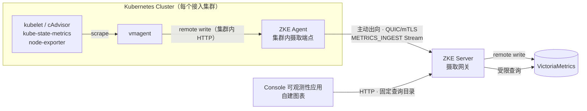

# Phase 3 可观测性架构设计

本文定义 ZKE Phase 3 多集群可观测性的数据通路：集群内采集、经 Agent QUIC 连接回传、Server 摄取与作用域
改写、集中存储，以及面向 Console 的查询、可视化与权限边界。可视化由 ZKE Console 自建，不依赖 Grafana。

> 状态：第一个切片已实现。协议层（`STREAM_KIND_METRICS_INGEST`、`STREAM_KIND_METRICS_COLLECTOR` 与两个
> 对应能力）、Agent 摄取端点与转发、Agent 侧采集组件安装与卸载、Server 摄取网关与作用域改写、存储写入、
> 固定查询目录、权限词、审计事件，以及 Console 的「可观测性」应用都已落地。
>
> 已验证（三项都可复跑）：
>
> - 摄取网关与查询目录对着真实的 VictoriaMetrics v1.149.0 跑通——写入的样本可查回，集群侧伪造的
>   `zke_cluster_id` 被替换为连接身份，六个具名查询都能在真实存储上执行
>   （`ZKE_TEST_METRICS_STORAGE_URL=http://127.0.0.1:8428 go test ./pkg/server/metricsingest ./pkg/server/metricsquery`）；
> - Agent 在真实集群中安装采集组件：Deployment 被 API Server 接受、vmagent 启动并就绪，卸载后包括凭证在内
>   的对象全部消失（`ZKE_LIVE_KUBERNETES_E2E=1 go test ./pkg/agent -run LiveMetricsCollector`）。这一步抓出了
>   替身客户端抓不到的缺陷：vmagent 不接受 Kubernetes 的 `512Mi` 写法，缓冲上限必须换算成字节；
> - Agent 的 ClusterRole 必须持有 `nodes/metrics` 才能授予它：缺少该权限时 Kubernetes 以
>   `attempting to grant RBAC permissions not currently held` 拒绝创建采集组件的 ClusterRole。
>
> 尚未验证：完整链路（真实集群里的 vmagent → Agent 摄取端点 → Server → 存储 → Console）没有在同一次运行中
> 端到端跑过——上面的集群内安装是在 Agent 运行于集群外的条件下做的，此时摄取 Service 没有 Endpoint。
> 容量、保留期与基数限流的实际取值也还没有基线数据。日志、告警与集群标签体系仍是规划（见 §13）。

前置阅读：[Server + Agent 架构](server-agent.md)、[Phase 2 Server–Agent 协议设计](agent-protocol-phase-2.md)、
[应用作用域与资源模型](resource-model.md)、[安全与权限](../security/authorization.md)。
产品侧的能力范围见[可观测性平台](../features/observability.md)。

## 1. 目标

- 在不要求 Server 直连任何集群网络的前提下，提供跨集群的指标查询与集群健康视图；
- 可视化在 ZKE Console 内自建，与桌面工作空间的窗口、权限和作用域模型保持一致，不引入第二套 UI、
  第二套登录与第二套权限体系；
- 采集、回传、存储和查询的每一段都保留不可变的 `cluster_id`，多集群数据不串扰；
- 查询结果严格受调用者的 Tenant、Project 与 RBAC 可见范围约束；
- 采集组件的安装、升级和卸载对使用者是显式的，不在用户集群里静默创建工作负载；
- 对基数、样本速率、正文大小、并发和保留期设置明确上限，单个集群不能拖垮平台；
- 允许 Server 与 Agent 独立升级：未启用或不支持可观测性能力的 Agent 保持现有行为。

## 2. 非目标

- 不实现自研时序数据库、查询引擎或采集器；
- 不向浏览器开放自由 PromQL 或后端存储的原始查询接口；
- 不集成、不嵌入、不代理 Grafana，也不提供 Grafana 数据源（理由见 §9.4）；
- 不做通用仪表盘编辑器与自定义可视化平台；
- 不做全局告警执行引擎（Phase 3 后续切片再设计，见 §13）；
- 不承担用户已有 Prometheus 生态的托管与迁移；
- 不在本阶段引入日志链路（首个切片只做指标，见 §13）。

## 3. 继承约束

以下约束来自 Phase 1/2，本设计不得打破：

- Server 不直接访问任何集群的 Kubernetes API Server，也不直接访问集群内的采集组件；
- Agent 主动出向连接 Server，集群侧只需要一条出向通道；
- 授权作用域止于 Cluster，Namespace 不是授权层级；
- ZKE Server 当前只支持单副本部署；
- Agent 使用最小权限 ServiceAccount，新增采集能力必须显式扩展 RBAC，不得复用现有资源权限；
- 敏感正文不进入日志、审计与错误消息。

## 4. 总体数据通路



四段职责边界：

| 段 | 归属 | 职责 | 不负责 |
| --- | --- | --- | --- |
| 采集 | 集群内 vmagent | 服务发现、抓取、relabel、失败重试与本地缓冲 | 认证 ZKE 用户、决定数据归属 |
| 回传 | ZKE Agent + QUIC Stream | 有界转发、背压、连接生命周期 | 解释指标语义、改写作用域标签 |
| 摄取 | ZKE Server | 强制作用域改写、限额、写入存储 | 抓取、长期存储 |
| 查询 | ZKE Server | 权限过滤、固定查询目录、错误分类 | 透传任意 PromQL |
| 展示 | ZKE Console | 图表渲染、时间范围与筛选、缺失与降级状态呈现 | 自行拼装查询表达式 |

## 5. 采集侧

### 5.1 为什么不在 Agent 内实现采集

Agent 内置抓取需要重新实现 Kubernetes 服务发现、relabel、staleness 标记、失败退避和断线期间的持久缓冲，
这些正是 vmagent 已经稳定提供的能力。自研会把一个采集器的长期维护成本加到 Agent 上，同时让 Agent 的内存
占用随目标数量增长，而 Agent 还承担着终端、日志和资源请求等交互链路。

因此采集由集群内独立的 vmagent 承担，ZKE Agent 只做一件事：把 vmagent 的 remote write 请求经已有的
QUIC 连接转发给 Server。这也让"断线期间数据不丢"由 vmagent 的磁盘队列解决，Agent 不需要自建持久缓冲。

### 5.2 组件与安装形态

采集组件是**可选**的，由集群自己的 Agent 安装，而不是由使用者去执行一份清单：

- 集群接入本身不安装任何采集组件。Console 打开「可观测性 → 采集接入」时向当前项目下每个集群的 Agent
  分别询问状态，未安装时提供安装，已安装时提供卸载；两者都要求 `cluster.metrics.manage`。逐集群询问而
  不是一次批量查询：合并成一个接口会让整体等最慢的集群，并在任何一个 Agent 离线时返回一份说不清哪里缺了
  的结果；
- **安装由 Agent 完成。** Server 只下发配置——镜像、拉取策略、抓取间隔、缓冲上限、kubelet 端口、CPU 与
  内存的请求和限制——对象的形状由 Agent 决定。这与独立终端会话是同一条既有路径：固定形状的特权操作走专用
  协议，由必须承担后果的一侧校验，而不是在 Server 侧给通用写入路径开一个口子。一个 Server 侧的缺陷因此不能
  变成"持 `cluster.metrics.manage` 就能往 Agent Namespace 里跑任意工作负载"；
- 安装的对象是 vmagent 的 Deployment、ServiceAccount、ClusterRole/ClusterRoleBinding 与抓取配置
  ConfigMap，全部位于该集群的 Agent Namespace（`identity.namespace`）。采集组件的 RBAC 只有 `nodes` 的
  读取和 `nodes/metrics` 的 `get`：比 `nodes/proxy` 窄，后者可以访问 kubelet 的任意路径；
- ZKE Agent 的 ClusterRole 因此需要持有 `nodes/metrics` 的 `get`——Kubernetes 拒绝创建一个包含创建者本身
  没有的权限的 ClusterRole。Agent 自己从不抓取 kubelet，持有它只是为了能够授予；
- 安装是幂等的：重复安装不会替换已有的摄取凭证，运行中的采集不会因此中断。同名但不带 ZKE 管理标签的
  对象一律拒绝而不是接管——集群里可能本来就跑着使用者自己的 vmagent；
- 卸载按安装的反序删除，凭证最后删除：不留下一个没有采集组件却仍然可用的令牌。Server 侧不保留任何
  "采集已启用"的记录，状态每次都问集群，因此有人手工删掉 Deployment 时 Console 会如实显示未安装；
- 采集组件的镜像、拉取策略与资源请求/限制是**平台配置**而不是 Server 配置文件项：采集在 Server 启动很久
  之后才按集群启用，换镜像或调预算不应当需要重启。镜像默认 `victoriametrics/vmagent:v1.149.0`，固定版本，
  未固定的 tag 会让两个集群装上不同的构建，报出无法互相比较的指标；请求默认 `50m` / `128Mi`，限制默认
  `500m` / `512Mi`——采集组件跑在别人的集群里，它能占多少必须由部署方说了算。四项都可以留空，表示不在容器
  上写这一项，供用 LimitRange 统一管预算的部署使用；Server 不为空值补默认，只有四项**全部**为空时 Agent
  才回落到旧的固定请求，那正是尚未认识这些字段的旧 Server 所要求的形状；
- kube-state-metrics 与 node-exporter 目前不在抓取配置中：第一个切片只抓 kubelet 的
  `/metrics/resource`，因为那已经足够支撑集群健康与资源用量视图，而每多一个目标都会成倍放大一个集群
  送出的基数。加入它们是后续切片里一次显式的抓取配置变更，不是自动发现。

### 5.3 默认指标集

首个切片只采集足以支撑集群健康与资源用量视图的最小集合：

- kubelet `/metrics/resource`：Node 与 Pod 的 CPU、内存实际用量；
- kubelet cAdvisor（可选，默认关闭）：容器级细粒度用量，基数显著更高；
- kube-state-metrics（存在时）：Node、Namespace、Pod、五类工作负载的状态与副本数；
- node-exporter（存在时）：节点磁盘、文件系统与网络。

抓取配置中的 relabel 规则负责丢弃高基数标签（例如容器 ID、Pod 模板哈希之外的可变标签），默认抓取间隔
30 秒。所有默认值都是资源保护配置，不是容量承诺。

### 5.4 集群内摄取端点与来源认证

ZKE Agent 在集群内暴露一个仅供 remote write 使用的 HTTP 端点（默认 `:8429`，仅通过 ClusterIP Service
暴露，不创建 Ingress）。它随 Agent 安装清单无条件部署：这样后续启用指标只需要 Server 配置加 Console 里的
一次操作，而不必让每个集群重新应用一遍 Agent 清单。集群内任何 Pod 都能访问 ClusterIP，因此该端点必须
认证：

- **凭证由 Agent 自己生成**，写入 Agent Namespace 下的 Secret，再挂载给 vmagent。Server 从不接触它：
  只有 Agent 需要校验它，让它经过 Server 只会凭空多出一段可能泄露的路径；
- Agent 拒绝没有匹配 Token 的请求，返回 401，且不区分"Token 错误"与"Token 缺失"的细节；
- Token 属于集群内凭证，只用于防止同集群内的误写与污染，不用于识别 ZKE 用户，也不参与 Server 侧鉴权；
  Server 侧的数据归属完全由 mTLS 连接身份决定（见 §7.1）；
- Agent 通过 client-go 读取该 Secret，并每分钟刷新一次，因此凭证变化不需要重启 Agent；Secret 中的
  `token` 与 `previous-token` 两个键都被接受，构成轮换的重叠窗口；
- 端点只接受 remote write 路径与 `POST`，不提供查询、管理或调试路由；
- 采集组件被告知写往哪里，由 Agent 决定：默认是它自己的 ClusterIP Service，这在 Agent 作为 Pod 运行时永远
  正确。本地开发中 Agent 常直接跑在宿主机上，此时它没有 Pod、Service 背后也就没有 Endpoint，因此 Agent 配置
  中的 `metrics_ingest.advertised_url` 可以给出一个集群能访问到宿主机的地址；两者都没有时 Agent 拒绝安装并
  说明原因，而不是部署一个只会不断重试的采集组件。

## 6. 回传协议

### 6.1 新增 Stream 类型与能力

Phase 2 协议明确规定：Agent 主动上报必须使用独立的、由 Agent 发起的 Stream 类型，不得复用 Server 发起的
Resource Stream。Phase 3 据此新增：

```protobuf
enum StreamKind {
  // ... 现有取值不变
  STREAM_KIND_METRICS_INGEST = 40;
  STREAM_KIND_METRICS_COLLECTOR = 41;
}
```

两个能力独立协商：`metrics-ingest.v1` 与 `metrics-collector.v1`，由双方在 `ClientHello` / `ServerHello`
中各自声明。只有双方都声明，对应的 Stream 才会建立；未声明的旧 Agent 与旧 Server 组合保持 Phase 2 行为。

- `METRICS_INGEST` 由 **Agent** 发起，是当前协议中第一个这样的业务 Stream，Server 侧的 `AcceptStream`
  分发为它建立了处理器与额度；
- `METRICS_COLLECTOR` 由 **Server** 发起，是一次短请求：STATUS、INSTALL 或 UNINSTALL。它只携带配置，
  不携带对象，Agent 按自己的定义渲染并写入（见 §5.2）。Server 只在自己确实有存储时才通告这个能力——
  装上一个无处上报的采集组件比不装更糟。

Stream 生命周期：Agent 在采集启用且连接可用时打开一条摄取 Stream，长期保持；连接替换或排空时随连接
关闭并在新连接上重开。同一 Connection 同时只允许一条摄取 Stream，重复打开视为协议错误并重置后开的那条。

### 6.2 帧格式

摄取 Stream 是"多请求、有确认"的长流，而不是一次 RPC：

```text
StreamHeader(kind=METRICS_INGEST, idempotency_key="")
MetricsIngestHello(collector, payload_encoding)
MetricsIngestReady(result, max_batch_bytes, max_in_flight_batches)
  ┌─ MetricsIngestBatch(batch_id, payload_size) + Payload（恰好 payload_size 字节）
  └─ MetricsIngestAck(batch_id, result, reason, message, retry_after_millis)   … 循环
FIN
```

- `Payload` 是 snappy 压缩后的 Prometheus remote write 请求正文，原样来自 vmagent。Agent 不解压、不解析、
  不改写；解析和作用域改写只发生在 Server（见 §7.1）；
- 正文以 §6.6 的方式紧随 Protobuf 消息传输：先校验 `payload_size` 上限，再用有界 Reader 流式读取，
  不按声明大小预分配内存；
- `batch_id` 在单条 Stream 内单调递增，仅用于确认与日志关联，不跨连接保留，也不作为幂等键——重放由
  vmagent 的重试与存储侧的相同样本覆写语义处理；
- 单批默认上限 4 MiB（压缩后），协议硬上限 16 MiB；两者由 Server 在 `MetricsIngestReady` 中下发，Agent 取
  双方较小值，并拒绝超过协议上限的声明；
- 未确认批次窗口当前实现为 1，即严格的发送—确认交替。协议保留 `max_in_flight_batches` 字段，让后续版本
  不必换 Stream 类型就能放宽；选择 1 是因为它不需要任何批次簿记，而且已经产生了这条链路存在的意义所在的
  背压：批次未被确认时，等待的是集群内的采集器；
- 没有单独的 Trailer 消息：每个批次都有自己的确认，正常结束就是 Agent 关闭发送方向，异常结束由 Stream
  reset code 表达。为一条"每批都已回执"的流再定义一个收尾消息，只会多出一个两端可能不一致的状态；
- `MetricsIngestAck` 区分接受、限流（携带 `retry_after_millis`）、正文非法与存储不可用。Agent 把非
  接受结果映射为对 vmagent 的 429 或 503，由 vmagent 决定退避与重试。

### 6.3 背压与丢弃

链路上只有一处允许持久缓冲，就是集群内的 vmagent 磁盘队列：

- Agent 内存中同时只持有有限个未确认批次，超出即对 vmagent 返回 429，不排队；
- Server 摄取网关到存储的写入失败或超时，映射为对该批次的非接受确认，不在 Server 侧堆积；
- Agent 与 Server 断连期间，vmagent 按 `-remoteWrite.maxDiskUsagePerURL` 缓冲并在恢复后回灌，超出上限
  由 vmagent 丢弃最旧数据。ZKE 不承诺断线期间零丢失，Console 需要能显示数据空洞而不是插值掩盖；
- 摄取 Stream 的额度独立于其余业务 Stream，任何情况下不得挤占 Resource、日志与终端的额度。

### 6.4 Server incoming Stream 额度重新核算

当前 `agent_listener.max_incoming_streams` 默认 16，其中 Control Stream 长期占用 1 个。新增 Agent 发起的
摄取 Stream 后，Phase 2 协议给出的约束变为：

```text
1 条 Control Stream + 1 条 Metrics Ingest Stream + 预留额度
≤ Server agent_listener.max_incoming_streams
```

默认值仍够用，但 Server 侧必须新增按类型的应用层额度（例如 `max_concurrent_metrics_ingest_streams`
与实例级摄取并发上限），避免 Agent 数量增长后摄取流耗尽连接级额度或 Server 处理能力。额度耗尽时立即以
`RESOURCE_EXHAUSTED` 重置该 Stream，不建立等待队列。

## 7. Server 摄取网关

### 7.1 作用域改写

**Server 不信任任何来自集群侧的作用域标签。** 摄取网关解压并解析 remote write 正文后，对每个时间序列：

1. 删除所有 `zke_` 前缀的标签，无论其原值是什么；
2. 写入 `zke_cluster_id`，取值来自该 QUIC Connection 经 mTLS 与 Connection Registry 绑定的 Cluster；
3. 校验剩余标签数量、标签名合法性与单序列标签总长度，超限则拒绝整批。

`zke_` 前缀是保留命名空间：这样集群里已有的 `cluster` 或 `tenant` 标签不会与 ZKE 的作用域身份冲突，
也不会被误当作身份使用。改写发生在 Server 而不是 Agent，因为 Agent 运行在用户集群内、其配置与 Secret
对集群管理员可见，把身份决定权放在集群侧等于允许一个集群冒充另一个集群。

### 7.2 为什么 `tenant_id` 与 `project_id` 不作为存储标签

[可观测性平台](../features/observability.md)此前记录"指标必须携带 `cluster_id`、`tenant_id`、`project_id`"。
本设计收敛为**只有 `zke_cluster_id` 进入存储**，理由是：

- Cluster 归属的 Tenant 与 Project 是 Server 数据库中的可变关系，集群可以在生命周期内改变归属；
- 时间序列标签一旦写入就不可回改。把可变归属写进标签，会产生同一集群的历史数据分裂成多组标签组合，
  按当前归属查询时要么漏掉历史，要么需要在查询层枚举全部历史归属；
- Server 在每次查询时都要解析调用者的可见范围，这一步本来就会把 Tenant/Project 展开成一组 `cluster_id`
  （见 §9.2），因此存储侧不需要重复携带归属。

代价是：脱离 Server 直接查询存储时看不到租户维度。这是可接受的——存储后端不是对外查询入口。

### 7.3 摄取限额

按 Cluster 与 Server 实例分别设限，超限拒绝并计数，不静默截断：

- 单批压缩后正文、解压后正文与解压比例；
- 每集群样本速率与活跃时间序列数（基数）上限；
- 单序列标签数与标签值长度；
- 样本时间戳窗口：拒绝过于超前的未来时间戳，限制可回填的历史深度；
- Server 实例级并发摄取批次数。

集群触碰基数上限时，Server 记录结构化告警并在集群的采集状态中显式暴露"已限流"，Console 必须显示这个
状态；把限流藏起来会让使用者把数据缺口误判为集群故障。

## 8. 存储后端

ZKE 不实现时序存储，使用 VictoriaMetrics 作为后端：

- Server 通过 remote write 写入，通过 `/prometheus/api/v1/*` 查询，两者都只在 Server 进程内使用，
  不向浏览器暴露；
- 首选单实例（single-node）形态。它没有存储级多租户隔离，隔离完全依赖 §7.1 的强制标签改写与 §9 的固定
  查询目录。需要存储级隔离时再评估集群形态的 `accountID` 方案，那属于后续设计，不在本文范围；
- 后端地址、超时与保留期是部署级配置，归全局管理员，放在「平台配置」而不是 Tenant/Project 层；
- 部署形态与现有 Server 一致地提供三种路径：Compose 增加一个可选服务、Helm Chart 增加一个可选
  subchart 或外部地址、单机场景提供打包镜像。具体镜像与 Chart 名称在实现时确定，本文不预先给出；
- 存储不可用时，摄取拒绝当前批次，查询返回明确的"存储不可用"，Server 其余功能不受影响。可观测性是
  可降级能力，不能让集群管理链路跟着不可用。

保留期默认值需要结合样本速率与磁盘容量给出，并在部署文档中说明估算方式；本文不预设未经实测的容量数字。

## 9. 查询与权限

### 9.1 固定查询目录，不开放自由 PromQL

Server 已有的安全立场是"不做透明 Kubernetes 代理"，查询侧沿用同一原则：Console 只能调用 Server 定义的
一组具名查询，每个查询有固定的 PromQL 模板与受校验的参数（时间范围、步长、集群集合、Namespace、
工作负载、Top N）。

理由不只是安全边界。自由 PromQL 要求 Server 解析并安全改写用户表达式才能注入作用域过滤，任何解析或
改写缺陷都是跨租户数据泄露；同时自由表达式的执行成本无法预估，单个查询就能拖垮单副本 Server 背后的
存储。固定目录让作用域过滤成为模板的一部分，而不是对用户输入的事后修补。

已实现的查询目录：`cluster_cpu_usage`、`cluster_memory_usage`、`node_cpu_usage`、`node_memory_usage`、
`namespace_cpu_usage`、`collection_health`。它们都建立在 kubelet `/metrics/resource` 之上，与生成的抓取
配置是同一个决定：目录里不应出现集群侧根本没有采集的指标。

目录本身是可扩展的，新增查询是一次显式的 Server 变更，需要同时评审它的成本、它的作用域过滤，以及集群侧
是否真的在采集它依赖的指标。

### 9.2 权限与可见范围

权限词沿用 `cluster.` 前缀，与授权作用域止于 Cluster 的既有模型一致：

| 权限词 | 含义 |
| --- | --- |
| `cluster.metrics.read` | 读取所属作用域内 Cluster 的指标查询结果 |
| `cluster.metrics.manage` | 为 Cluster 启用/停用采集、生成与撤销采集清单 |

存储后端地址等部署级配置继续走全局管理员路由，不新增权限词。

每次查询的作用域解析：

1. 从 Session 解析调用者的可见范围（Global / Tenant / Project）；
2. 展开为其中具有 `cluster.metrics.read` 的 `cluster_id` 集合；
3. 若请求显式指定集群，取交集；交集为空时返回无权限或空结果，不静默扩大范围；
4. 把最终集合作为强制标签过滤注入查询模板，注入发生在模板内部，调用方参数无法覆盖；
5. 可见集群数量有上限，超出时要求调用方缩小范围，而不是发起一个覆盖全平台的查询。

集合为空与"有权限但无数据"必须在响应中可区分，否则使用者无法判断是权限问题还是采集未启用。

### 9.3 查询响应格式

查询响应不透传 VictoriaMetrics 的原始格式，由 Server 归一化为面向图表的稳定结构：

```json
{
  "query": "cluster_cpu_usage",
  "start": "2026-08-15T00:00:00Z",
  "end": "2026-08-15T01:00:00Z",
  "step_seconds": 60,
  "unit": "millicores",
  "series": [
    {
      "cluster_id": "cls_...",
      "cluster_name": "prod-sh",
      "labels": { "node": "node-1" },
      "points": [[1755216000, 1420.5], [1755216060, null]]
    }
  ],
  "partial": false,
  "issues": []
}
```

要点：

- 时间戳统一为秒级 Unix 时间，数值统一在 Server 侧换算为响应声明的 `unit`，前端不做单位推断；
- 缺失样本用 `null` 显式表示，不省略、不前值填充。数据空洞是真实信息，插值会把采集中断显示成平线；
- `cluster_name` 由 Server 用当前数据库归属补齐，只作展示；`cluster_id` 才是序列身份（见 §7.2）；
- 部分集群失败时返回 `partial=true` 与不含敏感正文的 `issues`，与集群概览的既有语义保持一致；
- 序列数量与点数有上限，超限时降低 `step_seconds` 或要求缩小范围，而不是返回一个前端渲染不动的响应。

### 9.4 自建可视化，不依赖 Grafana

可视化由 Console 自建。不集成 Grafana 的理由：

- **权限模型无法对齐。** Grafana 有自己的用户、组织与数据源权限体系，而 ZKE 的可见范围来自 Session
  解析出的 Tenant/Project/RBAC，且必须按查询逐次展开成 `cluster_id` 集合。要让 Grafana 正确执行这套
  过滤，只能给它一个已经受限的数据源或代理层——那等于把 §9.1、§9.2 的过滤再实现一遍，多一处实现就多
  一处跨租户泄露的可能；
- **与固定查询目录冲突。** Grafana 的价值在于自由编辑面板与表达式，而本设计明确不向浏览器开放自由
  PromQL。嵌入一个不能自由查询的 Grafana，既失去了它的长处，又保留了它的运维成本；
- **产品形态不一致。** ZKE Console 是以窗口、Dock 和应用分区组织的桌面式工作空间。嵌入 iframe 会带来
  第二套导航、第二套主题、第二次登录与第二套会话过期行为；
- **部署负担。** 自建采集与存储已经引入了 vmagent 与 VictoriaMetrics 两个组件，再加一个有状态的 Grafana
  会继续抬高最小部署成本，而 ZKE 的定位是单二进制加一个数据库。

需要 Grafana 的使用者仍可以直接连接自己的 VictoriaMetrics 实例——那是他们的部署选择，不是 ZKE 的集成点。
ZKE 不为此提供数据源、代理路由或凭证分发。

### 9.5 Console 图表实现

Console 当前没有图表依赖（React 19 + Tailwind 4 + Radix + TanStack Query/Table）。选型已定：

**时序折线与面积图使用 uPlot（MIT，Canvas 渲染，无传递依赖）。** 可观测性视图的典型负载是"多集群 ×
多序列 × 数百到数千点"，SVG 在这个量级会产生数以万计的 DOM 节点，拖慢的不只是图表本身，还有它所在
窗口的滚动、拖拽与缩放——在一个可以同时打开多个窗口的桌面式工作空间里，这个代价会被窗口数量放大。
uPlot 正是为大规模时序而写，体积与 API 面都远小于通用图表库，代价是需要自己封装坐标轴格式化、
Tooltip、图例与主题联动。这个代价是可控的一次性工作，而通用图表库省下的这部分工作会以体积、
抽象层和难以对齐设计系统的形式长期还回来。

被否决的方案：全自绘 SVG（零依赖，但大序列量下的性能问题要自己兜，且等于自研一个图表库）；
Recharts / ECharts 等通用库（功能远超所需，体积与主题定制成本更高）。

其余约束：

- **条形、占比、迷你趋势和状态指示**：用现有 Tailwind 与内联 SVG 自绘，不为它们再引入第二个库。
  uPlot 只用于真正的时序场景；
- uPlot 通过一个受控的 React 封装组件接入，实例创建、`setData`、`setSize` 与销毁在该组件内闭环，
  不把命令式实例散落到各视图；窗口尺寸变化经现有窗口系统驱动，不额外监听全局 resize；
- 坐标轴、Tooltip、图例、配色与暗色模式全部复用 `styles/theme.css` 的语义变量，uPlot 不自带调色板，
  也不引入它自己的 CSS 主题；
- 图表只消费 §9.3 的归一化响应，不在前端拼装查询表达式、不做单位换算、不做插值；`null` 直接交给
  uPlot 的空值语义渲染为断点；
- 加载中、无权限、采集未启用、数据空洞、部分失败与限流是六种不同的空状态，各自有明确文案与后续动作，
  不复用同一个"暂无数据"；
- 依赖在第一个切片实际动手时再加入 `package.json`，届时按仓库约定核对许可证与打包体积增量，不提前
  引入一个没有使用者的依赖。

首期只提供固定视图，不做用户自定义仪表盘编辑器：自定义面板需要自由表达式，与 §9.1 的安全立场直接冲突。
若后续确有需求，方向是"基于具名查询与受校验参数的受限布局保存"，而不是开放查询语言。

### 9.6 错误分类

查询与摄取的错误必须区分：未认证、无权限、集群不存在、采集未启用、Agent 离线、存储不可用、查询超时、
查询被限流、参数非法。这些状态在 Console 上对应完全不同的处置动作，合并成一个"查询失败"等于让使用者
自己去猜。

## 10. 审计与敏感数据

- 启用采集、停用采集、生成采集清单、轮换摄取 Token 与修改存储后端配置是审计事件，记录发起者、目标
  Cluster、操作类型、结果与时间；
- 指标查询是高频读取，默认不逐次写审计，只记录结构化访问日志（含 `cluster_id`、请求关联 ID、查询名、
  时间范围与耗时）；
- 摄取正文、Token 值、存储后端凭证不得进入日志、审计与错误消息；
- 指标标签本身可能携带用户命名的业务信息，因此错误消息中不回显整条标签集，只回显违规的标签名与限额。

## 11. 失败路径

| 场景 | 行为 |
| --- | --- |
| Agent 离线 | 采集状态显示离线与最后接收时间；vmagent 本地缓冲，恢复后回灌 |
| Agent 在线但未启用采集 | 查询返回"采集未启用"，Console 提供启用入口 |
| vmagent 未部署或不健康 | 数据停止到达，采集状态按最后接收时间转为陈旧 |
| 摄取 Token 不匹配 | Agent 返回 401，采集状态显示凭证不匹配，提示重新应用清单 |
| 集群触碰基数或速率上限 | 部分数据被拒；采集状态显示已限流，不伪装成正常 |
| 存储不可用 | 摄取拒绝批次、查询报错；集群管理与容器服务不受影响 |
| 部分集群查询失败 | 返回成功响应并标明受影响集群，与集群概览的 `partial` 语义保持一致 |
| Server 重启 | 摄取 Stream 随连接重建；缓冲期数据由 vmagent 回灌 |

## 12. 配置项

已实现的配置项：

- 平台配置（PostgreSQL，Console 的「平台配置 → 指标采集」，全局管理员）：采集组件镜像、拉取策略，以及
  它的 CPU / 内存请求与限制；
- Server `observability.metrics`：`enabled`、`storage_write_url`、`storage_query_url` 与各自的超时、
  `collector_buffer_size`、`scrape_interval`、`kubelet_metrics_port`、`ingest_session_timeout`、
  `max_batch_bytes`、`max_ingest_streams`、`max_decompressed_batch_bytes`、每批的序列与样本上限、
  标签数量与长度上限、样本时间窗口，以及查询侧的 `max_query_clusters`、`max_query_points`、
  `max_query_series`、`max_query_range`、`min_query_step`；
- Agent `metrics_ingest`：`address`、`max_batch_bytes`、`max_concurrent_batches`、`session_timeout`、
  `token_refresh_interval`、`unavailable_retry_after` 与该 HTTP 端点自身的超时。Agent 侧**没有**开关：
  是否采集由 Server 决定（它是否有存储、是否通告能力），再由操作者决定（是否安装采集组件），Agent 配置
  文件里的第三个开关只能与这两者矛盾。

Server 的 `enabled` 为 false 时不校验其余取值，一份没人填写的段落不会让 Server 拒绝启动；仓库示例配置默认
开启并指向本机 `127.0.0.1:8428`，与其中的数据库地址一样是给本地开发用的。与现有配置一致，这些默认值是
资源保护配置，不是性能或生产容量承诺。

尚未实现的是每集群的样本速率与基数上限（§7.3 中按 Cluster 计的那两项）：当前只有按批次的结构性限额与
存储后端回压。

## 13. 落地切片

Phase 3 按可独立验证的切片推进，每个切片结束时链路端到端可用：

1. **指标端到端最小链路**（已实现）：协议与能力协商、Agent 摄取端点与转发、Agent 侧采集组件安装与卸载、
   Server 摄取网关与标签改写、存储写入、六个固定查询、Console 可观测性应用（集群与节点用量图表、采集
   接入的自动探测与一键安装/卸载）、权限词与审计。
2. **指标深化**：节点与工作负载维度查询、Namespace 维度、Top N、数据空洞与限流状态的完整呈现、
   图表组件成套化（折线、面积、条形、迷你趋势与状态指示）、容量与保留期的运维文档。
3. **集群标签体系**：为跨集群筛选与分组提供稳定的标签维度，先在查询层落地，不改变存储侧身份标签。
4. **日志链路**：VictoriaLogs 与日志采集，复用同一条回传通道与作用域改写机制；正文体量、保留期与
   敏感内容过滤需要独立设计。
5. **告警**：告警规则、评估位置（Server 侧集中评估与集群侧就地评估的取舍）、告警记录与通知，
   依赖前四个切片就绪。

每个切片都包含自己的 Console 视图。可视化不是排在链路之后的独立阶段：一条没有视图的采集链路无法验证
它采到的数据是否正确。

## 14. 验证与验收

第一个切片至少覆盖：

- 摄取 Stream 的能力协商：一端不声明时不建立，且不影响其他业务 Stream；
- 作用域改写：集群侧伪造 `zke_cluster_id`、`zke_tenant_id` 等标签后，存储中的身份仍来自 mTLS 绑定；
- 权限过滤：跨 Tenant/Project 的用户查询不到范围外集群的任何样本，包括通过参数构造的越界请求；
- 限额：超大正文、超高解压比例、超限基数与超前时间戳被拒绝且只影响当前批次；
- 背压：Server 停止确认时 Agent 不无界占用内存，vmagent 收到 429 并退避；
- 断连恢复：连接替换后摄取 Stream 重建，缓冲数据回灌，样本不重复计数、不产生错误的空洞；
- 降级：存储不可用时集群管理、容器服务与终端不受影响；
- Agent 未启用采集时，内存与 Stream 占用与 Phase 2 一致；
- 图表渲染：数据空洞显示为断点而不是连线或零值，六种空状态各自可达且文案区分；
- uPlot 封装组件的生命周期闭环：窗口关闭、视图切换和数据刷新后没有残留实例、监听器或定时器；
- 图表在窗口缩放、拖拽、暗色主题切换和多窗口并存时保持可用，不阻塞桌面交互；
- Console `typecheck`、`lint` 与生产构建通过，uPlot 对打包体积的影响有记录；
- `go test -race` 下无数据竞争。

性能指标先记录基线再设阈值，不预设未经实测的吞吐、延迟或容量承诺。

## 15. 开放问题

- VictoriaMetrics 查询接口上强制标签过滤的具体机制（`extra_filters` 等）需在实现前按目标版本实测确认，
  不能仅依据文档描述就作为唯一的隔离手段；模板内注入仍是主要防线。
- 单副本 Server 同时承担摄取与查询时的资源竞争边界，需要基线数据后再决定是否拆分摄取与查询的额度池。
- kube-state-metrics 与 node-exporter 缺失时，哪些查询降级为"不可用"、哪些可用替代来源近似，需要逐项确定。
- 采集组件的版本与升级：清单固定版本还是跟随 Server 版本，涉及跨版本兼容与升级节奏。
- 集群被删除或重新接入后，历史时间序列的保留与清理策略。
- 查询响应的序列数与点数上限，需要结合真实集群规模、uPlot 的实测渲染耗时和图表可读性确定，而不是先定
  一个数字。
