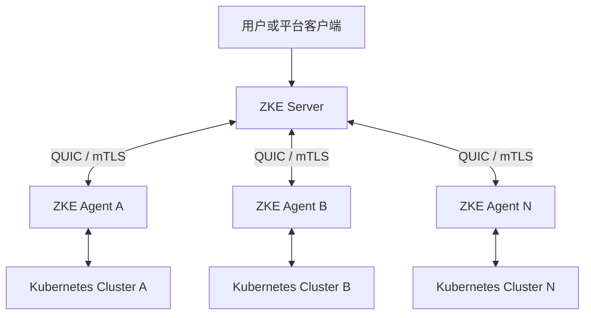

# 系统架构

ZKE 采用 Server + Agent 模型。ZKE Server 负责认证、授权、审计、管理 API 和任务编排；每个接入集群中的
ZKE Agent 主动连接 Server，并在所属 Kubernetes 集群内执行资源查询和操作。Server 不需要直接访问目标集群的
Kubernetes API Server。

## 当前数据流

- 用户通过 Console 或 Server API 访问平台能力。
- Server 从用户会话解析 Tenant、Project、Cluster 权限作用域。
- 集群查询和操作通过目标 Cluster 的 Agent 定域执行，结果保留 Cluster、Namespace 和资源身份。
- 平台主数据、会话、角色绑定、幂等记录和审计事件保存在 PostgreSQL。

指标的第一条链路已实现，一体镜像、Compose 与 Helm 都自带存储并默认启用：集群内 vmagent 采集，经该集群
Agent 已有的 QUIC 连接回传，Server 在摄取时按连接身份强制写入 `zke_cluster_id` 后存入 VictoriaMetrics，
查询只经 Server 的具名查询目录、每次针对一个目标集群，可视化由 Console 自建，不集成 Grafana。日志与告警
仍在规划中。
详见 [Phase 3 可观测性架构设计](observability-phase-3.md)。

## 延伸阅读

- [Server + Agent 架构](server-agent.md)
- [应用作用域与资源模型](resource-model.md)
- [安全与权限](../security/authorization.md)
