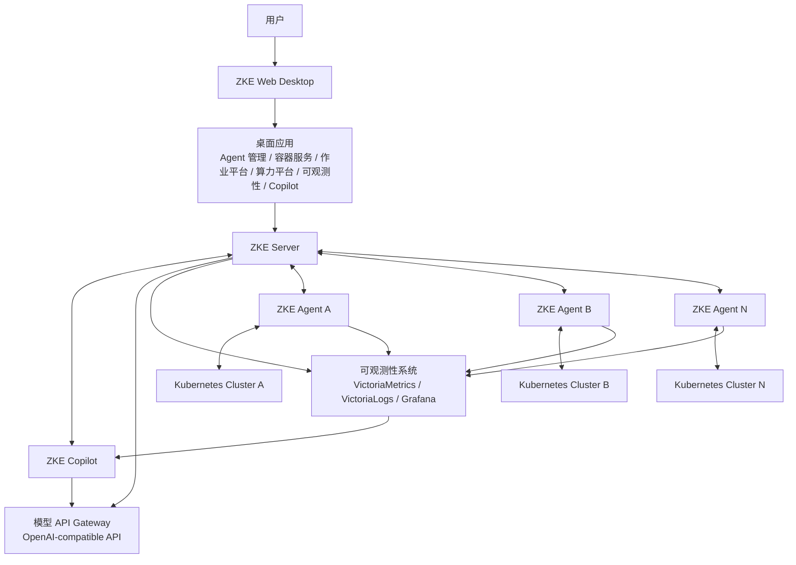

# 系统架构

> 状态：目标架构。当前已完成 Phase 1 可运行工程骨架，以及本地认证与 RBAC 基础、Agent 注册与安装
> Manifest、QUIC/mTLS 连接、心跳、证书续期、撤销 API 与通知断连、实时连接和证书状态查询。业务 Stream、
> 集群资源管理、Web Desktop 和其余平台组件仍处于规划阶段。

ZKE 的目标架构采用 Server + Agent 模型。用户计划通过 Web Desktop 使用各桌面应用；ZKE Server 负责统一控制与编排；每个 Kubernetes 集群中的 ZKE Agent 负责资源查询和定域执行。

## 规划数据流

- 用户计划从 Web Desktop 打开不同桌面应用，并通过 ZKE Server 使用平台能力。
- ZKE Server 计划通过各集群内的 ZKE Agent 查询资源、下发任务和执行已授权操作。
- Agent 计划收集或转发携带集群标识的指标、日志与事件。
- 可观测性系统计划汇总多集群遥测数据，并为平台应用和 ZKE Copilot 提供分析依据。
- ZKE Copilot 计划联合资源状态与遥测数据进行分析；需要执行的操作仍由目标集群 Agent 完成。
- 模型 API Gateway 计划为模型服务提供统一访问入口，调用方无需直接感知底层 Pod。

## 延伸阅读

- [Server + Agent 架构](server-agent.md)
- [应用作用域与资源模型](resource-model.md)
- [安全与权限](../security/authorization.md)
