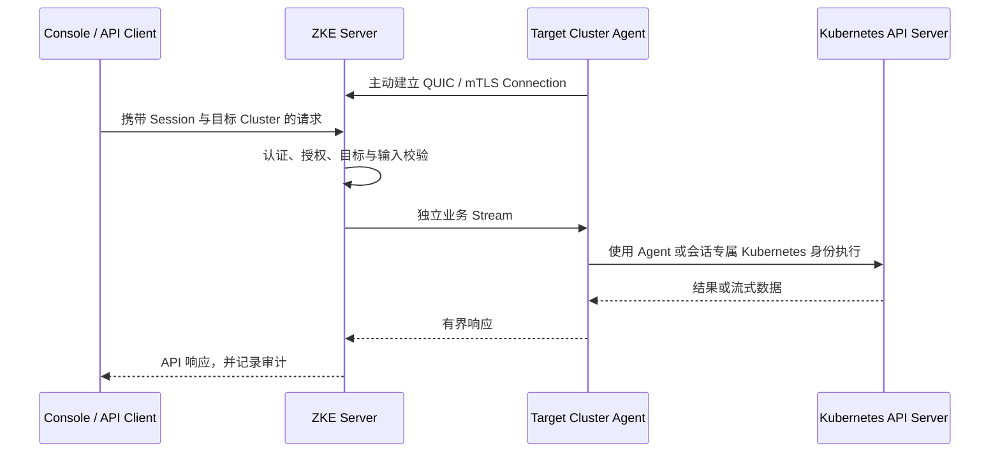

# Server + Agent 架构

ZKE Server 是统一管理面，每个接入的 Kubernetes 集群部署一个 ZKE Agent。Agent 主动连接 Server，Server 不需要
直接访问目标集群的 Kubernetes API Server。

## 职责边界

ZKE Server 负责：

- 用户认证、Tenant、Project 与 RBAC；
- Cluster、Agent 连接身份和接入凭证管理；
- HTTP API、Console、敏感操作确认、幂等与审计；
- 将资源请求定域到目标 Cluster 的当前 Agent；
- PostgreSQL 主数据与 Managed Agent PKI。

ZKE Agent 负责：

- 注册、身份 Secret、QUIC/mTLS 连接、心跳、重连和客户端证书续期；
- 使用目标集群内的 Kubernetes 身份执行资源查询和操作；
- 承载 Resource、Event Watch、Pod Logs、Pod Exec、Pod Port Forward 与独立终端会话 Stream；
- 在本地再次校验请求类型、资源身份、正文上限和允许的 Subresource。

多集群指标、日志和告警采集仍在规划中，不属于当前 Agent 数据面。

## 连接与请求模型

一条 Agent Connection 只绑定一个内部 Agent 身份和一个稳定的 `cluster_id`。管理 API 不暴露内部
`agent_id`；重新接入复用原 `cluster_id` 并创建新的内部连接身份。所有查询和操作都必须保留目标 Cluster；
命名空间级操作还必须保留 Namespace、资源名称及适用的 UID/`resourceVersion` 前置条件。

业务请求各占用独立 QUIC 双向 Stream。Control Stream 只承载 Hello、心跳、证书续期和连接排空，不承载资源任务。
Secret、Kubernetes Event、Pod Logs、Exec、Port Forward 和 Kubernetes RBAC 不通过宽泛的通用接口旁路各自的
专用权限与协议边界。

## 身份与最小权限

Agent 首次注册使用短期一次性 Enrollment Token，在集群内生成私钥和 CSR；Server 只接收 CSR。注册后，Agent 将
客户端证书和私钥保存在固定 identity Secret 中，并使用 mTLS 长连接。HTTP 注册入口与 QUIC Listener 地址、TLS
身份和信任根分别配置。

Server 生成的 Agent 安装 Manifest 包含 Deployment、ConfigMap、Secret、ServiceAccount 和最小 RBAC。Agent 的
Kubernetes 权限决定它最终可以访问的资源；Server 授权不能越过这层限制。独立终端 App 不复用 Agent
ServiceAccount，而是为每个会话创建短生命周期的 ServiceAccount 和按当前用户权限投影的 RBAC。

## 当前部署边界

ZKE Server 当前只支持单副本部署。连接快照、状态事件扇出和部分限流状态保存在进程内；同时运行多个 Server
副本会产生不一致的在线状态，且尚无跨实例业务 Stream 路由。Server 重启后，Agent 会自动重连，但内存中的离线
断开详情不会保留。

Managed PKI 将 Agent Client CA、Listener CA 和 Listener 身份保存在 Server 持久目录；目录缺失或与数据库指纹
不一致时拒绝启动。客户端证书和 Listener 叶子证书支持自动续期，CA 双信任窗口与无中断自动轮换尚未实现。

## 延伸阅读

- [Agent 注册与连接](agent-enrollment-and-connection.md)
- [Phase 2 Server–Agent 协议设计](agent-protocol-phase-2.md)
- [集群接入管理](../features/agent-management.md)
- [容器服务](../features/container-service.md)
- [终端](../features/terminal.md)
- [安全与权限](../security/authorization.md)
