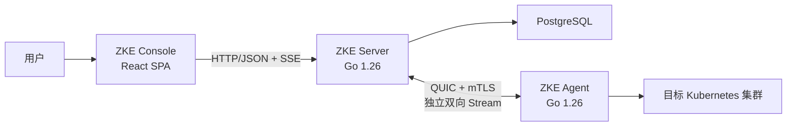

# 技术基础设计

> 状态：已确定。
>
> 本文定义 ZKE Phase 1 已确认的技术基线与首个可运行闭环。

## 1. 目标

技术基础需要优先验证 ZKE 最核心的 Server + Agent 架构，并为后续认证、RBAC、容器服务、可观测性和
ZKE Copilot 提供稳定边界。

首个纵向闭环定义为：

1. 已授权用户为指定 Tenant 和 Project 创建一次性 Agent 注册凭证；
2. ZKE Agent 从 Kubernetes 集群主动连接 ZKE Server；
3. Server 完成 Agent 注册、身份建立、心跳接收与连接状态维护；
4. ZKE Console 通过 Server API 查看权限范围内的集群和 Agent 状态；
5. Agent 断开后，Server 能够判定离线；Agent 重启后使用原身份恢复连接；
6. 注册、拒绝、连接、断开和凭证撤销均留下不含敏感正文的审计记录。

## 2. 决策状态

| 主题 | 状态 | 基线 |
| --- | --- | --- |
| ZKE Server | 已确定 | Go 1.26 |
| ZKE Agent | 已确定 | Go 1.26 |
| ZKE Console | 已确定 | React 19 + TypeScript + Vite 8 的客户端 SPA |
| Console 构建环境 | 已确定 | Node.js 24 LTS + pnpm，具体补丁版本通过项目文件和 lockfile 固定 |
| Console 组件体系 | 已确定 | Ant Design 6 作为基础组件库，ZKE 自行维护主题 Token 和桌面交互组件 |
| Server HTTP 框架 | 已确定 | Gin；使用自建 `http.Server` 承载并统一配置超时 |
| Server–Agent 传输 | 已确定 | QUIC/`quic-go` + mTLS，Agent 主动建立连接 |
| Agent 消息编码 | 已确定 | 版本化 Protobuf 消息和长度前缀帧 |
| Console–Server API | 已确定 | HTTP/JSON + OpenAPI；SSE 提供单向实时状态，WebSocket 仅用于交互式会话 |
| 主数据存储 | 已确定 | PostgreSQL |
| 用户认证 | 已确定 | ZKE 内置本地用户、Argon2id 密码摘要和 Server 端不透明会话 |
| Agent 身份 | 已确定 | 一次性注册凭证完成引导，注册后使用 mTLS |
| 仓库组织 | 已确定 | 单仓库；Server 与 Agent 初期共用一个 Go module；Console 位于同仓库的 `web/console` 前端工作区 |

初始化工程时显式设置 Go 1.26 的 `go` 与 `toolchain` 指令，并提交 `packageManager`、Node.js 版本文件和依赖
lockfile；补丁版本由这些文件固定。

## 3. 总体边界



- Console 通过 ZKE Server 访问平台能力。
- Server 负责用户认证、RBAC、作用域校验、Agent 连接管理、任务编排、持久化和审计。
- Agent 主动连接 Server，仅使用出站连接。
- 所有集群查询和操作最终由对应集群中的 Agent 定域执行。
- Server 从用户会话或 Agent 身份推导 Tenant、Project 和 Cluster 权限作用域。
- Console HTTP API 与 Agent QUIC 连接使用不同 Listener；Agent Listener 使用 UDP。

## 4. Server 技术基线

### 4.1 运行时与代码组织

- 使用 Go 1.26。
- Console HTTP API 使用 Gin。使用 `gin.New()` 显式装配日志、恢复、认证、授权、CSRF、限流和审计中间件，
  并由 ZKE 控制全部中间件配置。
- Gin Engine 作为标准库 `http.Server` 的 Handler；由 ZKE 显式配置 Header、读取和空闲超时，并执行优雅关闭。
  普通 API 使用写超时，SSE 使用独立写入 Deadline、心跳和最长连接时限。
- 包之间保持单向依赖，接口仅在测试隔离或实现替换确有需要时定义。
- 共享代码只包含确实被 Server 和 Agent 共同使用的协议、标识、版本与安全基础类型。

Server 按职责组织：

```text
httpapi          Gin HTTP、SSE、参数与响应转换
agentconn        QUIC 连接、Stream、心跳和请求分发
service          注册、集群查询和任务等业务流程
store            PostgreSQL 数据访问
auth             用户、会话、Agent 身份和权限校验
audit            审计事件
observability    日志、指标和追踪
```

`httpapi` 和 `agentconn` 调用 `service`，`service` 调用 `store`、`auth` 和 `audit`。Gin、`quic-go` 和 `pgx`
类型不进入 `service`。参数绑定后由 `service` 校验资源作用域、状态和业务约束。恢复中间件返回统一错误并记录
请求关联 ID。

### 4.2 数据存储

使用 PostgreSQL 保存平台主数据：

- Tenant、Project、Cluster、Agent、权限绑定和审计之间具有明确关系；
- 注册凭证消费、Agent 身份建立和审计写入需要事务边界；
- 后续任务状态机、幂等键和并发控制需要可靠的唯一约束与行级更新。

开发与部署环境统一使用 PostgreSQL。

使用显式 SQL、`pgx` 和生成式类型安全查询工具；具体工具和版本在工程初始化时确定。数据库迁移要求：

- 随代码版本化并进入评审；
- 同时定义升级和失败处理方式；
- 由独立迁移步骤或单一实例执行；
- 对唯一约束、外键、作用域字段和查询索引进行测试。

### 4.3 用户认证与会话

Phase 1 使用 ZKE 内置本地用户认证：

- 用户名在规范化后唯一；登录失败使用统一错误，避免泄露账户是否存在；
- 密码只保存 Argon2id 摘要，并为每个密码生成独立随机 Salt；
- Argon2id 参数与摘要一起存储，参数在目标部署资源上基准测试后确定，并支持登录时升级；
- 密码比较使用恒定时间比较，明文密码不得进入日志、审计、指标或错误；
- 登录按账户和来源执行有界限流，连续失败、锁定和恢复均写入安全审计；
- 登录成功后生成高熵不透明 Session Token，数据库只保存其摘要；
- Session Token 只通过 `HttpOnly`、`Secure`、`SameSite` Cookie 传输，不写入 `localStorage`；
- 会话具有空闲超时、绝对超时、主动注销、管理员撤销和权限变更后轮换机制；
- 变更请求使用 Server 端 Synchronizer Token 防护 CSRF，并使用 Go 标准库跨源保护作为纵深防御；
- 首个管理员通过初始化命令创建，密码从交互式标准输入或安全文件读取；
- 管理员通过一次性、短有效期重置流程协助账户恢复。

Phase 1 使用固定权限标识：`agent.enrollment.create`、`cluster.read`、`agent.read` 和 `agent.revoke`。内置
`admin` 与 `viewer` 角色通过 RoleBinding 绑定到 Global、Tenant 或 Project；`admin` 包含全部权限，`viewer`
只包含读取权限，首个管理员拥有 Global `admin` 角色。

## 5. Agent 技术基线

### 5.1 运行与权限

- 使用 Go 1.26。
- 以 Kubernetes Deployment 运行，每个接入集群部署一个逻辑 Agent。
- 使用专用 ServiceAccount，并按当前启用能力授予最小 Kubernetes RBAC 权限。
- Phase 1 集群业务权限仅包含读取必要基础信息。
- 部署清单预创建 Agent 身份 Secret；ServiceAccount 使用 `resourceNames` 限定到该 Secret，仅拥有 `get`、
  `update` 和 `patch` 权限。
- Kubernetes 客户端使用官方 `client-go`，版本由 Kubernetes 支持矩阵确定。
- Agent 的所有后台任务都必须支持 `context` 取消、超时和有界关闭。

### 5.2 连接行为

- Agent 主动解析并连接配置的 Server 地址。
- 注册使用 HTTPS；完成注册后，Agent 使用 `quic-go` 和 mTLS 主动建立到 Agent Listener 的 QUIC 长连接。
- Agent 和 Server 都持续接受对方创建的新逻辑 Stream；每个独立请求或流式会话使用独立 Stream。
- Hello 和心跳使用专用 Control Stream，与业务请求和数据分离。
- 断线重连使用有上限的指数退避和随机抖动，避免大量 Agent 同时重连。
- 同一 Agent 同一时刻只保留一个有效主连接；新连接替换旧连接时必须记录原因。
- Server 根据连接和最后有效心跳计算在线状态。
- Agent 只接受目标 `cluster_id` 与自身身份一致的任务。

## 6. Agent 注册与身份

采用“一次性注册凭证 + 注册后 mTLS”的两阶段模型。

### 6.1 注册凭证

注册凭证由已授权用户为指定 Tenant 和 Project 创建，并满足：

- 高熵、短有效期、默认单次使用；
- 数据库只保存不可逆摘要；
- 创建、使用、过期、撤销和重复使用失败均记录审计事件；
- Tenant 和 Project 由注册凭证确定。

### 6.2 身份建立

1. Agent 在本地生成私钥和 CSR；
2. Agent 通过 HTTPS 注册接口提交注册凭证、幂等键、CSR、Agent 版本和最小集群元数据；
3. Server 创建或读取与注册凭证、幂等键和 CSR 指纹绑定的注册尝试；
4. Server 验证凭证、作用域、有效期和消费状态，并签发 Agent 客户端证书；
5. Server 在单个事务中创建 Cluster 与 Agent、消费凭证、保存证书元数据和返回结果，并写入审计记录；
6. 相同幂等键和 CSR 的重试返回已保存结果；绑定内容不同则返回幂等冲突；
7. Agent 通过 Kubernetes API 将私钥和证书写入预创建的身份 Secret；
8. 后续连接使用 mTLS，注册凭证不再参与认证。

Server 配置服务端证书及 Agent 客户端证书签发 CA；Agent 配置 Server 信任根。私钥始终保存在目标集群，Server
只保存客户端证书及其元数据。签发或持久化失败时注册尝试保持可重试状态。

### 6.3 证书生命周期

- Agent 在证书到期前，通过现有 mTLS Connection 的独立 Request Stream 提交新 CSR；
- Server 验证当前 Agent 身份后签发新证书，新旧证书保留短暂重叠期；
- Agent 更新身份 Secret 后使用新证书建立后续连接；
- 撤销 Agent 时，Server 关闭其当前 Connection，并拒绝该 Agent 或已撤销证书再次连接；
- Server 与 Agent 的信任根轮换使用双信任窗口。

## 7. Server–Agent 连接与协议

### 7.1 传输选型

Server–Agent 确定使用 **QUIC/`quic-go` + mTLS + Protobuf 分帧**。

Agent 主动建立 QUIC 连接，双方在同一连接上创建独立双向 Stream。Agent 通过独立 Stream 上报状态、事件和数据；
Server 通过独立 Stream 发起请求。

`agentconn` 封装 `quic-go` 的 Connection、Stream、End、Cancel 和 Error 语义。

### 7.2 协议分层

```text
UDP
└── QUIC / TLS 1.3 / mTLS
    └── Connection
        ├── Control Stream
        ├── Request Stream
        └── Data Stream
```

- QUIC 内建 TLS 1.3；Agent 验证 Server 证书，Server 验证 Agent 客户端证书。
- TLS ALPN 固定为 `zke-agent/1`。
- Phase 1 不使用 QUIC 0-RTT，应用消息在 mTLS 握手完成后发送。
- Console HTTP Listener 与 Agent QUIC Listener 分离；Agent Listener 需要 UDP 入口。
- Agent 始终作为连接发起方，但双方都可以创建双向 Stream。

### 7.3 Connection 建立

1. Agent 完成 mTLS 握手并建立 QUIC Connection；
2. Agent 在规定超时内创建唯一的 Control Stream；
3. Control Stream 的第一条消息必须是 `ClientHello`；
4. Server 将证书中的 Agent 身份与 `ClientHello` 中的 `agent_id`、`cluster_id` 比对；
5. Server 验证版本和能力后返回 `ServerHello`，Connection 才进入可服务状态；
6. 建立完成后，双方分别循环接受对端创建的新 Stream；
7. 新连接替换旧连接时，Server 先停止旧 Connection 接受新 Stream，再有界等待已有 Stream 结束并关闭连接。

未在时限内建立 Control Stream、重复建立 Control Stream、身份不一致或协议版本不兼容都必须关闭 Connection，
并记录不含证书正文的审计或安全事件。

### 7.4 Stream 类型与生命周期

每个非 Control Stream 的首帧必须是版本化的 `StreamHeader`，至少包含：

```text
protocol_version
stream_type
request_id
timeout_ms
idempotency_key    # 仅变更请求使用
```

- `stream_type` 使用允许列表；未知类型返回协议错误并关闭当前 Stream。
- Server 创建请求 Stream；Agent 可以为事件或数据上报创建独立 Stream。
- `request_id` 使用随机 128 位标识并在 Connection 内保持唯一。
- `timeout_ms` 是相对时长，接收方按本地上限截断。
- Namespace 和资源身份只在类型化请求中表达；Agent 根据 Connection 绑定的 `cluster_id` 校验目标。
- 每个请求对应一个 Stream。
- 请求使用 Request、Response、Data、Error 和 End 帧。
- 所有帧使用长度前缀；读取长度前缀后先校验最大帧大小。
- 每个 Stream 设置创建、首帧、读写、空闲和总时长限制；超时或用户取消只终止当前 Stream。
- 取消由 Control Stream 上的 `CancelRequest(request_id, reason)` 和业务 Stream 关闭共同表达；接收方将
  `request_id` 映射到对应 `context.CancelFunc`，只终止对应 Stream。

Protobuf package 使用显式版本，例如 `zke.agent.v1`。协议版本与 Server、Agent 产品版本分离。已发布字段编号保留；
删除的字段保留编号和名称；未识别字段按 Protobuf 兼容规则处理。代码生成工具固定版本，并在 CI 中执行 lint 和
breaking-change 检查。

### 7.5 Control Stream

Control Stream 只传输小型控制消息：

Agent 到 Server：

- `ClientHello`：Agent 版本、协议版本、启动标识和能力集合；
- `Heartbeat`：连接存活、Agent 健康摘要和必要的集群版本信息；
- `ClientGoodbye`：在可控关闭时说明断开原因。

Server 到 Agent：

- `ServerHello`：连接会话 ID、Server 时间、心跳间隔和兼容性结果；
- `HeartbeatAck`：确认最后处理的心跳；
- `CancelRequest`：取消指定 `request_id` 对应的任务或流式会话；
- `GoAway`：凭证撤销、版本不兼容、连接被替换或 Server 排空。

Control Stream 每个方向使用一个串行 Writer，只承载控制消息。请求和数据使用独立 Stream。传输层 KeepAlive
判断底层连接状态，ZKE Heartbeat 负责 Agent 应用健康与状态更新。

### 7.6 并发、背压与资源限制

QUIC 可以避免丢包造成跨 Stream 队头阻塞，但所有 Stream 仍共享连接级带宽、拥塞控制和对端并发限制。

Server 和 Agent 必须配置并验证：

- 每个 Connection 的最大并发 Stream 数；
- 按 Stream 类型划分的并发数；
- 最大帧、流控窗口、连接总缓冲和最大消息；
- Stream Open、Read、Write、Idle 和总任务 Deadline；
- 单个 Data Stream 的吞吐与缓冲上限；
- Server 排空、Connection 关闭、单 Stream 取消和异常路径；
- 指标：当前 Stream、排队数、开流延迟、取消、超时、吞吐和连接级阻塞时间。

配置值通过混合负载测试确定。

### 7.7 验证要求

- 验证批量连接、重连风暴、证书握手和 Server 排空；
- 同时运行心跳、小型请求、持续 Data Stream 和慢消费者，检查延迟与公平性；
- 覆盖延迟、抖动、丢包、带宽受限和连接中断；
- 验证 Stream 上限、超时、取消、异常帧和资源回收。

### 7.8 Agent 状态

Agent 状态拆分为：

| 状态 | 取值 | 来源 |
| --- | --- | --- |
| 生命周期 | `pending`、`active`、`revoked` | 数据库 |
| 连接 | `online`、`offline` | 当前 Connection 与心跳，Server 内存派生 |
| 健康 | `unknown`、`healthy`、`degraded` | Agent 健康上报 |

注册完成后生命周期为 `pending`，首次有效连接后转为 `active`。

心跳间隔和离线阈值由 Server 下发并设置上下限。心跳先更新内存状态，`last_seen_at` 限频写入数据库；生命周期和
健康状态跃迁立即持久化，连接变化记录事件。撤销状态同时触发连接关闭和安全审计。

## 8. Console 技术基线

### 8.1 基础组合

| 层次 | 基线 |
| --- | --- |
| UI 运行时 | React 19 + TypeScript |
| 构建工具 | Vite 8 |
| 路由 | React Router，客户端路由模式 |
| Server 状态 | TanStack Query |
| 桌面与窗口状态 | Zustand |
| 基础组件 | Ant Design 6 |
| 样式 | Ant Design Token + ZKE CSS 变量 + CSS Modules |
| 国际化 | 从入口预留 locale 层，基础组件使用 Ant Design locale |
| 单元与组件测试 | Vitest + React Testing Library |
| API Mock | Mock Service Worker |
| 端到端测试 | Playwright |

具体依赖补丁版本在初始化时锁定，升级由自动化检查和测试验证。

### 8.2 应用形态

Console 是登录后的高交互管理工作区，采用 React SPA。Vite 负责 TypeScript 和 React 构建，生产环境仅部署静态资源。

### 8.3 状态边界

必须区分以下三类状态：

1. **Server 状态**：Cluster、Agent、权限和审计等，以 Server 为事实来源，由 TanStack Query 管理缓存、失效和重取；
2. **桌面状态**：已打开窗口、位置、大小、层级、最小化状态和当前焦点，由 Zustand 管理；
3. **作用域状态**：当前 Tenant、Project、Cluster 和 Namespace，必须显式展示，并由路由或窗口实例持有。

Cluster 数据保留在 TanStack Query；每个窗口保存自己的作用域快照，或明确声明跟随全局作用域。

### 8.4 应用与窗口模型

每个桌面应用提供静态 Manifest：

```text
id
title
icon
scope_mode          global / project / cluster / namespace
required_permissions
instance_mode       singleton / multiple
entry
```

Manifest 用于 Console 展示和交互控制，Server 始终执行权限校验。窗口状态按 `window_id` 归一化保存；
业务应用按路由懒加载。

Ant Design 用于表格、表单、弹窗、通知和基础可访问性能力。桌面、窗口、任务栏、作用域指示器和敏感操作确认属于
ZKE 产品核心交互，由 ZKE 自有组件实现。

### 8.5 API 与实时更新

- Console 使用从 OpenAPI 生成或严格校验的 TypeScript Client。
- 普通查询和变更使用 HTTP/JSON。
- Agent 状态等 Server 到浏览器的单向更新优先使用 SSE；断线后通过事件 ID 或重新查询恢复。SSE 使用心跳、
  单次写入 Deadline 和最长连接时限。
- WebSocket 用于 Web Terminal 等双向会话。
- SSE 或 WebSocket 事件只携带资源标识和变化摘要，收到事件后由 TanStack Query 精确失效对应缓存。
- 实时连接按当前会话和 RBAC 过滤事件；会话撤销或权限变化时立即关闭。
- 所有敏感变更均由 Server 执行 RBAC、目标和影响校验。

### 8.6 构建与部署

Console 作为 `zke-console` 独立构建产物和容器：

- 生产产物为静态文件；
- 网关保持 Console 与 `/api`、`/events` 同源，减少 Cookie、CORS 和 CSRF 配置复杂度；
- 本地开发由 Vite 代理 API 和事件连接到本地 Server；
- 部署时使用不可变资源文件名，并确保 `index.html` 不被长期缓存；
- Browser Router 的非根路径由静态服务回退到 `index.html`。

## 9. HTTP API

### 9.1 Console–Server API

HTTP API 使用显式版本前缀，例如 `/api/v1`。Server 从会话解析用户身份，并对每次访问校验 Tenant、Project 和
Cluster 关系。

Phase 1 API 权限映射：

| API | 权限 |
| --- | --- |
| 创建 Agent 注册凭证 | `agent.enrollment.create` |
| 查看 Cluster | `cluster.read` |
| 查看 Agent | `agent.read` |
| 撤销 Agent | `agent.revoke` |

`/api/v1/events` 根据订阅者已有的读取权限和作用域过滤事件。

首个闭环包含：

```text
POST /api/v1/auth/login
POST /api/v1/auth/logout
GET  /api/v1/auth/me
POST /api/v1/projects/{project_id}/agent-enrollments
GET  /api/v1/projects/{project_id}/clusters
GET  /api/v1/clusters/{cluster_id}
GET  /api/v1/clusters/{cluster_id}/agent
POST /api/v1/agents/{agent_id}/revoke
GET  /api/v1/events
```

错误响应至少区分：

- 未认证；
- 无权限；
- 输入无效；
- 目标不存在，或因权限边界不可见；
- Agent 未连接；
- Agent 执行失败；
- 超时；
- 版本不兼容；
- 幂等冲突。

错误正文只包含可安全展示的错误码、消息和请求关联 ID。

### 9.2 Agent 注册 API

Agent 初次注册通过 Gin HTTPS Listener：

```text
POST /agent-api/v1/enroll
```

该接口使用注册凭证认证，接受 CSR、Agent 版本、幂等键和最小集群元数据。Tenant 和 Project 由注册凭证确定。
注册接口与 Console API 可以共用 HTTPS Server，但使用独立路由组、认证中间件、请求体上限和限流策略。

## 10. 最小数据模型

| 实体 | 关键字段 | 说明 |
| --- | --- | --- |
| Tenant | `id`, `name`, `status` | 顶层权限边界 |
| Project | `id`, `tenant_id`, `name`, `status` | Cluster 的直接管理范围 |
| User | `id`, `username_normalized`, `display_name`, `password_hash`, `status`, `password_changed_at` | 本地用户，规范化用户名唯一；只保存 Argon2id 摘要 |
| UserSession | `id`, `user_id`, `token_digest`, `idle_expires_at`, `expires_at`, `revoked_at` | Server 端不透明会话，只保存 Token 摘要 |
| RoleBinding | `subject_id`, `role`, `scope_type`, `scope_id` | 服务端授权依据 |
| Cluster | `id`, `tenant_id`, `project_id`, `name`, `status`, `last_seen_at` | 全局逻辑资源；操作仍在该集群执行 |
| Agent | `id`, `cluster_id`, `version`, `protocol_version`, `lifecycle_status`, `health_status`, `last_seen_at` | Agent 逻辑身份与持久状态 |
| AgentCredential | `id`, `agent_id`, `serial`, `csr_fingerprint`, `certificate_pem`, `expires_at`, `revoked_at` | 客户端证书及元数据 |
| Enrollment | `id`, `tenant_id`, `project_id`, `token_digest`, `expires_at`, `consumed_at` | 一次性注册凭证 |
| EnrollmentAttempt | `id`, `enrollment_id`, `idempotency_key`, `csr_fingerprint`, `status`, `response`, `created_at` | 注册幂等与结果恢复 |
| AuditEvent | `id`, `actor`, `scope`, `action`, `target`, `result`, `request_id`, `created_at` | 审计元数据 |

所有从属资源表都保留足够的作用域字段或可验证外键，防止仅凭资源 ID 造成跨 Tenant、Project 数据串扰。
Cluster 和 Agent 使用稳定 ID 作为协议身份，名称可修改。

连接状态由 Server 内存和 `agentconn` 维护，数据库保存限频的 `last_seen_at`、生命周期与健康状态。Phase 1
不包含 Cluster Group；Server 多副本方案落地前，需要补充 Agent 连接所有权和跨实例任务路由设计。

## 11. 仓库结构

初期使用单仓库。Server 与 Agent 共用一个 Go module，减少共享协议与工具链的版本协调成本；Console 位于同仓库
的 `web/console`，使用独立的前端 `package.json`、构建和测试配置：

```text
.
├── api/
│   ├── agent/v1/          # Protobuf 源文件
│   └── openapi/v1/        # Console HTTP API 定义
├── cmd/
│   ├── zke-server/
│   └── zke-agent/
├── internal/
│   ├── server/
│   ├── agent/
│   └── shared/            # 严格限制为真实共享的基础代码
├── web/
│   └── console/
├── deploy/
└── docs/
```

- `cmd` 只负责进程装配和生命周期，不承载业务逻辑。
- Server 和 Agent 的实现分别留在 `internal/server` 与 `internal/agent`。
- Protobuf、OpenAPI 和数据库代码生成工具必须固定版本并提供单一生成命令。
- 生成文件是否入库在工程初始化时统一决定，生成产物通过统一命令更新。

## 12. 配置与敏感信息

配置来源按“命令行参数覆盖环境变量，环境变量覆盖配置文件，配置文件覆盖默认值”的顺序合并，并在启动日志
中只输出经过脱敏的最终配置摘要。

- 示例只使用明显的占位值。
- Token、证书私钥、会话与 CSRF 密钥、可选密码 Pepper 和数据库密码通过 Secret 文件或安全注入提供。
- 敏感值不得出现在命令行参数、日志、指标标签、错误正文或诊断包中。
- Server 地址、超时、心跳和重试参数需要上下限校验。
- 启动时对缺失、冲突和不安全配置快速失败，并返回可定位但不泄密的错误。

## 13. 可观测性与审计

Server 和 Agent 使用结构化日志，并在适用时携带：

```text
request_id
connection_id
tenant_id
project_id
cluster_id
agent_id
namespace
resource_kind
resource_name
```

使用 OpenTelemetry 作为指标和追踪的抽象边界。最低指标包括连接数、注册结果、
心跳延迟、重连次数、API 延迟和数据库错误。

审计与普通运行日志分离。审计事件至少记录发起者、作用域、操作、目标、结果、时间和请求关联 ID，不记录注册
Token、证书、Secret 或完整敏感请求正文。

## 14. 验证策略

### Go

- 业务规则和状态机单元测试；
- Argon2id 参数编码、密码校验、登录限流、会话轮换、撤销、过期和 CSRF 测试；
- 注册凭证单次消费、过期、撤销和并发消费测试；
- PostgreSQL `store` 集成测试；
- QUIC、mTLS 和 Protobuf 协议兼容、ALPN、0-RTT 禁用、身份不匹配、重连、证书续期撤销和心跳超时测试；
- 使用 Kubernetes fake client 验证 Agent 权限内的读取行为；
- 验证 RBAC 清单只允许 Agent 更新固定名称的身份 Secret；
- `go test`、静态检查、竞态检测和构建验证。

### Console

- 窗口状态、作用域隔离和权限展示的单元测试；
- Agent 列表、状态变化和错误路径的组件测试；
- 使用 Mock Service Worker 覆盖成功、未认证、无权限、离线和超时；
- 使用 Playwright 验证登录、创建注册凭证、Agent 上线、离线和恢复的完整流程；
- 独立执行 TypeScript 类型检查。

### 安全与协议

- 重复、过期和已撤销注册凭证必须失败；
- Agent 证书与 `cluster_id` 不匹配必须失败；
- 跨 Tenant、Project 查询必须失败或按不可见资源处理；
- Server 重启后 Agent 能够安全重连，不重复创建 Cluster；
- 注册响应丢失后，相同幂等键和 CSR 能够恢复原结果；
- 一个持续 Data Stream 不得在应用层阻塞其他请求、心跳或状态上报；
- 取消、超时或异常业务 Stream 不得关闭同一 Agent 的整个 Connection；
- 撤销 Agent 时关闭现有 Connection，后续握手必须失败；
- SSE 按会话作用域过滤，并在会话撤销或权限变化时关闭；
- 日志和审计输出经过敏感信息扫描；
- Protobuf breaking-change 和 OpenAPI 兼容性检查进入 CI。

## 15. 首个里程碑完成标准

只有同时满足以下条件，Agent 接入闭环才算完成：

- 可以在本地开发环境启动 PostgreSQL、Server、Agent 和 Console；
- 已认证且有权限的用户可以创建短期一次性注册凭证；
- Agent 能完成注册并使用注册后身份建立 QUIC/mTLS 长连接；
- Agent 能更新身份 Secret，并在证书到期前完成轮换；
- Console 能在正确 Tenant 和 Project 边界内显示 Cluster、Agent 版本、在线状态和最后心跳；
- Agent 停止后在规定阈值内变为离线，重启后恢复同一身份；
- 无权限、无效、过期、重复使用和已撤销凭证路径均经过测试；
- 关键操作具有审计记录，日志中不包含凭证明文；
- 相关协议、API、本地开发和部署文档同步更新。

## 16. 暂不确定的事项

以下事项后续单独设计：

- 支持的 Kubernetes 版本与发行版范围，需要通过测试矩阵单独定义；
- Server 多副本下的 Agent 连接协调方案；
- 细粒度 RBAC 策略实现库和策略存储格式；
- Kubernetes 资源任务协议；
- Web Terminal 和日志流协议；
- Volcano 与 Kueue 选型；
- VictoriaMetrics、VictoriaLogs 和 Grafana 的具体集成方式；
- 跨集群自动调度与多集群模型部署；
- ZKE Copilot 的模型、工具和执行编排实现。

## 参考资料

- [React 版本](https://react.dev/versions)
- [Vite 8 发布说明](https://vite.dev/blog/announcing-vite8)
- [Ant Design React 介绍](https://ant.design/docs/react/introduce)
- [Node.js 发布状态](https://nodejs.org/en/about/previous-releases)
- [Gin](https://github.com/gin-gonic/gin)
- [Go net/http](https://pkg.go.dev/net/http)
- [quic-go Streams](https://quic-go.net/docs/quic/streams/)
- [quic-go Client 与 0-RTT](https://quic-go.net/docs/quic/client/)
- [QUIC RFC 9000](https://www.rfc-editor.org/rfc/rfc9000.html)
- [Kubernetes Secret](https://kubernetes.io/docs/concepts/configuration/secret/)
- [Kubernetes RBAC](https://kubernetes.io/docs/reference/access-authn-authz/rbac/)
- [OWASP Password Storage Cheat Sheet](https://cheatsheetseries.owasp.org/cheatsheets/Password_Storage_Cheat_Sheet.html)
- [OWASP Session Management Cheat Sheet](https://cheatsheetseries.owasp.org/cheatsheets/Session_Management_Cheat_Sheet.html)
