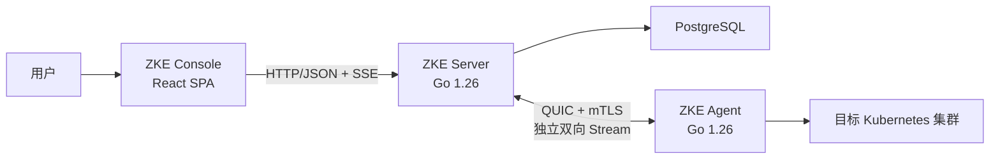

# 技术基础设计

> 状态：已确定。
>
> 本文定义 ZKE Phase 1 已确认的技术基线与首个可运行闭环。

## 1. 目标

技术基础需要优先验证 ZKE 最核心的 Server + Agent 架构，并为后续认证、RBAC、容器服务、可观测性和
ZKE Copilot 提供稳定边界。

首个纵向闭环定义为：

1. 已授权用户为指定 Tenant 和 Project 创建一次性 Agent 注册凭证；
2. ZKE Agent 从 Kubernetes 集群主动连接 ZKE Server；
3. Server 完成 Agent 注册、身份建立、心跳接收与连接状态维护；
4. ZKE Console 通过 Server API 查看权限范围内的集群和 Agent 状态；
5. Agent 断开后，Server 能够判定离线；Agent 重启后使用原身份恢复连接；
6. 注册、拒绝、连接、断开和凭证撤销均留下不含敏感正文的审计记录。

## 2. 决策状态

| 主题 | 状态 | 基线 |
| --- | --- | --- |
| ZKE Server | 已确定 | Go 1.26 |
| ZKE Agent | 已确定 | Go 1.26 |
| ZKE Console | 已确定 | React 19 + TypeScript + Vite 8 的客户端 SPA |
| Console 构建环境 | 已确定 | Node.js 24 LTS + pnpm，具体补丁版本通过项目文件和 lockfile 固定 |
| Console 组件体系 | 已确定 | Ant Design 6 作为基础组件库，ZKE 自行维护主题 Token 和桌面交互组件 |
| Server HTTP 框架 | 已确定 | Gin；使用自建 `http.Server` 承载并统一配置超时 |
| Server–Agent 传输 | 已确定 | QUIC/`quic-go` + mTLS，Agent 主动建立连接 |
| Agent 消息编码 | 已确定 | 版本化 Protobuf 消息和长度前缀帧 |
| Console–Server API | 已确定 | HTTP/JSON + OpenAPI；SSE 提供单向实时状态，WebSocket 仅用于交互式会话 |
| 主数据存储 | 已确定 | PostgreSQL |
| 用户认证 | 已确定 | ZKE 内置本地用户、Argon2id 密码摘要和 Server 端不透明会话 |
| Agent 身份 | 已确定 | 一次性注册凭证完成引导，注册后使用 mTLS |
| 仓库组织 | 已确定 | 单仓库；Server 与 Agent 初期共用一个 Go module；Console 位于同仓库的 `web/console` 前端工作区 |

初始化工程时显式设置 Go 1.26 的 `go` 与 `toolchain` 指令，并提交 `packageManager`、Node.js 版本文件和依赖
lockfile；补丁版本由这些文件固定。

## 3. 总体边界



- Console 通过 ZKE Server 访问平台能力。
- Server 负责用户认证、RBAC、作用域校验、Agent 连接管理、任务编排、持久化和审计。
- Agent 主动连接 Server，仅使用出站连接。
- 所有集群查询和操作最终由对应集群中的 Agent 定域执行。
- Server 从用户会话或 Agent 身份推导 Tenant、Project 和 Cluster 权限作用域。
- Console HTTP API 与 Agent QUIC 连接使用不同 Listener；Agent Listener 使用 UDP。

## 4. Server 技术基线

### 4.1 运行时与代码组织

- 使用 Go 1.26。
- Console HTTP API 使用 Gin。使用 `gin.New()` 显式装配日志、恢复、认证、授权、CSRF、限流和审计中间件，
  并由 ZKE 控制全部中间件配置。
- Gin Engine 作为标准库 `http.Server` 的 Handler；由 ZKE 显式配置 Header、读取和空闲超时，并执行优雅关闭。
  普通 API 使用写超时，SSE 使用独立写入 Deadline、心跳和最长连接时限。
- Server HTTP API 使用具体类型组成 `Handler → Service → Store` 三层，不为测试目的预先定义 Repository 或
  Service 接口，也不引入依赖注入框架。
- 共享代码只包含确实被 Server 和 Agent 共同使用的协议、标识、版本与安全基础类型。

Server 按职责组织：

```text
httpapi          Gin Handler、集中路由、参数与响应转换
httpapi/middleware
                 Request ID、日志、恢复、跨源保护、认证和 CSRF 中间件
httpapi/response  Handler 与 middleware 共用的稳定 HTTP 错误响应
agentconn        QUIC 连接、Stream、心跳和请求分发
auth             用户认证和会话业务流程
rbac             固定权限、角色矩阵和 Global/Tenant/Project 作用域授权
resourcemanagement
                 Tenant/Project 创建、可见范围列表和 Cluster 查询业务流程
enrollment       一次性 Agent 注册凭证创建业务流程
store            PostgreSQL 数据访问
audit            审计事件
observability    Server 专属指标、追踪和日志字段
```

每个 HTTP 业务模块由具体 Handler 调用对应的具体 Service，Service 再调用具体 Store。Handler 不直接访问
Store，也不使用 Store 的数据结构；Service 将数据库结构转换为对外业务结构。Gin 类型只存在于 `httpapi`，
`pgx` 类型只存在于 `store`，`quic-go` 类型只存在于 `agentconn`。参数绑定后由 Service 校验资源作用域、状态和
业务约束。

所有 HTTP Method、路径和局部中间件统一在 `pkg/server/httpapi/routes.go` 注册。`router.go` 只创建 Gin
Engine、装配全局中间件和构造 Handler；具体 Handler 文件不得自行向根 Router 注册路径。Console API 使用
`/api/v1` 路由组，Agent 注册 API 使用独立的 `/agent-api/v1` 路由组。恢复中间件返回统一错误并记录请求关联 ID。

### 4.2 数据存储

使用 PostgreSQL 保存平台主数据：

- Tenant、Project、Cluster、Agent、权限绑定和审计之间具有明确关系；
- 注册凭证消费、Agent 身份建立和审计写入需要事务边界；
- 后续任务状态机、幂等键和并发控制需要可靠的唯一约束与行级更新。

开发与部署环境统一使用 PostgreSQL。

使用显式 SQL、`pgx` 和生成式类型安全查询工具；具体工具和版本在工程初始化时确定。数据库迁移要求：

- 随代码版本化并进入评审；
- 同时定义升级和失败处理方式；
- 由独立迁移步骤或单一实例执行；
- 对唯一约束、外键、作用域字段和查询索引进行测试。

当前迁移实现位于 `pkg/server/store/migrations`，由 ZKE Server 在开始监听 HTTP 请求前自动执行。迁移文件嵌入
Server 二进制并按连续版本顺序执行；执行器使用 PostgreSQL advisory lock 串行化迁移，每个版本在独立事务中应用，
并保存名称和 SHA-256 校验和。多个 Server 同时启动时只有持有锁的实例执行迁移，其余实例等待并复核结果。迁移失败或
超过配置的迁移超时时，Server 启动失败。已经应用的迁移文件不得修改，结构调整必须新增更高版本的前向迁移。

### 4.3 用户认证与会话

Phase 1 使用 ZKE 内置本地用户认证：

- 用户名在规范化后唯一；登录失败使用统一错误，避免泄露账户是否存在；
- 密码只保存 Argon2id 摘要，并为每个密码生成独立随机 Salt；
- Argon2id 参数与摘要一起存储，参数在目标部署资源上基准测试后确定，并支持登录时升级；
- 密码比较使用恒定时间比较，明文密码不得进入日志、审计、指标或错误；
- 登录按账户和来源执行有界限流，连续失败、锁定和恢复均写入安全审计；
- 登录成功后生成高熵不透明 Session Token，数据库只保存其摘要；
- Session Token 只通过 `HttpOnly`、`Secure`、`SameSite` Cookie 传输，不写入 `localStorage`；
- 会话具有空闲超时、绝对超时、主动注销、管理员撤销和权限变更后轮换机制；
- 变更请求使用 Server 端 Synchronizer Token 防护 CSRF，并使用 Go 标准库跨源保护作为纵深防御；
- Server 启动时只在用户表为空时创建首个管理员，密码从安全文件读取；
- 管理员通过一次性、短有效期重置流程协助账户恢复。

Phase 1 使用固定权限标识：`tenant.create`、`project.create`、`agent.enrollment.create`、`cluster.read`、
`agent.read`、`agent.revoke`、`user.read`、`user.manage`、`rbac.read`、`rbac.manage` 和 `audit.read`。
内置 `admin` 与 `viewer` 角色通过 RoleBinding 绑定到 Global、Tenant 或 Project；`admin` 包含全部权限，
`viewer` 只包含 Cluster 与 Agent 读取权限，首个管理员拥有 Global `admin` 角色。

当前认证基础已经实现：

- 密码使用 Argon2id PHC 格式保存算法版本、内存、迭代、并行度、Salt 和摘要；
- 默认参数为每次校验总计 64 MiB 内存、3 次迭代和 4 路并行，部署前仍需在目标资源上完成基准测试；
- 密码校验使用全局并发信号量，默认最多同时执行 4 次，按当前参数将 Argon2id 校验内存峰值约束在 256 MiB；
- 单因素认证的新密码至少包含 15 个字符，支持 Unicode、空格和最长 1024 字节，不要求固定字符组合；
- 首个管理员、Global `admin` RoleBinding 和审计事件在同一事务中创建，并使用 advisory lock 防止并发重复初始化；
- Session 与 CSRF Token 分别使用独立的 256 位安全随机值，数据库只保存 SHA-256 摘要；
- `POST /api/v1/auth/login`、`POST /api/v1/auth/logout` 与 `GET /api/v1/auth/me` 已实现统一认证错误、Session Cookie、CSRF 校验和安全错误响应；
- 登录按规范化账户和直接网络来源执行有界内存限流，同一限流窗口只写入一次拒绝审计，避免审计写放大；
- 登录成功、失败、限流拒绝和注销会写入安全审计；密码凭证版本校验、可选摘要参数升级、Session 和成功审计在同一事务中完成，避免并发改密后继续签发会话或恢复旧密码；
- 认证数据库操作使用有界应用层超时，默认 10 秒；超时返回稳定的 `timeout` 错误，不依赖 HTTP 写超时取消数据库工作；
- 有效会话查询会原子续期空闲时间且不超过绝对过期时间，用户禁用、会话撤销、超时或密码变更会使会话失效；
- Session Cookie 使用 `HttpOnly` 和 `SameSite=Lax`，CSRF Token 通过 `SameSite=Strict` Cookie 交付并要求 `X-CSRF-Token` 请求头；两者在 TLS 部署中必须启用 `Secure`；
- Go 标准库跨源保护会在业务 Handler 之前拒绝非安全的跨源浏览器请求。
- RBAC 使用固定权限 `tenant.create`、`project.create`、`agent.enrollment.create`、`cluster.read`、
  `agent.read`、`agent.revoke`、`user.read`、`user.manage`、`rbac.read`、`rbac.manage` 和 `audit.read`；
  `admin` 拥有全部固定权限，`viewer` 只拥有 Cluster 与 Agent 读取权限。
- RoleBinding 支持 Global、Tenant 和 Project 作用域；Global 绑定向下覆盖全部作用域，Tenant 绑定覆盖对应
  Tenant 及其 Project，Project 绑定只覆盖目标 Project。未命中有效绑定时默认拒绝。
- RBAC Service、PostgreSQL Store 和 HTTP 授权 middleware 已实现；Project middleware 会根据 `project_id`
  解析 Tenant 归属，并在业务 Handler 前完成权限检查。

持久化账户锁定与到期自动恢复、管理员解锁和密码重置已经实现；锁定、禁用和密码重置均撤销现有 Session。
用户与 RoleBinding 管理 API 仅允许 Global 管理员调用，保留最后一个有效 Global 管理员并记录事务内成功审计。
RBAC 已接入 Tenant/Project 创建、Cluster/Agent 查询、Agent 注册凭证创建、安装 Manifest、Agent 撤销和
审计查询。Console 登录流程尚未实现，但 Phase 1 后端认证与 RBAC 闭环不再依赖直接写数据库。
登录来源当前使用直接 TCP 对端地址；部署可信反向代理前需要补充显式的代理信任配置。

## 5. Agent 技术基线

### 5.1 运行与权限

- 使用 Go 1.26。
- 以 Kubernetes Deployment 运行，每个接入集群部署一个逻辑 Agent。
- 使用专用 ServiceAccount，并按当前启用能力授予最小 Kubernetes RBAC 权限。
- Phase 1 集群业务权限仅包含读取必要基础信息。
- Agent 首次启动时创建固定名称身份 Secret，之后读取和更新它。ServiceAccount 至少需要所在 Namespace 内
  Secret 的 `create` 权限，以及使用 `resourceNames` 限定到该身份 Secret 的 `get`、`update` 权限；Kubernetes
  的 `create` 授权不能按尚不存在的资源名限定。
- Kubernetes 客户端使用官方 `client-go`，版本由 Kubernetes 支持矩阵确定。
- Agent 的所有后台任务都必须支持 `context` 取消、超时和有界关闭。

### 5.2 连接行为

- Agent 分别配置注册 Server URL 与 QUIC Connection 地址，不从其中一个端点隐式推导另一个端点。
- Agent 在生产环境通过 HTTPS 地址注册；TLS 可以由 ZKE Server 原生终止，也可以由上游网关终止。仓库中的本地
  配置只允许对回环地址使用明文 HTTP。完成注册后，Agent 使用 `quic-go` 和 mTLS 主动连接独立的 Agent
  Listener UDP 地址。
- Agent 和 Server 都持续接受对方创建的新逻辑 Stream；每个独立请求或流式会话使用独立 Stream。
- Hello 和心跳使用专用 Control Stream，与业务请求和数据分离。
- 断线重连使用有上限的指数退避和随机抖动，避免大量 Agent 同时重连。
- 同一 Agent 同一时刻只保留一个有效主连接；新连接替换旧连接时必须记录原因。
- Server 根据连接和最后有效心跳计算在线状态。
- Agent 只接受目标 `cluster_id` 与自身身份一致的任务。

## 6. Agent 注册与身份

采用“一次性注册凭证 + 注册后 mTLS”的两阶段模型。

### 6.1 注册凭证

注册凭证由已授权用户为指定 Tenant 和 Project、集群名称创建，并满足：

- 高熵、短有效期、默认单次使用；
- 数据库只保存不可逆摘要；
- 创建、使用、过期、撤销和重复使用失败均记录审计事件；
- Tenant、Project 和集群名称由注册凭证确定，Agent 不得提交或覆盖。

### 6.2 身份建立

1. Agent 在本地生成私钥和 CSR；
2. Agent 通过 HTTPS 注册接口提交注册凭证、幂等键、CSR、Agent 版本和协议版本；
3. Server 创建或读取与注册凭证、幂等键和 CSR 指纹绑定的注册尝试；
4. Server 验证凭证、作用域、有效期和消费状态，并签发 Agent 客户端证书；
5. Server 在单个事务中创建 Cluster 与 Agent、消费凭证、保存证书元数据和返回结果，并写入审计记录；
6. 相同幂等键和 CSR 的重试返回已保存结果；绑定内容不同则返回幂等冲突；
7. Agent 通过 Kubernetes API 创建或更新身份 Secret，将私钥和证书持久化；
8. 后续连接使用 mTLS，注册凭证不再参与认证。

Server 配置 Agent Listener 服务端证书及 Agent Client CA；Agent 配置 Agent Listener CA 作为 Server 信任根。
Agent 私钥始终保存在目标集群，Server 只保存客户端证书及其元数据。签发或持久化失败时注册尝试保持可重试状态。

当前已实现注册流程的 Handler/Service/Store：校验一次性 Token 与 CSR，将注册尝试绑定到幂等键和 CSR 指纹，
由配置的 Agent Client CA 签发仅用于 ClientAuth 的客户端证书，并在单个 PostgreSQL 事务中创建 Cluster、Agent 与
证书元数据、消费 Token、保存可恢复响应和成功审计；签发或持久化失败另行记录失败审计。证书的 URI SAN 使用
`zke://agent/...` 身份 URI 显式绑定 Tenant、Project、Cluster 和 Agent，CSR 中由 Agent 自行提供的 Subject
不会成为平台身份。

并发提交会在注册凭证上串行化；相同幂等键与 CSR 恢复同一结果，绑定不同 CSR 时拒绝。CA 或持久化暂时失败时
注册尝试保持 `pending`，之后可使用原幂等键和 CSR 重试。Agent 侧私钥生成、注册调用和身份 Secret 持久化已经
实现。注册完成后，Agent 使用客户端证书主动建立 QUIC/mTLS Connection，完成 `ClientHello`、证书身份交叉校验、
`ServerHello`、心跳确认和有界重连；Server 会校验数据库中的证书序列号、有效期与撤销状态，并将首次有效连接
持久化为 active。Agent 会在配置的续期窗口内通过 Control Stream 自动续期；新证书成功连接后旧 Credential
被撤销。Credential、Agent 或 Cluster 撤销会通过 PostgreSQL 通知各 Server 实例关闭对应现有连接。业务
Request/Data Stream 仍未实现。

### 6.3 证书生命周期

- Agent 在证书到期前，通过现有 mTLS Connection 的 Control Stream 提交新 CSR；
- CSR 在网络请求前写入 identity Secret，Server 以 CSR 指纹保证续期幂等；
- Server 验证当前 Agent 身份后签发新叶子证书，旧 Credential 保留到新证书成功连接；
- Agent 原子更新身份 Secret 并用新证书重连，Server 激活新 Credential 后撤销旧 Credential；
- Credential、Agent 或 Cluster 撤销通过 PostgreSQL 通知关闭当前 Connection，并阻止后续连接；
- 已建立连接会在客户端证书自然到期时关闭；
- Agent 离线至证书过期后不能再通过 mTLS 续期，当前需要重新 Enrollment；
- Server 与 Agent 信任根的双信任窗口轮换仍属于后续工作。

## 7. Server–Agent 连接与协议

### 7.1 传输选型

Server–Agent 确定使用 **QUIC/`quic-go` + mTLS + Protobuf 分帧**。

Agent 主动建立 QUIC 连接，双方在同一连接上创建独立双向 Stream。Agent 通过独立 Stream 上报状态、事件和数据；
Server 通过独立 Stream 发起请求。

`agentconn` 封装 `quic-go` 的 Connection、Stream、End、Cancel 和 Error 语义。

### 7.2 协议分层

```text
UDP
└── QUIC / TLS 1.3 / mTLS
    └── Connection
        ├── Control Stream
        ├── Request Stream
        └── Data Stream
```

- QUIC 内建 TLS 1.3；Agent 验证 Server 证书，Server 验证 Agent 客户端证书。
- TLS ALPN 固定为 `zke-agent/1`。
- Phase 1 不使用 QUIC 0-RTT，应用消息在 mTLS 握手完成后发送。
- Console HTTP Listener 与 Agent QUIC Listener 分离；Agent Listener 需要 UDP 入口。
- Agent 始终作为连接发起方，但双方都可以创建双向 Stream。

### 7.3 Connection 建立

1. Agent 完成 mTLS 握手并建立 QUIC Connection；
2. Agent 在规定超时内创建唯一的 Control Stream；
3. Control Stream 的第一条消息必须是 `ClientHello`；
4. Server 将证书中的 Agent 身份与 `ClientHello` 中的 `agent_id`、`cluster_id` 比对；
5. Server 验证版本和能力后返回 `ServerHello`，Connection 才进入可服务状态；
6. 建立完成后，双方分别循环接受对端创建的新 Stream；
7. 新连接替换旧连接时，Server 先停止旧 Connection 接受新 Stream，再有界等待已有 Stream 结束并关闭连接。

未在时限内建立 Control Stream、重复建立 Control Stream、身份不一致或协议版本不兼容都必须关闭 Connection，
并记录不含证书正文的审计或安全事件。

### 7.4 Stream 类型与生命周期

每个非 Control Stream 的首帧必须是版本化的 `StreamHeader`，至少包含：

```text
protocol_version
stream_type
request_id
timeout_ms
idempotency_key    # 仅变更请求使用
```

- `stream_type` 使用允许列表；未知类型返回协议错误并关闭当前 Stream。
- Server 创建请求 Stream；Agent 可以为事件或数据上报创建独立 Stream。
- `request_id` 使用随机 128 位标识并在 Connection 内保持唯一。
- `timeout_ms` 是相对时长，接收方按本地上限截断。
- Namespace 和资源身份只在类型化请求中表达；Agent 根据 Connection 绑定的 `cluster_id` 校验目标。
- 每个请求对应一个 Stream。
- 请求使用 Request、Response、Data、Error 和 End 帧。
- 所有帧使用长度前缀；读取长度前缀后先校验最大帧大小。
- 每个 Stream 设置创建、首帧、读写、空闲和总时长限制；超时或用户取消只终止当前 Stream。
- 取消由 Control Stream 上的 `CancelRequest(request_id, reason)` 和业务 Stream 关闭共同表达；接收方将
  `request_id` 映射到对应 `context.CancelFunc`，只终止对应 Stream。

Protobuf package 使用显式版本，例如 `zke.agent.v1`。协议版本与 Server、Agent 产品版本分离。已发布字段编号保留；
删除的字段保留编号和名称；未识别字段按 Protobuf 兼容规则处理。代码生成工具固定版本，并在 CI 中执行 lint 和
breaking-change 检查。

### 7.5 Control Stream

Control Stream 只传输小型控制消息：

Agent 到 Server：

- `ClientHello`：Agent 版本、协议版本、启动标识和能力集合；
- `Heartbeat`：连接存活、Agent 健康摘要和必要的集群版本信息；
- `ClientGoodbye`：在可控关闭时说明断开原因。

Server 到 Agent：

- `ServerHello`：连接会话 ID、Server 时间、心跳间隔和兼容性结果；
- `HeartbeatAck`：确认最后处理的心跳；
- `CancelRequest`：取消指定 `request_id` 对应的任务或流式会话；
- `GoAway`：凭证撤销、版本不兼容、连接被替换或 Server 排空。

Control Stream 每个方向使用一个串行 Writer，只承载控制消息。请求和数据使用独立 Stream。传输层 KeepAlive
判断底层连接状态，ZKE Heartbeat 负责 Agent 应用健康与状态更新。

### 7.6 并发、背压与资源限制

QUIC 可以避免丢包造成跨 Stream 队头阻塞，但所有 Stream 仍共享连接级带宽、拥塞控制和对端并发限制。

Server 和 Agent 必须配置并验证：

- 每个 Connection 的最大并发 Stream 数；
- 按 Stream 类型划分的并发数；
- 最大帧、流控窗口、连接总缓冲和最大消息；
- Stream Open、Read、Write、Idle 和总任务 Deadline；
- 单个 Data Stream 的吞吐与缓冲上限；
- Server 排空、Connection 关闭、单 Stream 取消和异常路径；
- 指标：当前 Stream、排队数、开流延迟、取消、超时、吞吐和连接级阻塞时间。

配置值通过混合负载测试确定。

### 7.7 验证要求

- 验证批量连接、重连风暴、证书握手和 Server 排空；
- 同时运行心跳、小型请求、持续 Data Stream 和慢消费者，检查延迟与公平性；
- 覆盖延迟、抖动、丢包、带宽受限和连接中断；
- 验证 Stream 上限、超时、取消、异常帧和资源回收。

### 7.8 Agent 状态

Agent 状态拆分为：

| 状态 | 取值 | 来源 |
| --- | --- | --- |
| 生命周期 | `pending`、`active`、`revoked` | 数据库 |
| 连接 | `online`、`offline` | 当前 Connection 与心跳，Server 内存派生 |
| 健康 | `unknown`、`healthy`、`degraded` | Agent 健康上报 |

注册完成后生命周期为 `pending`，首次有效连接后转为 `active`。

心跳间隔和离线阈值由 Server 下发并设置上下限。心跳先更新内存状态，`last_seen_at` 限频写入数据库；生命周期和
健康状态跃迁立即持久化，连接变化写入结构化日志。状态 API 合并当前 Server 实例的实时连接快照；撤销状态同时
触发连接关闭和安全审计。

## 8. Console 技术基线

### 8.1 基础组合

| 层次 | 基线 |
| --- | --- |
| UI 运行时 | React 19 + TypeScript |
| 构建工具 | Vite 8 |
| 路由 | React Router，客户端路由模式 |
| Server 状态 | TanStack Query |
| 桌面与窗口状态 | Zustand |
| 基础组件 | Ant Design 6 |
| 样式 | Ant Design Token + ZKE CSS 变量 + CSS Modules |
| 国际化 | 从入口预留 locale 层，基础组件使用 Ant Design locale |
| 单元与组件测试 | Vitest + React Testing Library |
| API Mock | Mock Service Worker |
| 端到端测试 | Playwright |

具体依赖补丁版本在初始化时锁定，升级由自动化检查和测试验证。

### 8.2 应用形态

Console 是登录后的高交互管理工作区，采用 React SPA。Vite 负责 TypeScript 和 React 构建，生产环境仅部署静态资源。

### 8.3 状态边界

必须区分以下三类状态：

1. **Server 状态**：Cluster、Agent、权限和审计等，以 Server 为事实来源，由 TanStack Query 管理缓存、失效和重取；
2. **桌面状态**：已打开窗口、位置、大小、层级、最小化状态和当前焦点，由 Zustand 管理；
3. **作用域状态**：当前 Tenant、Project、Cluster 和 Namespace，必须显式展示，并由路由或窗口实例持有。

Cluster 数据保留在 TanStack Query；每个窗口保存自己的作用域快照，或明确声明跟随全局作用域。

### 8.4 应用与窗口模型

每个桌面应用提供静态 Manifest：

```text
id
title
icon
scope_mode          global / project / cluster / namespace
required_permissions
instance_mode       singleton / multiple
entry
```

Manifest 用于 Console 展示和交互控制，Server 始终执行权限校验。窗口状态按 `window_id` 归一化保存；
业务应用按路由懒加载。

Ant Design 用于表格、表单、弹窗、通知和基础可访问性能力。桌面、窗口、任务栏、作用域指示器和敏感操作确认属于
ZKE 产品核心交互，由 ZKE 自有组件实现。

### 8.5 API 与实时更新

- Console 使用从 OpenAPI 生成或严格校验的 TypeScript Client。
- 普通查询和变更使用 HTTP/JSON。
- Agent 状态等 Server 到浏览器的单向更新优先使用 SSE；断线后通过事件 ID 或重新查询恢复。SSE 使用心跳、
  单次写入 Deadline 和最长连接时限。
- WebSocket 用于 Web Terminal 等双向会话。
- SSE 或 WebSocket 事件只携带资源标识和变化摘要，收到事件后由 TanStack Query 精确失效对应缓存。
- 实时连接按当前会话和 RBAC 过滤事件；会话撤销或权限变化时立即关闭。
- 所有敏感变更均由 Server 执行 RBAC、目标和影响校验。

### 8.6 构建与部署

Console 作为 `zke-console` 独立构建产物和容器：

- 生产产物为静态文件；
- 网关保持 Console 与 `/api`、`/events` 同源，减少 Cookie、CORS 和 CSRF 配置复杂度；
- 本地开发由 Vite 代理 API 和事件连接到本地 Server；
- 部署时使用不可变资源文件名，并确保 `index.html` 不被长期缓存；
- Browser Router 的非根路径由静态服务回退到 `index.html`。

## 9. HTTP API

### 9.1 Console–Server API

HTTP API 使用显式版本前缀，例如 `/api/v1`。Server 从会话解析用户身份，并对每次访问校验 Tenant、Project 和
Cluster 关系。

HTTP JSON 响应中的时间统一使用 RFC 3339 和固定 `UTC+8` 偏移（`+08:00`）。PostgreSQL 继续使用
`timestamptz` 保存绝对时间，HTTP Cookie 的 `Expires` 继续遵循协议使用 GMT，不把展示时区写入存储或协议字段。

Phase 1 API 权限映射：

| API | 权限 |
| --- | --- |
| 创建 Tenant | `tenant.create`（Global） |
| 创建 Project | `project.create`（Tenant） |
| 创建 Agent 注册凭证 | `agent.enrollment.create` |
| 查看 Cluster | `cluster.read` |
| 查看 Agent | `agent.read` |
| 撤销 Agent | `agent.revoke` |
| 查看和管理用户 | `user.read`、`user.manage`（Global） |
| 查看和管理 RoleBinding | `rbac.read`、`rbac.manage`（Global） |
| 查询审计事件 | `audit.read`（按 RoleBinding 作用域过滤） |

`/api/v1/events` 根据订阅者已有的读取权限和作用域过滤事件。

当前已实现的管理端点包括：

```text
POST /api/v1/auth/login
POST /api/v1/auth/logout
GET  /api/v1/auth/me
GET  /api/v1/users
POST /api/v1/users
GET  /api/v1/users/{user_id}
PUT  /api/v1/users/{user_id}/status
POST /api/v1/users/{user_id}/unlock
POST /api/v1/users/{user_id}/password-reset
GET  /api/v1/role-bindings
POST /api/v1/role-bindings
DELETE /api/v1/role-bindings/{role_binding_id}
GET  /api/v1/audit-events
GET  /api/v1/events
GET  /api/v1/tenants
POST /api/v1/tenants
GET  /api/v1/tenants/{tenant_id}/projects
POST /api/v1/tenants/{tenant_id}/projects
GET  /api/v1/projects/{project_id}/clusters
GET  /api/v1/clusters/{cluster_id}
GET  /api/v1/clusters/{cluster_id}/agent
POST /api/v1/projects/{project_id}/agent-enrollments
POST /api/v1/projects/{project_id}/agent-installations
GET  /api/v1/projects/{project_id}/agents
POST /api/v1/agents/{agent_id}/revoke
GET  /agent-install/v1/manifest
```

SSE 发送 `ready`、`agent.status`、`close` 和注释心跳。Agent 连接建立、健康变化、生命周期撤销和断开触发状态事件；
Server 定期重新验证 Session，并在发送每个事件前重新执行 Cluster `agent.read` 授权。事件不持久化，客户端
断线重连后重新查询当前状态。

Tenant 和 Project 创建要求 Session、CSRF、对应创建权限以及 `Idempotency-Key`。首次创建返回 `201`，相同用户、
作用域、Key 和名称的恢复返回 `200` 与 `replayed: true`，同一 Key 换用其他名称返回
`409 idempotency_conflict`；资源、幂等记录和成功审计在同一事务中提交。Tenant/Project 列表根据当前用户的
Global、Tenant 和 Project RoleBinding 过滤，不返回不可见资源。Cluster 列表、详情和单 Cluster Agent 详情
分别执行 Project 或 Cluster 定域的读取授权。

Agent 撤销接口要求 Session、CSRF、`agent.revoke` 权限和 `{"confirm":true}` 显式确认。Server 在同一事务中
更新 Agent 生命周期、撤销全部客户端 Credential 并写入集群作用域成功审计；重复撤销返回 `200`、原撤销时间和
`already_revoked: true`。数据库触发器向全部 Server 实例广播撤销通知，持有连接的实例立即关闭对应 QUIC
Connection。

创建 Agent 注册凭证时，Server 生成 15 分钟有效的一次性随机 Token。Token 明文只在成功响应中返回一次，
响应禁止缓存；数据库只保存 SHA-256 摘要。凭证记录和成功审计事件在同一事务内写入。请求必须携带 16 至 128
字符的 `Idempotency-Key`；同一用户、Project 和 Key 只允许创建一次，重复请求返回
`409 idempotency_conflict`，不会生成新凭证或重复成功审计。认证、授权和创建操作共享一个端到端 Deadline，
避免数据库已提交但 Token 响应因累计超时丢失。该接口只负责创建凭证；Agent 使用凭证提交 CSR 的
`/agent-api/v1/enroll`、CA 签发、注册幂等恢复以及 Agent 侧身份 Secret 持久化均已实现。

创建请求由 Server API 调用方指定集群名称，并将名称绑定到 Enrollment：

```http
POST /api/v1/projects/{project_id}/agent-enrollments
Idempotency-Key: <16 至 128 字符>
Content-Type: application/json

{
  "cluster_name": "cluster-a"
}
```

登录成功只在响应正文返回用户身份与会话绝对过期时间；Session Token 和 CSRF Token 分别通过 `zke_session`
与 `zke_csrf` Cookie 交付，不进入 JSON、日志或审计正文。除登录外的变更请求必须同时携带 Session Cookie 和
`X-CSRF-Token`。登录接口也使用标准库 Origin 与 Fetch Metadata 保护。

错误响应至少区分：

- 未认证；
- 无权限；
- 输入无效；
- 目标不存在，或因权限边界不可见；
- Agent 未连接；
- Agent 执行失败；
- 超时；
- 版本不兼容；
- 幂等冲突。

错误正文只包含可安全展示的错误码、消息和请求关联 ID。

### 9.2 Agent 注册 API

Agent 初次注册通过 Gin HTTP Listener。生产环境必须提供 HTTPS，可由 ZKE Server 原生终止 TLS，也可由上游
网关终止 TLS：

```text
POST /agent-api/v1/enroll
```

该接口使用注册凭证认证，接受 CSR、Agent 版本、协议版本和幂等键。Tenant、Project 和集群名称由注册凭证确定。
注册接口与 Console API 共用 HTTP Server，但使用独立路由组、认证中间件、请求体上限和限流策略。

当前接口约定：

```http
POST /agent-api/v1/enroll
Authorization: Bearer <一次性注册 Token>
Idempotency-Key: <16 至 128 字符>
Content-Type: application/json

{
  "csr_pem": "-----BEGIN CERTIFICATE REQUEST-----\n...\n",
  "agent_version": "v0.1.0",
  "protocol_version": "v1"
}
```

请求正文最大 128 KiB，不接受未知 JSON 字段。首次成功返回 `201`；相同 Token、幂等键和 CSR 的结果恢复返回
`200`；响应包含 `cluster_id`、`agent_id`、客户端叶子证书和证书过期时间，并设置 `Cache-Control: no-store`。
无效或已消费 Token 返回统一的 `401 invalid_enrollment_token`，幂等键绑定其他 CSR 返回
`409 idempotency_conflict`。接口按直接网络来源限流。

`http.tls.certificate_file` 与 `http.tls.private_key_file` 同时配置时，ZKE Server 原生提供 HTTPS；两项都省略
时提供 HTTP，适用于回环开发或由 Ingress/网关终止 TLS 的部署。不得把包含注册 Token、Session Cookie 或 CSRF
Token 的明文 HTTP 直接暴露到不可信网络。注册完成后的 Agent 长连接是独立的 QUIC/UDP Listener，始终使用
TLS 1.3 和 mTLS，不经过 HTTP 网关，也不复用 HTTP TLS 身份。

## 10. 最小数据模型

| 实体 | 关键字段 | 说明 |
| --- | --- | --- |
| Tenant | `id`, `name`, `status` | 顶层权限边界 |
| Project | `id`, `tenant_id`, `name`, `status` | Cluster 的直接管理范围 |
| User | `id`, `username_normalized`, `display_name`, `password_hash`, `status`, `failed_login_count`, `locked_at`, `lock_expires_at`, `password_changed_at` | 本地用户，规范化用户名唯一；只保存 Argon2id 摘要，锁定状态持久化 |
| UserSession | `id`, `user_id`, `token_digest`, `idle_expires_at`, `expires_at`, `revoked_at` | Server 端不透明会话，只保存 Token 摘要 |
| RoleBinding | `subject_id`, `role`, `scope_type`, `tenant_id`, `project_id` | 服务端授权依据；作用域形状由约束校验 |
| Cluster | `id`, `tenant_id`, `project_id`, `name`, `status`, `last_seen_at` | 全局逻辑资源；操作仍在该集群执行 |
| Agent | `id`, `cluster_id`, `version`, `protocol_version`, `lifecycle_status`, `health_status`, `active_credential_serial`, `last_seen_at` | Agent 逻辑身份、当前连接凭据与持久状态 |
| AgentCredential | `id`, `agent_id`, `serial`, `csr_fingerprint`, `certificate_pem`, `expires_at`, `revoked_at` | 客户端证书及元数据 |
| Enrollment | `id`, `tenant_id`, `project_id`, `cluster_name`, `token_digest`, `expires_at`, `consumed_at` | 绑定集群名称的一次性注册凭证 |
| EnrollmentAttempt | `id`, `enrollment_id`, `idempotency_key`, `csr_fingerprint`, `status`, `response`, `created_at` | 注册幂等与结果恢复 |
| ServerPKIState | Client/Listener CA 与 Listener 叶子证书的 `fingerprint`, `expires_at` | Managed PKI 的数据库绑定和 PV 丢失保护 |
| AuditEvent | `id`, `actor_type`, `actor_user_id`, `actor_agent_id`, `scope_type`, `tenant_id`, `project_id`, `cluster_id`, `action`, `target_type`, `target_id`, `result`, `request_id`, `created_at` | 审计元数据；发起者按类型使用外键约束，不保存敏感操作正文 |

所有从属资源表都保留足够的作用域字段或可验证外键，防止仅凭资源 ID 造成跨 Tenant、Project 数据串扰。
Cluster 和 Agent 使用稳定 ID 作为协议身份，名称可修改。

连接状态由 Server 内存和 `agentconn` 维护，数据库保存限频的 `last_seen_at`、生命周期与健康状态。Phase 1
状态 API 会把当前 Server 实例的连接快照与数据库记录合并，返回 `online`/`offline`、Connection ID、连接与
心跳时间、最近断开时间和原因。离线历史不持久化，Server 重启后丢失；多实例部署也尚未汇总其他实例的连接，
因此 Server 多副本方案落地前仍需补充 Agent 连接所有权和跨实例任务路由设计。Phase 1 不包含 Cluster Group。

## 11. 仓库结构

初期使用单仓库。Server 与 Agent 共用一个 Go module，减少共享协议与工具链的版本协调成本；Console 位于同仓库
的 `web/console`，使用独立的前端 `package.json`、构建和测试配置：

```text
.
├── api/
│   ├── agent/v1/          # Protobuf 源文件
│   └── openapi/           # Console HTTP API 定义
├── cmd/
│   ├── zke-server/
│   └── zke-agent/
├── pkg/
│   ├── server/
│   ├── agent/
│   └── shared/
│       └── logging/       # Server 与 Agent 共用的结构化日志初始化
├── web/
│   └── console/
├── deploy/
└── docs/
```

- `cmd` 只负责进程装配和生命周期，不承载业务逻辑。
- Server 和 Agent 的实现分别留在 `pkg/server` 与 `pkg/agent`。
- Protobuf、OpenAPI 和数据库代码生成工具必须固定版本并提供单一生成命令。
- 生成文件是否入库在工程初始化时统一决定，生成产物通过统一命令更新。

Agent Protobuf 使用 `go.mod` 的 `tool` 指令固定 `protoc-gen-go`，生成命令为：

```bash
bash hack/generate-agent-protocol.sh
```

Server HTTP API 的 OpenAPI 3.1 契约位于 `api/openapi/zke-server.v1.yaml`。测试会比较契约中的 Method/Path 与
Gin 实际注册路由，并检查 `operationId` 唯一性；Console TypeScript Client 的生成会在 Console 接入时基于该
契约完成。

### 11.1 本地启动与验证

本地开发环境需要 Go 1.26.4、Node.js 24 LTS、pnpm 11、Docker 与 Docker Compose。Go 命令在仓库根目录
执行，pnpm 命令只在 `web/console` 中执行。

本地配置使用 Server Managed PKI。首次正常启动会在被 Git 忽略的 `.local/development` 自动生成 Agent
Client CA、Agent Listener CA 和 Agent Listener 身份，不再需要独立的开发 PKI 生成脚本。
`hack/setup-local-agent-resources.sh` 只负责为宿主机运行的 Agent 初始化 Namespace、Enrollment Secret 和
Trust Secret。这些 PKI 文件仅用于 Agent QUIC/mTLS，不包含 HTTP TLS 证书：

- Agent Client CA：10 年；
- Agent Listener CA：20 年；
- Agent Listener 服务端证书：10 年。

```bash
docker compose -f deploy/development/compose.yaml up -d
go run ./cmd/zke-server --config configs/zke-server.yaml
# 在另一个终端输入刚创建的 Enrollment Token：
hack/setup-local-agent-resources.sh
go run ./cmd/zke-agent --config configs/zke-agent.yaml
cd web/console && pnpm install --frozen-lockfile && pnpm dev
```

Server 必须先成功启动一次，以便 Managed PKI 生成 `.local/development/agent-listener-ca.crt`。随后从已有
Project 创建 Enrollment，把响应中的一次性 Token 输入 `hack/setup-local-agent-resources.sh`。脚本使用当前
kubectl context 创建 Namespace、Enrollment Secret 和 Trust Secret，不创建或覆盖 identity Secret；如需避免
误用其他集群，可显式传入 `--context`。

Server 在迁移完成后检查用户表，只在空表时按 `auth.initial_admin` 创建首个全局管理员；管理员、Global
`admin` RoleBinding 和审计事件仍在同一事务中创建。仓库的本地配置会生成
`.local/development/admin-password`，权限为 `0600`，密码不会写入日志。已有用户时启动过程完全跳过该文件。
部署环境应关闭 `auto_generate_password`，并将 `password_file` 指向由 Kubernetes Secret 或等价机制挂载的
受保护文件。

Tenant、Project 和 Enrollment 属于正常产品资源，应由对应 Web/API 创建，不由本地脚本写数据库。当前 Server
已经提供 Tenant/Project 创建与权限范围列表 API；Console 界面尚未接入，因此本地开发暂时通过这些 HTTP API
创建 Project。随后启用 `agent_install`，由安装 API 返回 `curl | kubectl apply` 命令，将 Agent、Secret 和
最小 RBAC 一次部署到目标集群。

`configs/zke-agent.yaml` 使用本机 HTTP `127.0.0.1:8080` 和 QUIC `127.0.0.1:8443`，可以配合当前
kubeconfig 直接运行 Agent。Token、Listener CA 和身份均来自 Kubernetes Secret，不混入宿主机 `.local`
凭据路径。若开发期间直接修改了尚未提交的 `000001`，现有开发数据库会因
迁移校验和变化而拒绝启动；此时需要明确执行 `docker compose -f deploy/development/compose.yaml down --volumes`
后重新启动数据库，而不是让应用静默改写已执行迁移。

Server 启动时自动执行数据库迁移；没有待应用版本时不会修改业务表。Agent 会使用 client-go 创建或访问固定名称
身份 Secret，并在没有完整身份时调用注册接口；注册完成后使用该身份建立 QUIC/mTLS Connection，并在 Control
Stream 上执行 Hello 与心跳。Server 提供 `GET /healthz` 存活检查和使用 PostgreSQL 连接状态的 `GET /readyz`
就绪检查。

Agent 为固定的 Enrollment、Trust 和 identity Secret 名称、注册重试参数和日志级别提供默认值。identity
Secret 默认是 `zke-system/zke-agent-identity`，由 Agent 通过 client-go 创建并使用 `get`、`update`
访问。没有完整身份时，Agent 从同一 Namespace 的 `zke-agent-enrollment` Secret 读取 `token` Key；建立
QUIC/mTLS 信任时，从 `zke-agent-trust` Secret 读取 `agent-listener-ca.crt`。凭据不落宿主机文件。

`kubeconfig_file` 仅用于本地开发或特殊环境：显式配置时只使用指定文件；未配置时优先加载 Pod 内
ServiceAccount 提供的 InCluster 配置，不在集群内时再按 `client-go` 默认规则读取 `KUBECONFIG`，未设置该
环境变量则读取 `~/.kube/config`。若已经检测到集群环境但 ServiceAccount Token 或 CA 文件损坏，Agent 会直接报错，
不会回退到其他 kubeconfig，避免意外访问错误集群。

`registration.server_url`、Enrollment Secret 与可选的 `registration.ca_certificate_file` 只用于 HTTP(S)
注册；其中 CA 文件信任实际终止注册 HTTPS 的 ZKE Server 或上游网关。`connection.server_address` 与 Trust
Secret 中的 Listener CA 专门用于 QUIC/mTLS 长连接。特殊部署可用 `connection.ca_certificate_file` 覆盖。
两类地址和信任根相互独立，不应隐式派生或混用。配置文件不保存私钥与 Token 正文。

Server 可按配置生成完整的 Agent 安装 Manifest，包括 Token/Trust Secret、ConfigMap、ServiceAccount、
Role/RoleBinding 和 Deployment；当前仍未提供 Helm Chart。资源包不创建 Service、PVC 或 identity Secret。

`agent_pki.mode: managed` 时，Server 从持久目录加载或首次生成 Agent Client CA、Agent Listener CA 和
Listener 身份。初始化由 PostgreSQL advisory lock 串行化，数据库保存证书指纹；已有数据库状态但文件丢失、
目录只有部分文件或指纹冲突时拒绝启动。Listener 叶子在启动时自动续期，CA 不自动轮换。external 模式所需的
Agent Client CA、Agent Listener CA 和 Listener 身份文件全部集中在 `agent_pki.external`。
`agent_listener.address` 不得与 `http.address` 使用相同端口。

客户端证书默认有效 30 天，可通过 `agent_pki.agent_client_certificate_validity` 调整。Agent 默认在到期前 7 天进入自动
续期窗口，可通过 `identity.renew_before` 调整；若 Agent 离线直到旧证书过期，仍需重新 Enrollment。

构建与检查：

```bash
go build ./cmd/...
go test ./...
go vet ./...
cd web/console && pnpm typecheck && pnpm build
```

数据库迁移集成测试使用 `ZKE_TEST_DATABASE_URL` 指向专用 PostgreSQL，并在随机临时 Schema 中验证后自动清理；
CI 环境必须提供该变量，不能跳过迁移、作用域约束、唯一约束和索引测试。

## 12. 配置与敏感信息

Phase 1 工程骨架为 Server 和 Agent 各维护一份本地 YAML 配置。除 `--config` 指定文件路径外，进程配置全部
来自 YAML，不支持环境变量或单项命令行覆盖。部署配置与 Secret 注入计划在 Chart 实现时单独定义。

- 仓库内配置只包含明显的本地开发值，不得复用于共享或生产环境。
- Token、证书私钥、会话与 CSRF 密钥、可选密码 Pepper 和真实数据库密码不进入仓库；未来由 Chart 管理的
  Secret 注入。
- 首个管理员密码只从 `auth.initial_admin.password_file` 读取。本地开发可以在空用户库首次启动时生成权限为
  `0600` 的随机密码文件；部署环境应挂载预置 Secret 并关闭自动生成。密码正文不得写入日志。
- Managed PKI 私钥只保存在权限受限的持久目录；只在全新数据库状态和空目录组合下首次生成。已有数据库状态时
  缺失 PV 会失败关闭。external 模式的私钥只通过受保护文件或部署 Secret 提供。
- 可选的 HTTP TLS 私钥同样只通过受保护文件或部署 Secret 提供；它属于浏览器/API HTTPS 身份，不属于 Agent
  QUIC/mTLS Managed PKI。
- Agent 一次性注册 Token 只通过独立 Secret 读取。Agent 自行创建身份 Secret；ServiceAccount 需要 Namespace
  内 Secret 的 `create` 权限，对固定的 Enrollment、Trust 和 identity Secret 具有 `get` 权限，并只能更新
  identity Secret。
- 敏感值不得出现在命令行参数、日志、指标标签、错误正文或诊断包中。
- HTTP 注册 URL、QUIC Connection 地址、超时、心跳和重试参数需要上下限校验。
- 认证配置包含操作超时、会话空闲与绝对超时、Argon2id 最大并发校验数、Cookie `Secure` 开关、账户和来源
  登录限流；仓库中的 `cookie_secure: false` 仅用于本地明文 HTTP 开发。只要浏览器通过 HTTPS 访问，无论 TLS
  由 ZKE Server 还是网关终止，都必须设为 `true`。
- 启动时对缺失、冲突和不安全配置快速失败，并返回可定位但不泄密的错误。

## 13. 可观测性与审计

Server 和 Agent 使用结构化日志，并在适用时携带：

```text
request_id
connection_id
tenant_id
project_id
cluster_id
agent_id
namespace
resource_kind
resource_name
```

使用 OpenTelemetry 作为指标和追踪的抽象边界。最低指标包括连接数、注册结果、
心跳延迟、重连次数、API 延迟和数据库错误。

审计与普通运行日志分离。审计事件至少记录发起者、作用域、操作、目标、结果、时间和请求关联 ID，不记录注册
Token、证书、Secret 或完整敏感请求正文。

## 14. 验证策略

### Go

- 业务规则和状态机单元测试；
- Argon2id 参数编码、密码校验、登录限流、会话轮换、撤销、过期和 CSRF 测试；
- 使用 `BenchmarkVerifyPasswordDefault` 在目标部署资源上验证 Argon2id 单次延迟与内存分配，再决定是否调整工作因子；
- 注册凭证单次消费、过期、撤销和并发消费测试；
- PostgreSQL `store` 集成测试；
- QUIC、mTLS 和 Protobuf 协议兼容、ALPN、0-RTT 禁用、身份不匹配、重连、证书续期撤销和心跳超时测试；
- 使用 Kubernetes fake client 验证 Agent 权限内的读取行为；
- 验证 RBAC 清单只允许 Agent 更新固定名称的身份 Secret；
- `go test`、静态检查、竞态检测和构建验证。

### Console

- 窗口状态、作用域隔离和权限展示的单元测试；
- Agent 列表、状态变化和错误路径的组件测试；
- 使用 Mock Service Worker 覆盖成功、未认证、无权限、离线和超时；
- 使用 Playwright 验证登录、创建注册凭证、Agent 上线、离线和恢复的完整流程；
- 独立执行 TypeScript 类型检查。

### 安全与协议

- 重复、过期和已撤销注册凭证必须失败；
- Agent 证书与 `cluster_id` 不匹配必须失败；
- 跨 Tenant、Project 查询必须失败或按不可见资源处理；
- Server 重启后 Agent 能够安全重连，不重复创建 Cluster；
- 注册响应丢失后，相同幂等键和 CSR 能够恢复原结果；
- 一个持续 Data Stream 不得在应用层阻塞其他请求、心跳或状态上报；
- 取消、超时或异常业务 Stream 不得关闭同一 Agent 的整个 Connection；
- 撤销 Agent 时关闭现有 Connection，后续握手必须失败；
- SSE 按会话作用域过滤，并在会话撤销或权限变化时关闭；
- 日志和审计输出经过敏感信息扫描；
- Protobuf breaking-change 和 OpenAPI 兼容性检查进入 CI。

## 15. 首个里程碑完成标准

只有同时满足以下条件，Agent 接入闭环才算完成：

- 可以在本地开发环境启动 PostgreSQL、Server、Agent 和 Console；
- 已认证且有权限的用户可以创建短期一次性注册凭证；
- Agent 能完成注册并使用注册后身份建立 QUIC/mTLS 长连接；
- Agent 能更新身份 Secret，并在证书到期前完成轮换；
- Console 能在正确 Tenant 和 Project 边界内显示 Cluster、Agent 版本、在线状态和最后心跳；
- Agent 停止后在规定阈值内变为离线，重启后恢复同一身份；
- 无权限、无效、过期、重复使用和已撤销凭证路径均经过测试；
- 关键操作具有审计记录，日志中不包含凭证明文；
- 相关协议、API、本地开发和部署文档同步更新。

## 16. 暂不确定的事项

以下事项后续单独设计：

- 支持的 Kubernetes 版本与发行版范围，需要通过测试矩阵单独定义；
- Server 多副本下的 Agent 连接协调方案；
- 细粒度 RBAC 策略实现库和策略存储格式；
- Kubernetes 资源任务协议；
- Web Terminal 和日志流协议；
- Volcano 与 Kueue 选型；
- VictoriaMetrics、VictoriaLogs 和 Grafana 的具体集成方式；
- 跨集群自动调度与多集群模型部署；
- ZKE Copilot 的模型、工具和执行编排实现。

## 参考资料

- [React 版本](https://react.dev/versions)
- [Vite 8 发布说明](https://vite.dev/blog/announcing-vite8)
- [Ant Design React 介绍](https://ant.design/docs/react/introduce)
- [Node.js 发布状态](https://nodejs.org/en/about/previous-releases)
- [Gin](https://github.com/gin-gonic/gin)
- [Go net/http](https://pkg.go.dev/net/http)
- [quic-go Streams](https://quic-go.net/docs/quic/streams/)
- [quic-go Client 与 0-RTT](https://quic-go.net/docs/quic/client/)
- [QUIC RFC 9000](https://www.rfc-editor.org/rfc/rfc9000.html)
- [Kubernetes Secret](https://kubernetes.io/docs/concepts/configuration/secret/)
- [Kubernetes RBAC](https://kubernetes.io/docs/reference/access-authn-authz/rbac/)
- [OWASP Password Storage Cheat Sheet](https://cheatsheetseries.owasp.org/cheatsheets/Password_Storage_Cheat_Sheet.html)
- [OWASP Session Management Cheat Sheet](https://cheatsheetseries.owasp.org/cheatsheets/Session_Management_Cheat_Sheet.html)
