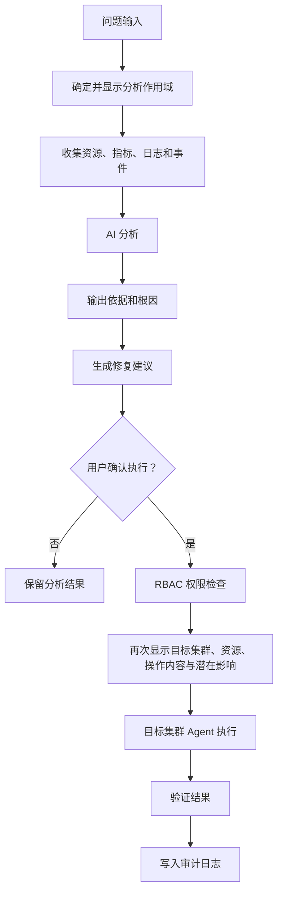

# ZKE Copilot

ZKE Copilot 是多集群 AI 运维与排障助手。用户无需先选择集群即可进入，但界面必须始终显示当前分析作用域，例如全部集群、全部生产集群、指定集群、指定 Namespace、指定工作负载或指定模型服务。

## 规划能力

- 使用自然语言查询一个或多个集群的资源状态；
- 汇总 Kubernetes Event；
- 联合分析指标、日志和事件；
- 检测异常工作负载；
- 分析 Pod 启动失败、资源不足、节点异常和 GPU 异常；
- 分析模型服务异常；
- 定位潜在根因并保存分析依据；
- 生成排障步骤、修复建议和 Kubernetes YAML；
- 经用户确认后执行操作；
- 保存操作记录并审计 AI 发起的操作。

## 工作流程

ZKE Copilot 可以进行多集群分析，但不是完全自主或无需审核的 AI。执行操作时必须：

1. 明确显示目标集群；
2. 明确显示 Namespace 和资源；
3. 执行 RBAC 权限检查；
4. 展示操作内容和潜在影响；
5. 要求用户确认；
6. 通过对应集群的 Agent 执行；
7. 保存完整审计记录。

